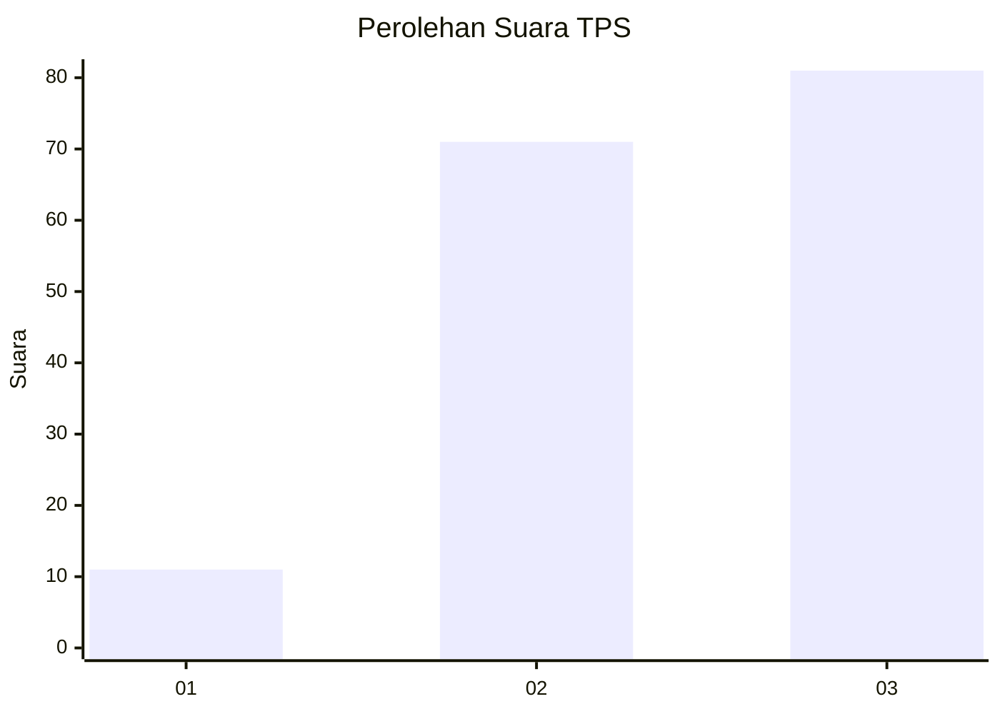
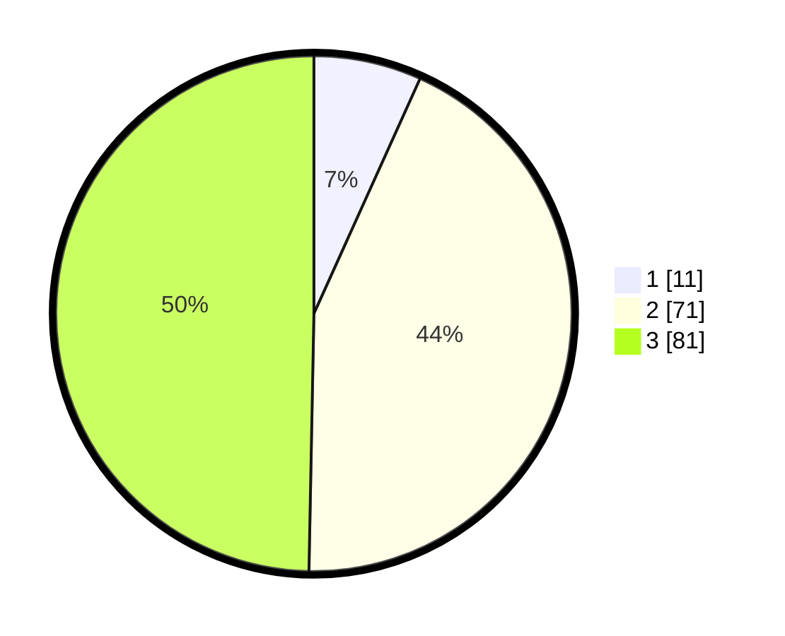

# Hasil

## Grafik

## Tabel

| No. | Nama Paslon    | Suara | Suara (raw) | Persentase |
|:--- |:-------------- | -----:| -----------:| ----------:|
| 1   | ANIES MUHAIMIN | 11    | [11][p-1]   | 6,75       |
| 2   | PRABOWO GIBRAN | 71    | [71][p-2]   | 43,56      |
| 3   | GANJAR MAHFUD  | 81    | [81][p-3]   | 49,69      |

[p-1]: https://github.com/gigit-pemilu/pemilu-2024-34-di-yogyakarta/blob/main/pilpres/hitung-suara/sub/34-di-yogyakarta/sub/03-gunungkidul/sub/09-karangmojo/sub/2004-kelor/sub/001-tps/sub/paslon-1.txt
[p-2]: https://github.com/gigit-pemilu/pemilu-2024-34-di-yogyakarta/blob/main/pilpres/hitung-suara/sub/34-di-yogyakarta/sub/03-gunungkidul/sub/09-karangmojo/sub/2004-kelor/sub/001-tps/sub/paslon-2.txt
[p-3]: https://github.com/gigit-pemilu/pemilu-2024-34-di-yogyakarta/blob/main/pilpres/hitung-suara/sub/34-di-yogyakarta/sub/03-gunungkidul/sub/09-karangmojo/sub/2004-kelor/sub/001-tps/sub/paslon-3.txt

## Foto C Plano

https://sirekap-obj-formc.kpu.go.id/ee7e/pemilu/ppwp/34/03/09/20/04/3403092004001-20240215-021209--efc6ba89-442f-4a4b-9c99-db53eb5a4d7c.jpg

https://sirekap-obj-formc.kpu.go.id/ee7e/pemilu/ppwp/34/03/09/20/04/3403092004001-20240215-021221--9deb9d75-8af2-4ed9-a1ca-e80599e1777f.jpg

https://sirekap-obj-formc.kpu.go.id/ee7e/pemilu/ppwp/34/03/09/20/04/3403092004001-20240215-021227--8f2c961d-d2e9-43be-8875-a215bca929c5.jpg

## Metadata

| Key        | Value               |
| ---------- | ------------------- |
| Time Stamp | 2024-02-19 06:16:00 |

