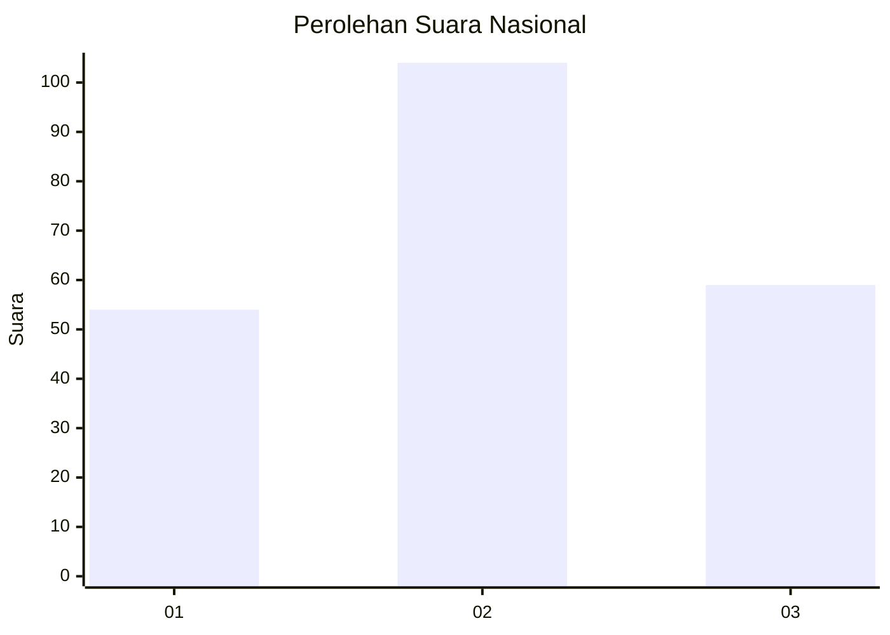
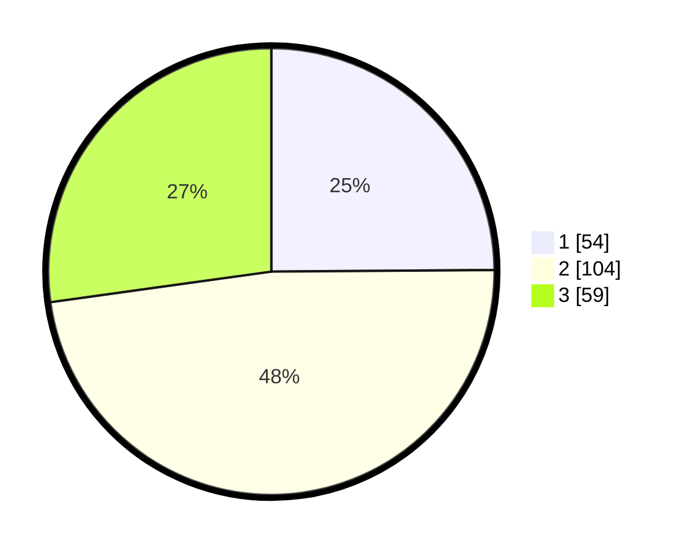

# Hasil

## Grafik

## Tabel

| No. | Nama Paslon    | Suara | Suara (raw) | Persentase |
|:--- |:-------------- | -----:| -----------:| ----------:|
| 1   | ANIES MUHAIMIN | 54    | [54][p-1]   | 24,88      |
| 2   | PRABOWO GIBRAN | 104   | [104][p-2]  | 47,93      |
| 3   | GANJAR MAHFUD  | 59    | [59][p-3]   | 27,19      |

[p-1]: https://github.com/gigit-pemilu/pemilu-2024/blob/main/pilpres/hitung-suara/sub/34-di-yogyakarta/sub/03-gunungkidul/sub/09-karangmojo/sub/2006-karangmojo/sub/005-tps/sub/paslon-1.txt
[p-2]: https://github.com/gigit-pemilu/pemilu-2024/blob/main/pilpres/hitung-suara/sub/34-di-yogyakarta/sub/03-gunungkidul/sub/09-karangmojo/sub/2006-karangmojo/sub/005-tps/sub/paslon-2.txt
[p-3]: https://github.com/gigit-pemilu/pemilu-2024/blob/main/pilpres/hitung-suara/sub/34-di-yogyakarta/sub/03-gunungkidul/sub/09-karangmojo/sub/2006-karangmojo/sub/005-tps/sub/paslon-3.txt

## Foto C Plano

https://sirekap-obj-formc.kpu.go.id/13ff/pemilu/ppwp/34/03/09/20/06/3403092006005-20240214-233938--d964b669-7779-45d9-8376-049efa5cf806.jpg

https://sirekap-obj-formc.kpu.go.id/13ff/pemilu/ppwp/34/03/09/20/06/3403092006005-20240214-234347--c35f7430-45e4-4716-8ad3-da46182e15fa.jpg

https://sirekap-obj-formc.kpu.go.id/13ff/pemilu/ppwp/34/03/09/20/06/3403092006005-20240215-181003--19932a35-35f3-4303-910f-f491f369f678.jpg

## Metadata

| Key        | Value               |
| ---------- | ------------------- |
| Time Stamp | 2024-02-15 18:30:25 |

