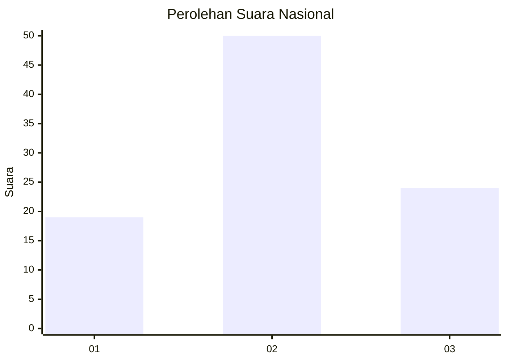
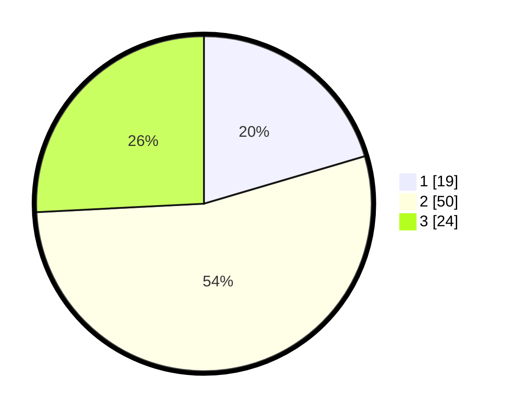

# Hasil

## Grafik

## Tabel

| No. | Nama Paslon    | Suara | Suara (raw) | Persentase |
|:--- |:-------------- | -----:| -----------:| ----------:|
| 1   | ANIES MUHAIMIN | 19    | [19][p-1]   | 20,43      |
| 2   | PRABOWO GIBRAN | 50    | [50][p-2]   | 53,76      |
| 3   | GANJAR MAHFUD  | 24    | [24][p-3]   | 25,81      |

[p-1]: https://github.com/gigit-pemilu/pemilu-2024/blob/main/pilpres/hitung-suara/sub/34-di-yogyakarta/sub/03-gunungkidul/sub/09-karangmojo/sub/2007-gedangrejo/sub/017-tps/sub/paslon-1.txt
[p-2]: https://github.com/gigit-pemilu/pemilu-2024/blob/main/pilpres/hitung-suara/sub/34-di-yogyakarta/sub/03-gunungkidul/sub/09-karangmojo/sub/2007-gedangrejo/sub/017-tps/sub/paslon-2.txt
[p-3]: https://github.com/gigit-pemilu/pemilu-2024/blob/main/pilpres/hitung-suara/sub/34-di-yogyakarta/sub/03-gunungkidul/sub/09-karangmojo/sub/2007-gedangrejo/sub/017-tps/sub/paslon-3.txt

## Foto C Plano

https://sirekap-obj-formc.kpu.go.id/7ddf/pemilu/ppwp/34/03/09/20/07/3403092007017-20240216-004329--88cd1105-9984-4e85-8053-7aab811ac922.jpg

https://sirekap-obj-formc.kpu.go.id/7ddf/pemilu/ppwp/34/03/09/20/07/3403092007017-20240216-004332--0ca10e9a-6de8-4a43-bdb0-024542572d2c.jpg

https://sirekap-obj-formc.kpu.go.id/7ddf/pemilu/ppwp/34/03/09/20/07/3403092007017-20240216-004330--6b4707dc-9eaa-40cd-92f8-9b7d90ce160f.jpg

## Metadata

| Key        | Value               |
| ---------- | ------------------- |
| Time Stamp | 2024-02-17 16:00:02 |

## DATA PEMILIH TETAP

Jumlah pemilih dalam DPT: **121**.
 * L: **68**.
 * P: **53**.

## DATA PENGGUNA HAK PILIH

Jumlah pengguna hak pilih dalam DPT: **90**.
 * L: **49**.
 * P: **41**.

Jumlah pengguna hak pilih dalam DPTb: **1**.
 * L: **1**.
 * P: **0**.

Jumlah pengguna hak pilih dalam DPK: **3**.
 * L: **2**.
 * P: **1**.

Jumlah pengguna hak pilih: **94**.
 * L: **52**.
 * P: **42**.

## JUMLAH SUARA SAH DAN TIDAK SAH

JUMLAH SELURUH SUARA SAH: **93**.

JUMLAH SUARA TIDAK SAH: **1**.

JUMLAH SELURUH SUARA SAH DAN SUARA TIDAK SAH: **94**.

