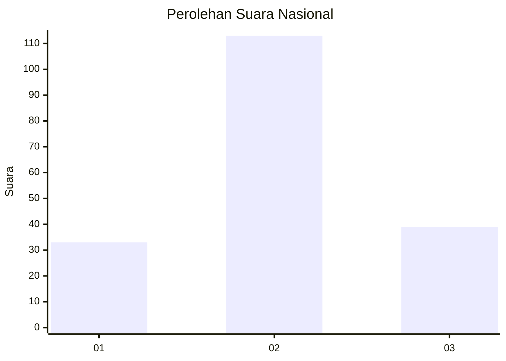
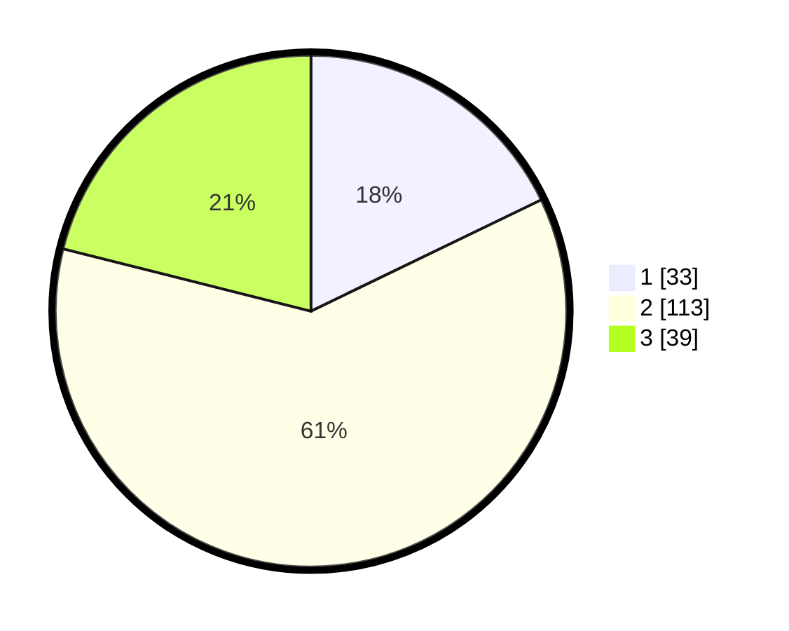

# Hasil

## Grafik

## Tabel

| No. | Nama Paslon    | Suara | Suara (raw) | Persentase |
|:--- |:-------------- | -----:| -----------:| ----------:|
| 1   | ANIES MUHAIMIN | 33    | [33][p-1]   | 17,84      |
| 2   | PRABOWO GIBRAN | 113   | [113][p-2]  | 61,08      |
| 3   | GANJAR MAHFUD  | 39    | [39][p-3]   | 21,08      |

[p-1]: https://github.com/gigit-pemilu/pemilu-2024/blob/main/pilpres/hitung-suara/sub/34-di-yogyakarta/sub/03-gunungkidul/sub/09-karangmojo/sub/2007-gedangrejo/sub/024-tps/sub/paslon-1.txt
[p-2]: https://github.com/gigit-pemilu/pemilu-2024/blob/main/pilpres/hitung-suara/sub/34-di-yogyakarta/sub/03-gunungkidul/sub/09-karangmojo/sub/2007-gedangrejo/sub/024-tps/sub/paslon-2.txt
[p-3]: https://github.com/gigit-pemilu/pemilu-2024/blob/main/pilpres/hitung-suara/sub/34-di-yogyakarta/sub/03-gunungkidul/sub/09-karangmojo/sub/2007-gedangrejo/sub/024-tps/sub/paslon-3.txt

## Foto C Plano

https://sirekap-obj-formc.kpu.go.id/55d7/pemilu/ppwp/34/03/09/20/07/3403092007024-20240214-235315--d1ccfa4e-0690-46ef-9d41-87b4b989e7a9.jpg

https://sirekap-obj-formc.kpu.go.id/55d7/pemilu/ppwp/34/03/09/20/07/3403092007024-20240214-235457--5d4b4347-1acb-40f5-9f99-59727611b016.jpg

https://sirekap-obj-formc.kpu.go.id/55d7/pemilu/ppwp/34/03/09/20/07/3403092007024-20240214-235537--afa69763-1e37-41fa-8f5a-9a3e918c4bbf.jpg

## Metadata

| Key        | Value               |
| ---------- | ------------------- |
| Time Stamp | 2024-02-17 16:00:02 |

