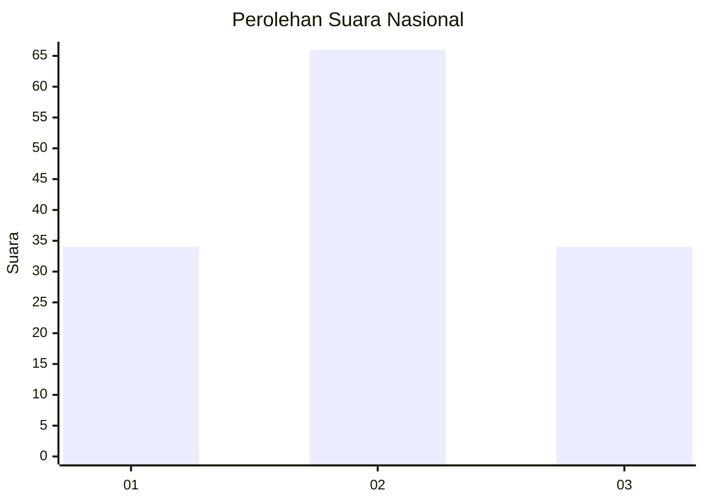
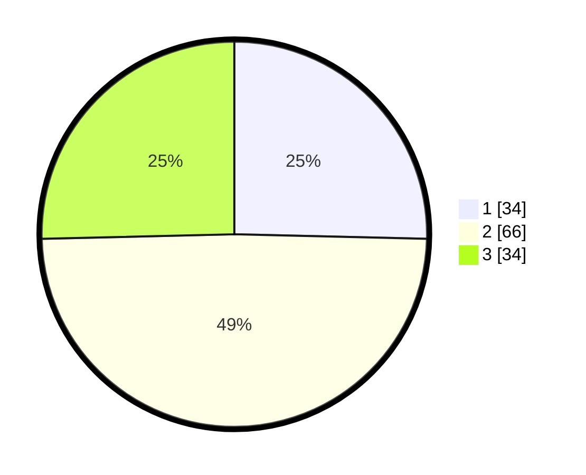

# Hasil

## Grafik

## Tabel

| No. | Nama Paslon    | Suara | Suara (raw) | Persentase |
|:--- |:-------------- | -----:| -----------:| ----------:|
| 1   | ANIES MUHAIMIN | 34    | [34][p-1]   | 25,37      |
| 2   | PRABOWO GIBRAN | 66    | [66][p-2]   | 49,25      |
| 3   | GANJAR MAHFUD  | 34    | [34][p-3]   | 25,37      |

[p-1]: https://github.com/gigit-pemilu/pemilu-2024/blob/main/pilpres/hitung-suara/sub/34-di-yogyakarta/sub/03-gunungkidul/sub/09-karangmojo/sub/2008-ngawis/sub/002-tps/sub/paslon-1.txt
[p-2]: https://github.com/gigit-pemilu/pemilu-2024/blob/main/pilpres/hitung-suara/sub/34-di-yogyakarta/sub/03-gunungkidul/sub/09-karangmojo/sub/2008-ngawis/sub/002-tps/sub/paslon-2.txt
[p-3]: https://github.com/gigit-pemilu/pemilu-2024/blob/main/pilpres/hitung-suara/sub/34-di-yogyakarta/sub/03-gunungkidul/sub/09-karangmojo/sub/2008-ngawis/sub/002-tps/sub/paslon-3.txt

## Foto C Plano

https://sirekap-obj-formc.kpu.go.id/7f99/pemilu/ppwp/34/03/09/20/08/3403092008002-20240216-061427--91339f10-07e6-4cfc-8cf1-006c02afec6c.jpg

https://sirekap-obj-formc.kpu.go.id/7f99/pemilu/ppwp/34/03/09/20/08/3403092008002-20240216-061429--8423e21b-d67a-4fcf-a150-30076c236a9b.jpg

https://sirekap-obj-formc.kpu.go.id/7f99/pemilu/ppwp/34/03/09/20/08/3403092008002-20240216-061428--81c2ea9e-d0a0-494e-93b3-cb6abfdfe06c.jpg

## Metadata

| Key        | Value               |
| ---------- | ------------------- |
| Time Stamp | 2024-02-17 14:56:33 |

## DATA PEMILIH TETAP

Jumlah pemilih dalam DPT: **159**.
 * L: **69**.
 * P: **90**.

## DATA PENGGUNA HAK PILIH

Jumlah pengguna hak pilih dalam DPT: **139**.
 * L: **60**.
 * P: **79**.

Jumlah pengguna hak pilih dalam DPTb: **1**.
 * L: **1**.
 * P: **0**.

Jumlah pengguna hak pilih dalam DPK: **1**.
 * L: **1**.
 * P: **0**.

Jumlah pengguna hak pilih: **141**.
 * L: **62**.
 * P: **79**.

## JUMLAH SUARA SAH DAN TIDAK SAH

JUMLAH SELURUH SUARA SAH: **134**.

JUMLAH SUARA TIDAK SAH: **7**.

JUMLAH SELURUH SUARA SAH DAN SUARA TIDAK SAH: **141**.

