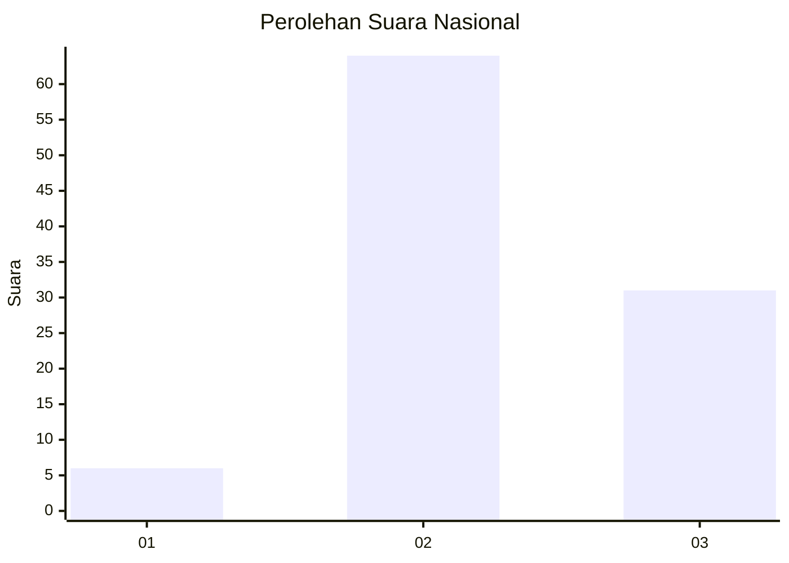
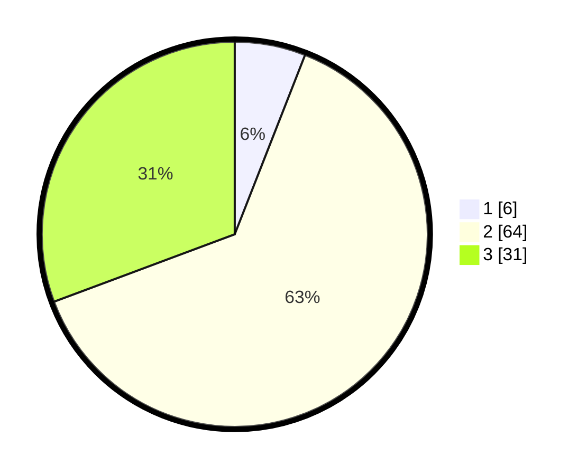

# Hasil

## Grafik

## Tabel

| No. | Nama Paslon    | Suara | Suara (raw) | Persentase |
|:--- |:-------------- | -----:| -----------:| ----------:|
| 1   | ANIES MUHAIMIN | 6     | [6][p-1]    | 5,94       |
| 2   | PRABOWO GIBRAN | 64    | [64][p-2]   | 63,37      |
| 3   | GANJAR MAHFUD  | 31    | [31][p-3]   | 30,69      |

[p-1]: https://github.com/gigit-pemilu/pemilu-2024/blob/main/pilpres/hitung-suara/sub/34-di-yogyakarta/sub/03-gunungkidul/sub/09-karangmojo/sub/2008-ngawis/sub/004-tps/sub/paslon-1.txt
[p-2]: https://github.com/gigit-pemilu/pemilu-2024/blob/main/pilpres/hitung-suara/sub/34-di-yogyakarta/sub/03-gunungkidul/sub/09-karangmojo/sub/2008-ngawis/sub/004-tps/sub/paslon-2.txt
[p-3]: https://github.com/gigit-pemilu/pemilu-2024/blob/main/pilpres/hitung-suara/sub/34-di-yogyakarta/sub/03-gunungkidul/sub/09-karangmojo/sub/2008-ngawis/sub/004-tps/sub/paslon-3.txt

## Foto C Plano

https://sirekap-obj-formc.kpu.go.id/5dca/pemilu/ppwp/34/03/09/20/08/3403092008004-20240215-214751--0a168c3b-4dd9-4229-913b-a5a49cfd848e.jpg

https://sirekap-obj-formc.kpu.go.id/5dca/pemilu/ppwp/34/03/09/20/08/3403092008004-20240215-214753--904c7adc-f801-499d-99fb-73bd8f355642.jpg

https://sirekap-obj-formc.kpu.go.id/5dca/pemilu/ppwp/34/03/09/20/08/3403092008004-20240215-214752--363917d6-7c5d-43e8-afa7-e68b19d873be.jpg

## Metadata

| Key        | Value               |
| ---------- | ------------------- |
| Time Stamp | 2024-02-17 16:00:02 |

## DATA PEMILIH TETAP

Jumlah pemilih dalam DPT: **121**.
 * L: **58**.
 * P: **63**.

## DATA PENGGUNA HAK PILIH

Jumlah pengguna hak pilih dalam DPT: **102**.
 * L: **49**.
 * P: **53**.

Jumlah pengguna hak pilih dalam DPTb: **0**.
 * L: **0**.
 * P: **0**.

Jumlah pengguna hak pilih dalam DPK: **0**.
 * L: **0**.
 * P: **0**.

Jumlah pengguna hak pilih: **102**.
 * L: **49**.
 * P: **53**.

## JUMLAH SUARA SAH DAN TIDAK SAH

JUMLAH SELURUH SUARA SAH: **101**.

JUMLAH SUARA TIDAK SAH: **1**.

JUMLAH SELURUH SUARA SAH DAN SUARA TIDAK SAH: **102**.

