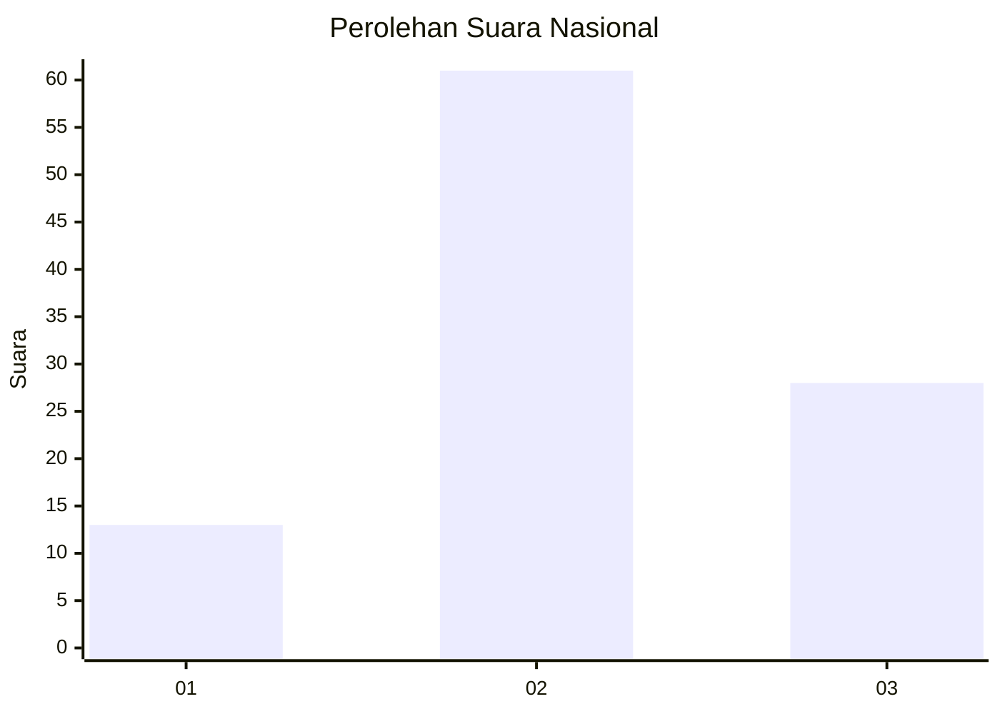
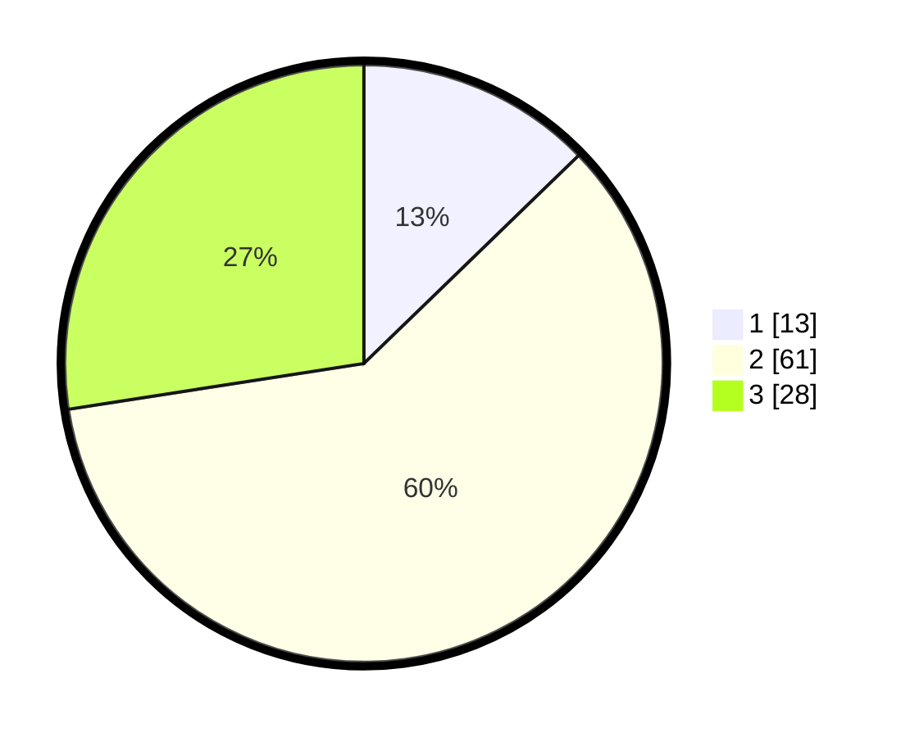

# Hasil

## Grafik

## Tabel

| No. | Nama Paslon    | Suara | Suara (raw) | Persentase |
|:--- |:-------------- | -----:| -----------:| ----------:|
| 1   | ANIES MUHAIMIN | 13    | [13][p-1]   | 12,75      |
| 2   | PRABOWO GIBRAN | 61    | [61][p-2]   | 59,80      |
| 3   | GANJAR MAHFUD  | 28    | [28][p-3]   | 27,45      |

[p-1]: https://github.com/gigit-pemilu/pemilu-2024/blob/main/pilpres/hitung-suara/sub/34-di-yogyakarta/sub/03-gunungkidul/sub/09-karangmojo/sub/2008-ngawis/sub/010-tps/sub/paslon-1.txt
[p-2]: https://github.com/gigit-pemilu/pemilu-2024/blob/main/pilpres/hitung-suara/sub/34-di-yogyakarta/sub/03-gunungkidul/sub/09-karangmojo/sub/2008-ngawis/sub/010-tps/sub/paslon-2.txt
[p-3]: https://github.com/gigit-pemilu/pemilu-2024/blob/main/pilpres/hitung-suara/sub/34-di-yogyakarta/sub/03-gunungkidul/sub/09-karangmojo/sub/2008-ngawis/sub/010-tps/sub/paslon-3.txt

## Foto C Plano

https://sirekap-obj-formc.kpu.go.id/0b66/pemilu/ppwp/34/03/09/20/08/3403092008010-20240214-182408--9047143b-2c48-461d-90ac-ecf618d0c333.jpg

https://sirekap-obj-formc.kpu.go.id/0b66/pemilu/ppwp/34/03/09/20/08/3403092008010-20240214-182410--d5e67b6d-4b9b-4d4d-9164-2237b0acfac9.jpg

https://sirekap-obj-formc.kpu.go.id/0b66/pemilu/ppwp/34/03/09/20/08/3403092008010-20240214-182409--5dc9cbe9-479b-4d59-ba99-0aa14ed840e2.jpg

## Metadata

| Key        | Value               |
| ---------- | ------------------- |
| Time Stamp | 2024-02-15 17:30:25 |

## DATA PEMILIH TETAP

Jumlah pemilih dalam DPT: **127**.
 * L: **63**.
 * P: **64**.

## DATA PENGGUNA HAK PILIH

Jumlah pengguna hak pilih dalam DPT: **106**.
 * L: **50**.
 * P: **56**.

Jumlah pengguna hak pilih dalam DPTb: **0**.
 * L: **0**.
 * P: **0**.

Jumlah pengguna hak pilih dalam DPK: **0**.
 * L: **0**.
 * P: **0**.

Jumlah pengguna hak pilih: **106**.
 * L: **50**.
 * P: **56**.

## JUMLAH SUARA SAH DAN TIDAK SAH

JUMLAH SELURUH SUARA SAH: **102**.

JUMLAH SUARA TIDAK SAH: **4**.

JUMLAH SELURUH SUARA SAH DAN SUARA TIDAK SAH: **106**.

