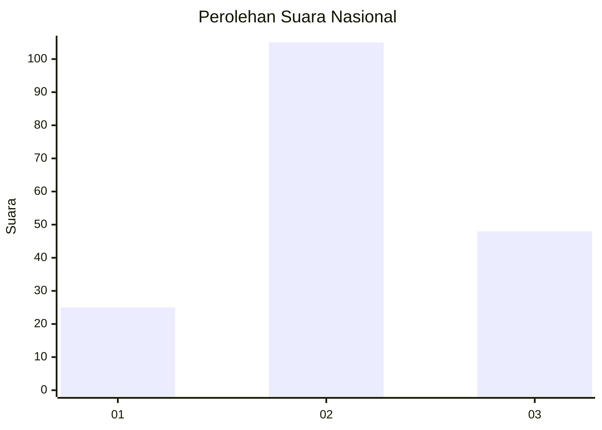
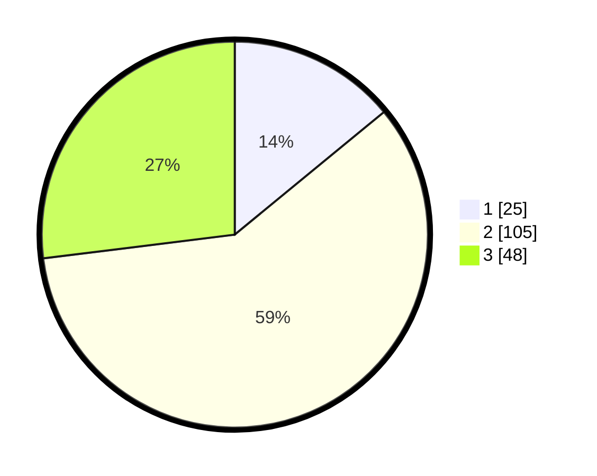

# Hasil

## Grafik

## Tabel

| No. | Nama Paslon    | Suara | Suara (raw) | Persentase |
|:--- |:-------------- | -----:| -----------:| ----------:|
| 1   | ANIES MUHAIMIN | 25    | [25][p-1]   | 14,04      |
| 2   | PRABOWO GIBRAN | 105   | [105][p-2]  | 58,99      |
| 3   | GANJAR MAHFUD  | 48    | [48][p-3]   | 26,97      |

[p-1]: https://github.com/gigit-pemilu/pemilu-2024/blob/main/pilpres/hitung-suara/sub/34-di-yogyakarta/sub/03-gunungkidul/sub/10-ponjong/sub/2001-umbulrejo/sub/001-tps/sub/paslon-1.txt
[p-2]: https://github.com/gigit-pemilu/pemilu-2024/blob/main/pilpres/hitung-suara/sub/34-di-yogyakarta/sub/03-gunungkidul/sub/10-ponjong/sub/2001-umbulrejo/sub/001-tps/sub/paslon-2.txt
[p-3]: https://github.com/gigit-pemilu/pemilu-2024/blob/main/pilpres/hitung-suara/sub/34-di-yogyakarta/sub/03-gunungkidul/sub/10-ponjong/sub/2001-umbulrejo/sub/001-tps/sub/paslon-3.txt

## Foto C Plano

https://sirekap-obj-formc.kpu.go.id/6845/pemilu/ppwp/34/03/10/20/01/3403102001001-20240216-055821--0dfc4fc0-c27e-4b09-8881-f02a39e09f7e.jpg

https://sirekap-obj-formc.kpu.go.id/6845/pemilu/ppwp/34/03/10/20/01/3403102001001-20240216-055826--c7a43c82-333e-4a0d-8cfa-e0c5e4a74dbd.jpg

https://sirekap-obj-formc.kpu.go.id/6845/pemilu/ppwp/34/03/10/20/01/3403102001001-20240216-055825--e1431538-b8a1-44d3-886f-27e16a00dab4.jpg

## Metadata

| Key        | Value               |
| ---------- | ------------------- |
| Time Stamp | 2024-02-16 16:25:10 |

## DATA PEMILIH TETAP

Jumlah pemilih dalam DPT: **214**.
 * L: **109**.
 * P: **105**.

## DATA PENGGUNA HAK PILIH

Jumlah pengguna hak pilih dalam DPT: **176**.
 * L: **89**.
 * P: **87**.

Jumlah pengguna hak pilih dalam DPTb: **3**.
 * L: **2**.
 * P: **1**.

Jumlah pengguna hak pilih dalam DPK: **0**.
 * L: **0**.
 * P: **0**.

Jumlah pengguna hak pilih: **179**.
 * L: **91**.
 * P: **88**.

## JUMLAH SUARA SAH DAN TIDAK SAH

JUMLAH SELURUH SUARA SAH: **178**.

JUMLAH SUARA TIDAK SAH: **1**.

JUMLAH SELURUH SUARA SAH DAN SUARA TIDAK SAH: **179**.

