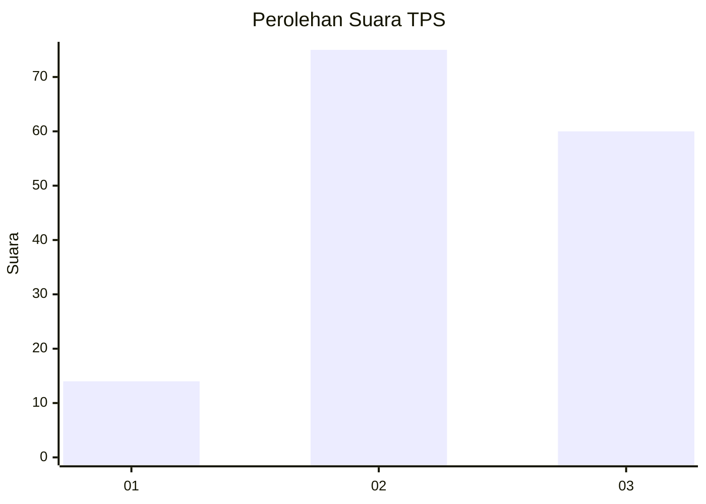
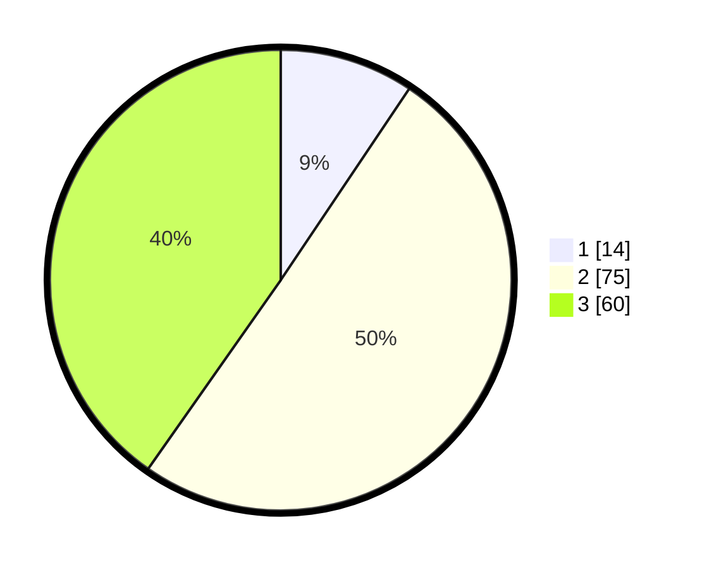

# Hasil

## Grafik

## Tabel

| No. | Nama Paslon    | Suara | Suara (raw) | Persentase |
|:--- |:-------------- | -----:| -----------:| ----------:|
| 1   | ANIES MUHAIMIN | 14    | [14][p-1]   | 9,40       |
| 2   | PRABOWO GIBRAN | 75    | [75][p-2]   | 50,34      |
| 3   | GANJAR MAHFUD  | 60    | [60][p-3]   | 40,27      |

[p-1]: https://github.com/gigit-pemilu/pemilu-2024-34-di-yogyakarta/blob/main/pilpres/hitung-suara/sub/34-di-yogyakarta/sub/03-gunungkidul/sub/10-ponjong/sub/2001-umbulrejo/sub/005-tps/sub/paslon-1.txt
[p-2]: https://github.com/gigit-pemilu/pemilu-2024-34-di-yogyakarta/blob/main/pilpres/hitung-suara/sub/34-di-yogyakarta/sub/03-gunungkidul/sub/10-ponjong/sub/2001-umbulrejo/sub/005-tps/sub/paslon-2.txt
[p-3]: https://github.com/gigit-pemilu/pemilu-2024-34-di-yogyakarta/blob/main/pilpres/hitung-suara/sub/34-di-yogyakarta/sub/03-gunungkidul/sub/10-ponjong/sub/2001-umbulrejo/sub/005-tps/sub/paslon-3.txt

## Foto C Plano

https://sirekap-obj-formc.kpu.go.id/b6d9/pemilu/ppwp/34/03/10/20/01/3403102001005-20240216-025026--8029ef3a-d536-45b6-bddc-58a7a9b63568.jpg

https://sirekap-obj-formc.kpu.go.id/b6d9/pemilu/ppwp/34/03/10/20/01/3403102001005-20240214-141508--1b5f7734-ca08-4c21-9c7f-3dc1c41a00ed.jpg

https://sirekap-obj-formc.kpu.go.id/b6d9/pemilu/ppwp/34/03/10/20/01/3403102001005-20240216-025027--0d4d0e5b-4798-424b-9a2b-455d33046722.jpg

## Metadata

| Key        | Value               |
| ---------- | ------------------- |
| Time Stamp | 2024-02-16 03:00:26 |

## DATA PEMILIH TETAP

Jumlah pemilih dalam DPT: **183**.
 * L: **94**.
 * P: **89**.

## DATA PENGGUNA HAK PILIH

Jumlah pengguna hak pilih dalam DPT: **147**.
 * L: **77**.
 * P: **70**.

Jumlah pengguna hak pilih dalam DPTb: **1**.
 * L: **0**.
 * P: **1**.

Jumlah pengguna hak pilih dalam DPK: **4**.
 * L: **2**.
 * P: **2**.

Jumlah pengguna hak pilih: **152**.
 * L: **79**.
 * P: **73**.

## JUMLAH SUARA SAH DAN TIDAK SAH

JUMLAH SELURUH SUARA SAH: **149**.

JUMLAH SUARA TIDAK SAH: **3**.

JUMLAH SELURUH SUARA SAH DAN SUARA TIDAK SAH: **152**.

