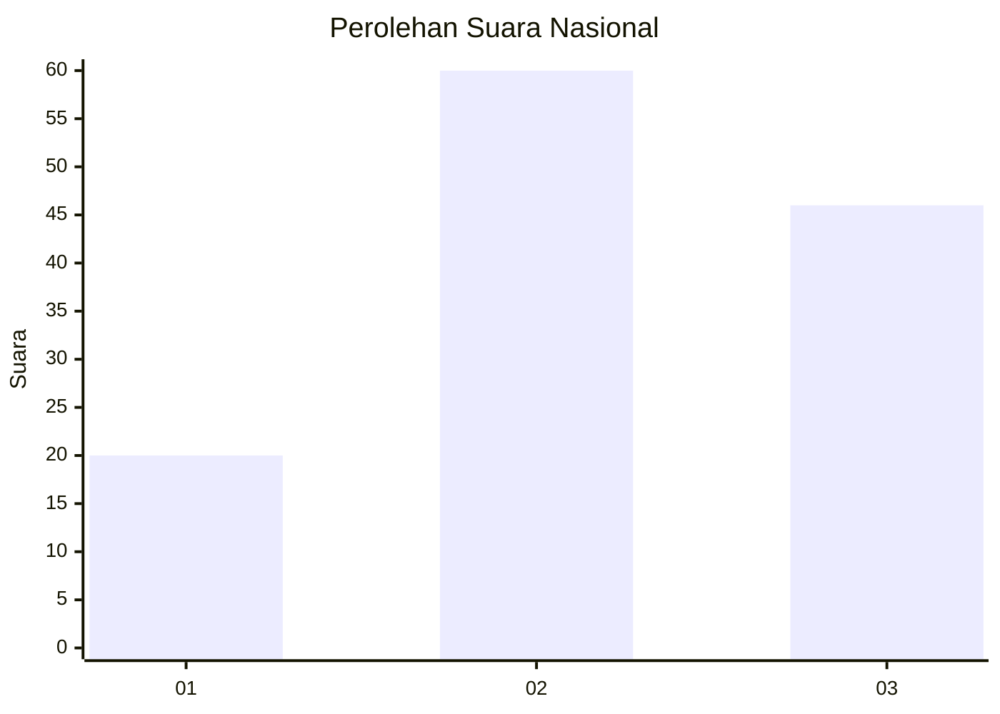
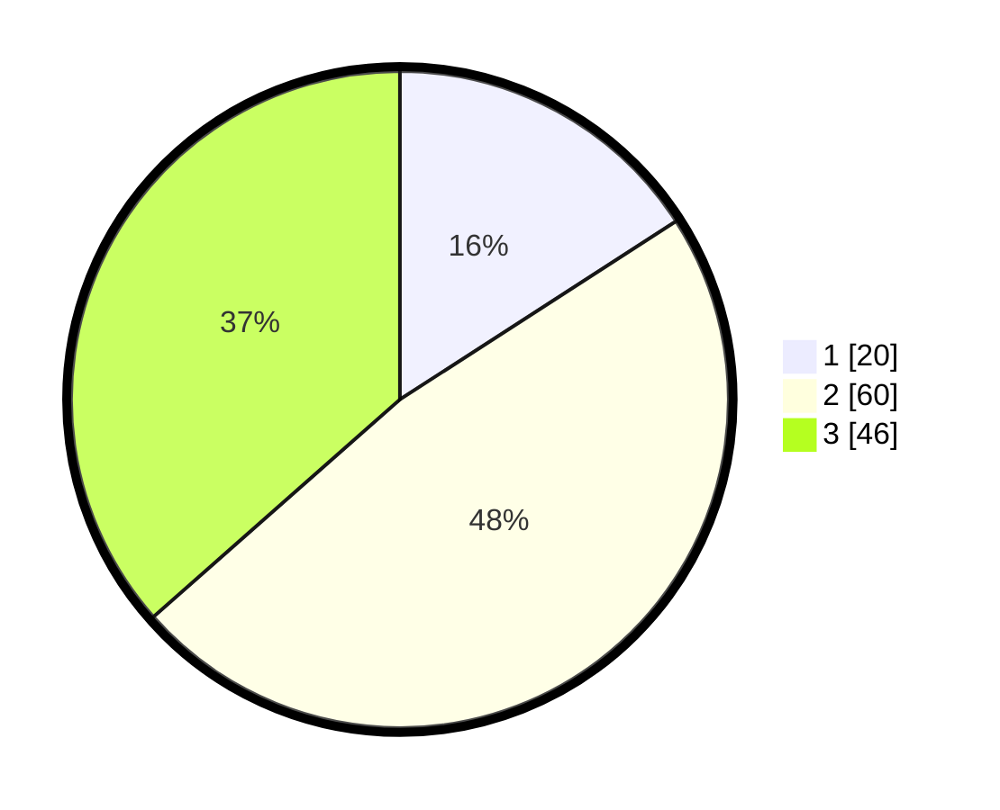

# Hasil

## Grafik

## Tabel

| No. | Nama Paslon    | Suara | Suara (raw) | Persentase |
|:--- |:-------------- | -----:| -----------:| ----------:|
| 1   | ANIES MUHAIMIN | 20    | [20][p-1]   | 15,87      |
| 2   | PRABOWO GIBRAN | 60    | [60][p-2]   | 47,62      |
| 3   | GANJAR MAHFUD  | 46    | [46][p-3]   | 36,51      |

[p-1]: https://github.com/gigit-pemilu/pemilu-2024/blob/main/pilpres/hitung-suara/sub/34-di-yogyakarta/sub/03-gunungkidul/sub/10-ponjong/sub/2001-umbulrejo/sub/006-tps/sub/paslon-1.txt
[p-2]: https://github.com/gigit-pemilu/pemilu-2024/blob/main/pilpres/hitung-suara/sub/34-di-yogyakarta/sub/03-gunungkidul/sub/10-ponjong/sub/2001-umbulrejo/sub/006-tps/sub/paslon-2.txt
[p-3]: https://github.com/gigit-pemilu/pemilu-2024/blob/main/pilpres/hitung-suara/sub/34-di-yogyakarta/sub/03-gunungkidul/sub/10-ponjong/sub/2001-umbulrejo/sub/006-tps/sub/paslon-3.txt

## Foto C Plano

https://sirekap-obj-formc.kpu.go.id/a249/pemilu/ppwp/34/03/10/20/01/3403102001006-20240215-172554--39cd767e-c16d-489f-9a6d-1447e685aaae.jpg

https://sirekap-obj-formc.kpu.go.id/a249/pemilu/ppwp/34/03/10/20/01/3403102001006-20240215-172615--02227430-20fa-4b64-94fe-065fcf324d30.jpg

https://sirekap-obj-formc.kpu.go.id/a249/pemilu/ppwp/34/03/10/20/01/3403102001006-20240215-172604--153563d7-bbd3-43a0-8b5e-0ecfadf30a70.jpg

## Metadata

| Key        | Value               |
| ---------- | ------------------- |
| Time Stamp | 2024-02-15 20:30:46 |

## DATA PEMILIH TETAP

Jumlah pemilih dalam DPT: **168**.
 * L: **86**.
 * P: **82**.

## DATA PENGGUNA HAK PILIH

Jumlah pengguna hak pilih dalam DPT: **130**.
 * L: **64**.
 * P: **66**.

Jumlah pengguna hak pilih dalam DPTb: **0**.
 * L: **0**.
 * P: **0**.

Jumlah pengguna hak pilih dalam DPK: **2**.
 * L: **1**.
 * P: **1**.

Jumlah pengguna hak pilih: **132**.
 * L: **65**.
 * P: **67**.

## JUMLAH SUARA SAH DAN TIDAK SAH

JUMLAH SELURUH SUARA SAH: **126**.

JUMLAH SUARA TIDAK SAH: **6**.

JUMLAH SELURUH SUARA SAH DAN SUARA TIDAK SAH: **132**.

