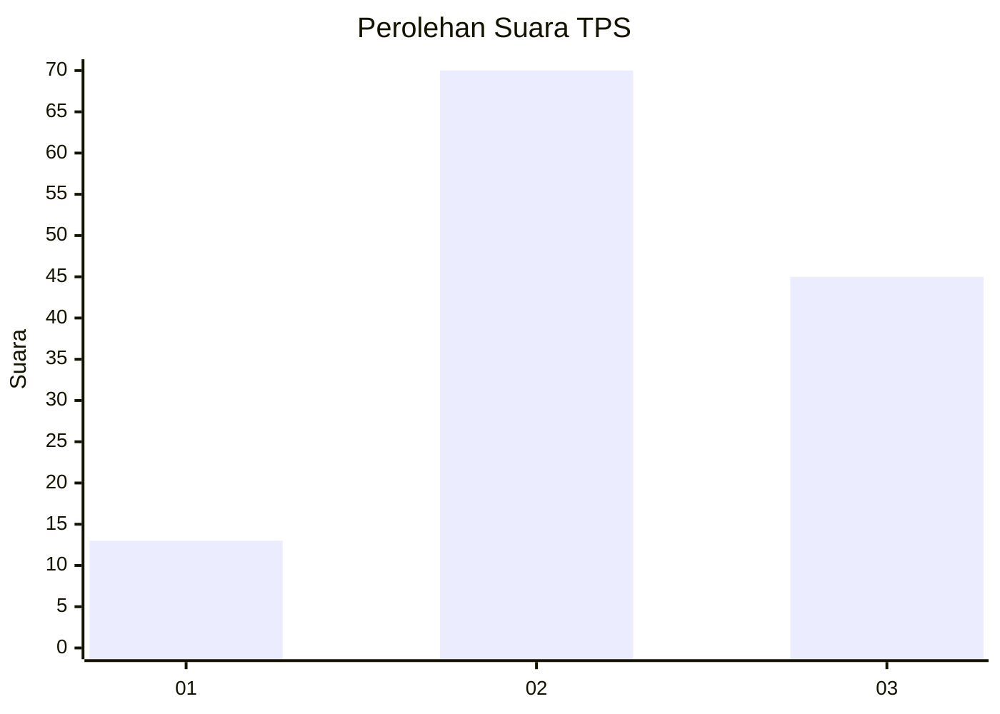
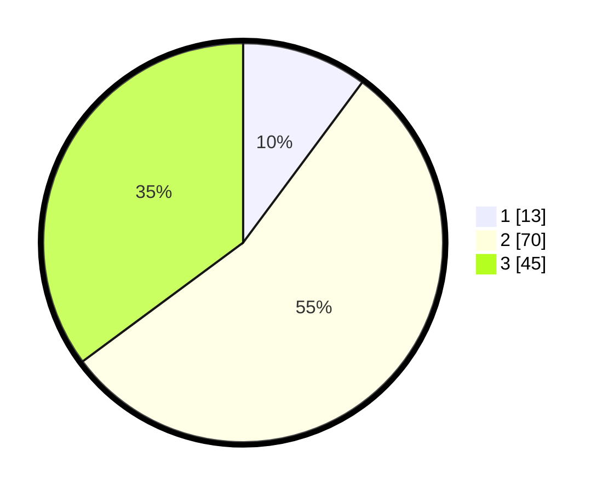

# Hasil

## Grafik

## Tabel

| No. | Nama Paslon    | Suara | Suara (raw) | Persentase |
|:--- |:-------------- | -----:| -----------:| ----------:|
| 1   | ANIES MUHAIMIN | 13    | [13][p-1]   | 10,16      |
| 2   | PRABOWO GIBRAN | 70    | [70][p-2]   | 54,69      |
| 3   | GANJAR MAHFUD  | 45    | [45][p-3]   | 35,16      |

[p-1]: https://github.com/gigit-pemilu/pemilu-2024-34-di-yogyakarta/blob/main/pilpres/hitung-suara/sub/34-di-yogyakarta/sub/03-gunungkidul/sub/10-ponjong/sub/2001-umbulrejo/sub/008-tps/sub/paslon-1.txt
[p-2]: https://github.com/gigit-pemilu/pemilu-2024-34-di-yogyakarta/blob/main/pilpres/hitung-suara/sub/34-di-yogyakarta/sub/03-gunungkidul/sub/10-ponjong/sub/2001-umbulrejo/sub/008-tps/sub/paslon-2.txt
[p-3]: https://github.com/gigit-pemilu/pemilu-2024-34-di-yogyakarta/blob/main/pilpres/hitung-suara/sub/34-di-yogyakarta/sub/03-gunungkidul/sub/10-ponjong/sub/2001-umbulrejo/sub/008-tps/sub/paslon-3.txt

## Foto C Plano

https://sirekap-obj-formc.kpu.go.id/a35b/pemilu/ppwp/34/03/10/20/01/3403102001008-20240214-225236--be43b41f-6738-452c-b062-acf58452767b.jpg

https://sirekap-obj-formc.kpu.go.id/a35b/pemilu/ppwp/34/03/10/20/01/3403102001008-20240214-225332--e8e6586a-f043-4c45-9a61-6dcf4e2613d7.jpg

https://sirekap-obj-formc.kpu.go.id/a35b/pemilu/ppwp/34/03/10/20/01/3403102001008-20240214-225431--7300a547-441b-468e-a3e6-47e5a47763f7.jpg

## Metadata

| Key        | Value               |
| ---------- | ------------------- |
| Time Stamp | 2024-02-15 17:00:25 |

