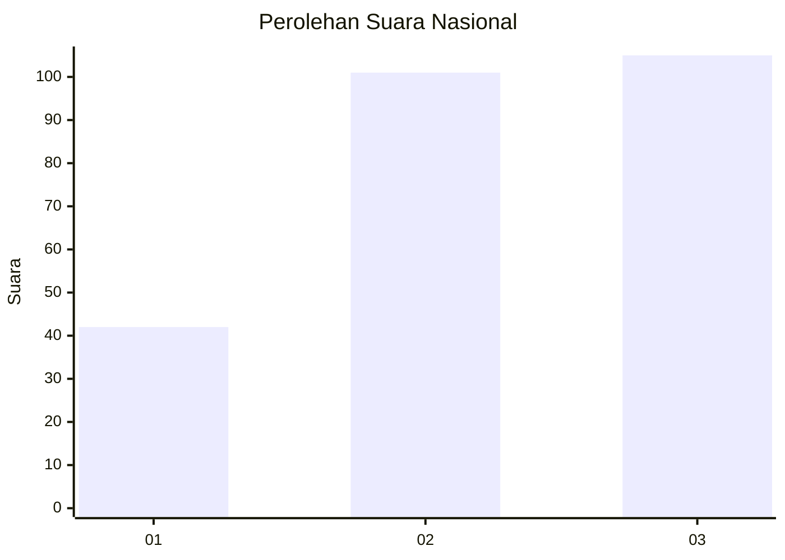
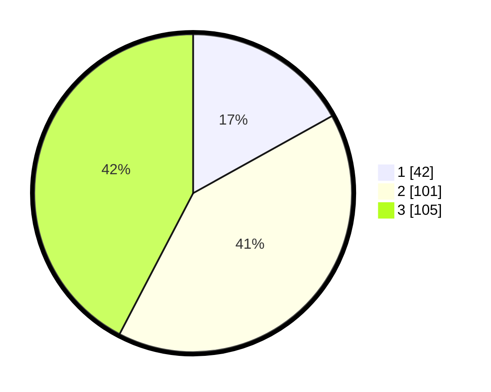

# Hasil

## Grafik

## Tabel

| No. | Nama Paslon    | Suara | Suara (raw) | Persentase |
|:--- |:-------------- | -----:| -----------:| ----------:|
| 1   | ANIES MUHAIMIN | 42    | [42][p-1]   | 16,94      |
| 2   | PRABOWO GIBRAN | 101   | [101][p-2]  | 40,73      |
| 3   | GANJAR MAHFUD  | 105   | [105][p-3]  | 42,34      |

[p-1]: https://github.com/gigit-pemilu/pemilu-2024/blob/main/pilpres/hitung-suara/sub/34-di-yogyakarta/sub/03-gunungkidul/sub/10-ponjong/sub/2001-umbulrejo/sub/018-tps/sub/paslon-1.txt
[p-2]: https://github.com/gigit-pemilu/pemilu-2024/blob/main/pilpres/hitung-suara/sub/34-di-yogyakarta/sub/03-gunungkidul/sub/10-ponjong/sub/2001-umbulrejo/sub/018-tps/sub/paslon-2.txt
[p-3]: https://github.com/gigit-pemilu/pemilu-2024/blob/main/pilpres/hitung-suara/sub/34-di-yogyakarta/sub/03-gunungkidul/sub/10-ponjong/sub/2001-umbulrejo/sub/018-tps/sub/paslon-3.txt

## Foto C Plano

https://sirekap-obj-formc.kpu.go.id/dc02/pemilu/ppwp/34/03/10/20/01/3403102001018-20240215-030715--b23d892e-139f-4568-9e84-68f0a6fe5b54.jpg

https://sirekap-obj-formc.kpu.go.id/dc02/pemilu/ppwp/34/03/10/20/01/3403102001018-20240215-134751--7102da15-c621-45bf-909f-22d35aabad34.jpg

https://sirekap-obj-formc.kpu.go.id/dc02/pemilu/ppwp/34/03/10/20/01/3403102001018-20240215-031016--744d1787-c1d2-4f6d-a735-582a693eef90.jpg

## Metadata

| Key        | Value               |
| ---------- | ------------------- |
| Time Stamp | 2024-02-15 17:00:25 |

