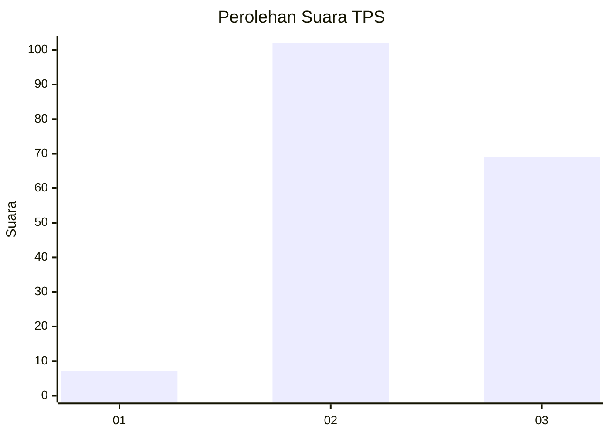
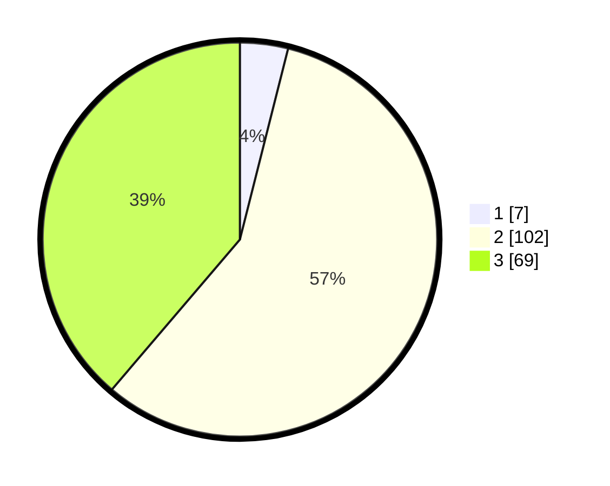

# Hasil

## Grafik

## Tabel

| No. | Nama Paslon    | Suara | Suara (raw) | Persentase |
|:--- |:-------------- | -----:| -----------:| ----------:|
| 1   | ANIES MUHAIMIN | 7     | [7][p-1]    | 3,93       |
| 2   | PRABOWO GIBRAN | 102   | [102][p-2]  | 57,30      |
| 3   | GANJAR MAHFUD  | 69    | [69][p-3]   | 38,76      |

[p-1]: https://github.com/gigit-pemilu/pemilu-2024-34-di-yogyakarta/blob/main/pilpres/hitung-suara/sub/34-di-yogyakarta/sub/03-gunungkidul/sub/10-ponjong/sub/2003-tambakromo/sub/009-tps/sub/paslon-1.txt
[p-2]: https://github.com/gigit-pemilu/pemilu-2024-34-di-yogyakarta/blob/main/pilpres/hitung-suara/sub/34-di-yogyakarta/sub/03-gunungkidul/sub/10-ponjong/sub/2003-tambakromo/sub/009-tps/sub/paslon-2.txt
[p-3]: https://github.com/gigit-pemilu/pemilu-2024-34-di-yogyakarta/blob/main/pilpres/hitung-suara/sub/34-di-yogyakarta/sub/03-gunungkidul/sub/10-ponjong/sub/2003-tambakromo/sub/009-tps/sub/paslon-3.txt

## Foto C Plano

https://sirekap-obj-formc.kpu.go.id/fb9a/pemilu/ppwp/34/03/10/20/03/3403102003009-20240214-215750--2a407e87-2792-477c-a6cf-7d82669ebb4e.jpg

https://sirekap-obj-formc.kpu.go.id/fb9a/pemilu/ppwp/34/03/10/20/03/3403102003009-20240214-192443--2549834f-44fc-4e54-b4a3-e53c9799539e.jpg

https://sirekap-obj-formc.kpu.go.id/fb9a/pemilu/ppwp/34/03/10/20/03/3403102003009-20240214-192556--34984630-6445-4a6c-875e-6571e163fd32.jpg

## Metadata

| Key        | Value               |
| ---------- | ------------------- |
| Time Stamp | 2024-02-15 15:00:29 |

