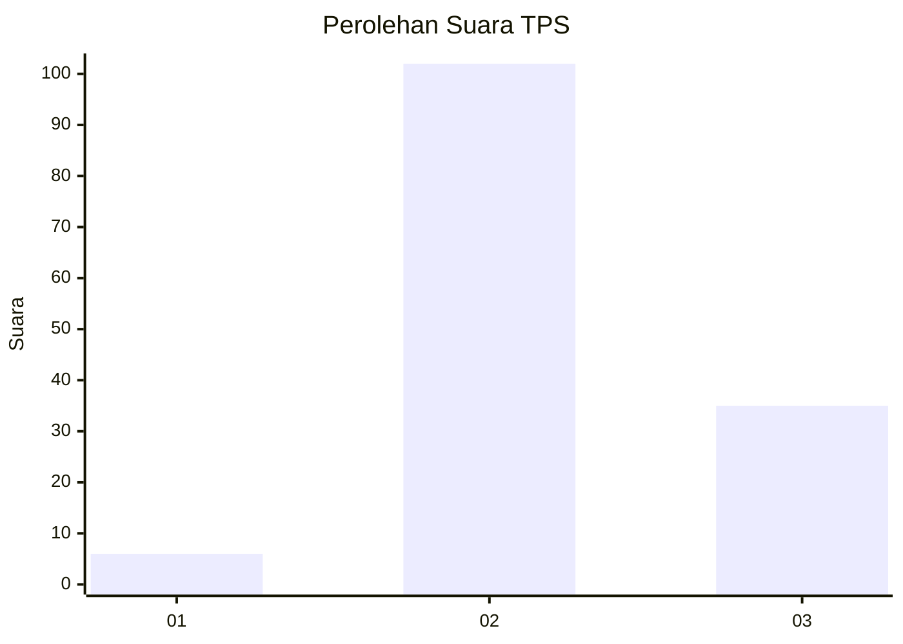
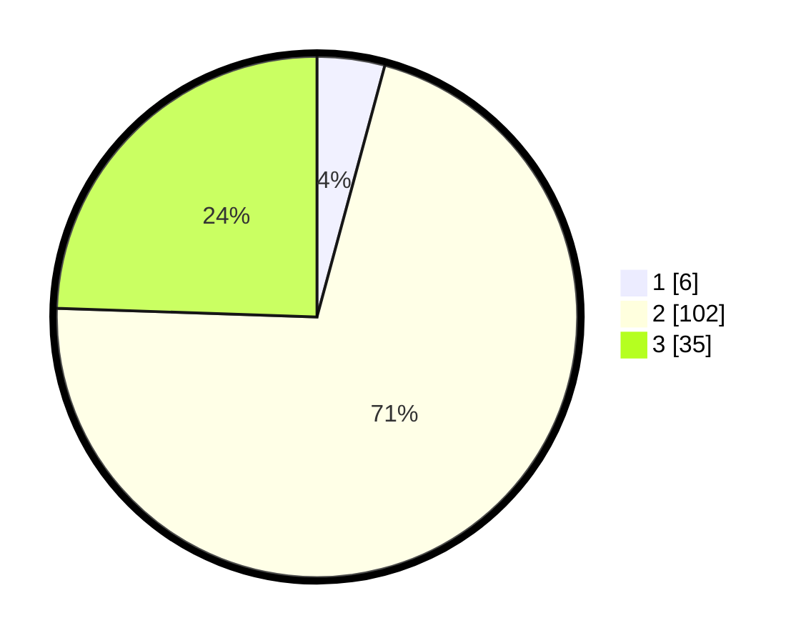

# Hasil

## Grafik

## Tabel

| No. | Nama Paslon    | Suara | Suara (raw) | Persentase |
|:--- |:-------------- | -----:| -----------:| ----------:|
| 1   | ANIES MUHAIMIN | 6     | [6][p-1]    | 4,20       |
| 2   | PRABOWO GIBRAN | 102   | [102][p-2]  | 71,33      |
| 3   | GANJAR MAHFUD  | 35    | [35][p-3]   | 24,48      |

[p-1]: https://github.com/gigit-pemilu/pemilu-2024-34-di-yogyakarta/blob/main/pilpres/hitung-suara/sub/34-di-yogyakarta/sub/03-gunungkidul/sub/10-ponjong/sub/2003-tambakromo/sub/012-tps/sub/paslon-1.txt
[p-2]: https://github.com/gigit-pemilu/pemilu-2024-34-di-yogyakarta/blob/main/pilpres/hitung-suara/sub/34-di-yogyakarta/sub/03-gunungkidul/sub/10-ponjong/sub/2003-tambakromo/sub/012-tps/sub/paslon-2.txt
[p-3]: https://github.com/gigit-pemilu/pemilu-2024-34-di-yogyakarta/blob/main/pilpres/hitung-suara/sub/34-di-yogyakarta/sub/03-gunungkidul/sub/10-ponjong/sub/2003-tambakromo/sub/012-tps/sub/paslon-3.txt

## Foto C Plano

https://sirekap-obj-formc.kpu.go.id/d738/pemilu/ppwp/34/03/10/20/03/3403102003012-20240215-011114--4c34ddd1-a206-4e0a-9f9e-77e391212454.jpg

https://sirekap-obj-formc.kpu.go.id/d738/pemilu/ppwp/34/03/10/20/03/3403102003012-20240215-011226--b9a17581-b4b2-4208-bef2-e26f52dd7b86.jpg

https://sirekap-obj-formc.kpu.go.id/d738/pemilu/ppwp/34/03/10/20/03/3403102003012-20240214-141918--e28c5af9-a000-4ee0-bf05-3f110a6d83fe.jpg

## Metadata

| Key        | Value               |
| ---------- | ------------------- |
| Time Stamp | 2024-02-17 10:30:03 |

