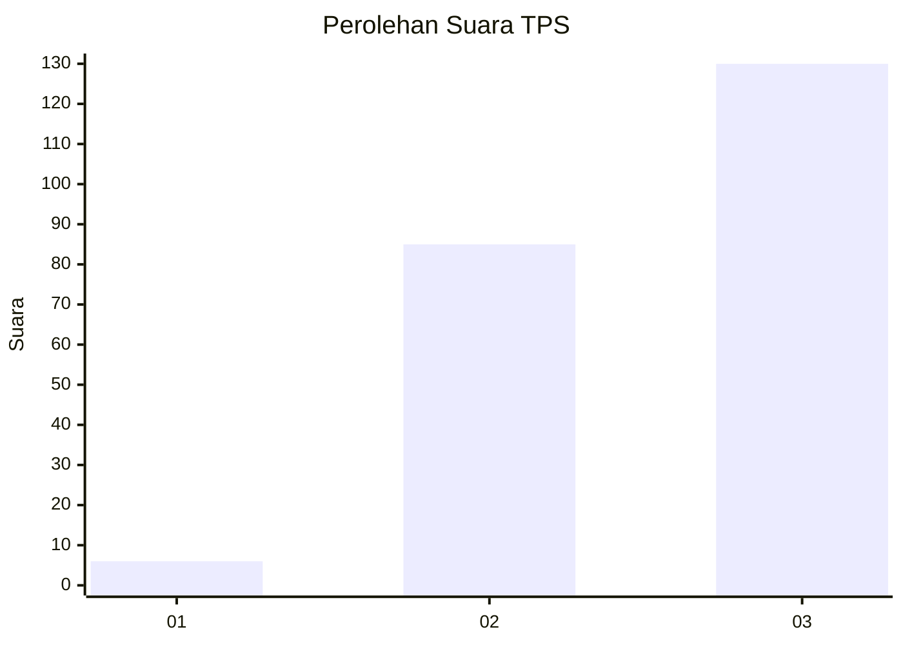
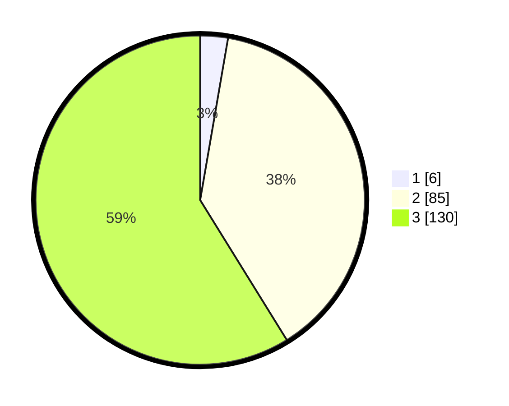

# Hasil

## Grafik

## Tabel

| No. | Nama Paslon    | Suara | Suara (raw) | Persentase |
|:--- |:-------------- | -----:| -----------:| ----------:|
| 1   | ANIES MUHAIMIN | 6     | [6][p-1]    | 2,71       |
| 2   | PRABOWO GIBRAN | 85    | [85][p-2]   | 38,46      |
| 3   | GANJAR MAHFUD  | 130   | [130][p-3]  | 58,82      |

[p-1]: https://github.com/gigit-pemilu/pemilu-2024-34-di-yogyakarta/blob/main/pilpres/hitung-suara/sub/34-di-yogyakarta/sub/03-gunungkidul/sub/10-ponjong/sub/2004-kenteng/sub/004-tps/sub/paslon-1.txt
[p-2]: https://github.com/gigit-pemilu/pemilu-2024-34-di-yogyakarta/blob/main/pilpres/hitung-suara/sub/34-di-yogyakarta/sub/03-gunungkidul/sub/10-ponjong/sub/2004-kenteng/sub/004-tps/sub/paslon-2.txt
[p-3]: https://github.com/gigit-pemilu/pemilu-2024-34-di-yogyakarta/blob/main/pilpres/hitung-suara/sub/34-di-yogyakarta/sub/03-gunungkidul/sub/10-ponjong/sub/2004-kenteng/sub/004-tps/sub/paslon-3.txt

## Foto C Plano

https://sirekap-obj-formc.kpu.go.id/e31b/pemilu/ppwp/34/03/10/20/04/3403102004004-20240214-233349--a6b6e43f-27d7-4138-87f5-9b701defac31.jpg

https://sirekap-obj-formc.kpu.go.id/e31b/pemilu/ppwp/34/03/10/20/04/3403102004004-20240214-233352--dd669218-8f84-40b0-81af-48d94624de41.jpg

https://sirekap-obj-formc.kpu.go.id/e31b/pemilu/ppwp/34/03/10/20/04/3403102004004-20240214-233356--a0f03cef-f9f6-49bf-af80-5054503ac9f1.jpg

## Metadata

| Key        | Value               |
| ---------- | ------------------- |
| Time Stamp | 2024-02-17 10:30:03 |

