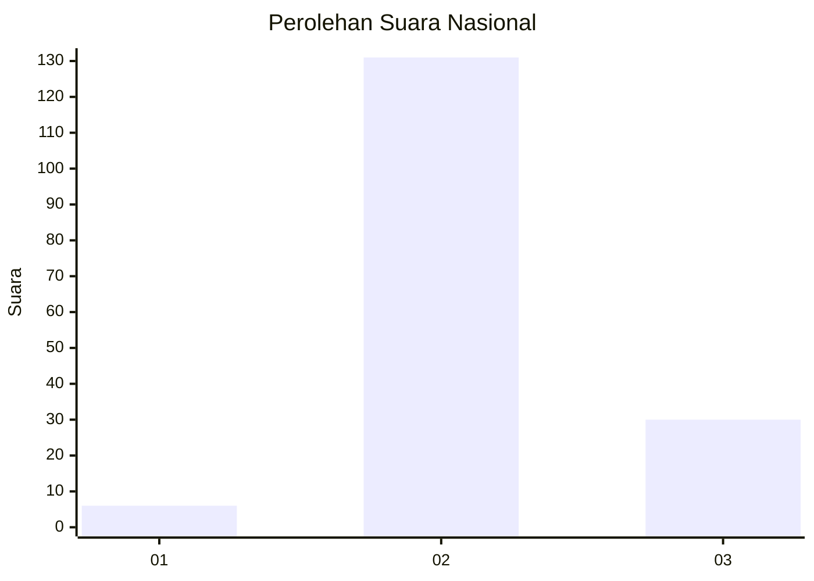

# Hasil

## Grafik

## Tabel

| No. | Nama Paslon    | Suara | Suara (raw) | Persentase |
|:--- |:-------------- | -----:| -----------:| ----------:|
| 1   | ANIES MUHAIMIN | 6     | [6][p-1]    | 3,59       |
| 2   | PRABOWO GIBRAN | 131   | [131][p-2]  | 78,44      |
| 3   | GANJAR MAHFUD  | 30    | [30][p-3]   | 17,96      |

[p-1]: https://github.com/gigit-pemilu/pemilu-2024/blob/main/pilpres/hitung-suara/sub/34-di-yogyakarta/sub/03-gunungkidul/sub/10-ponjong/sub/2004-kenteng/sub/006-tps/sub/paslon-1.txt
[p-2]: https://github.com/gigit-pemilu/pemilu-2024/blob/main/pilpres/hitung-suara/sub/34-di-yogyakarta/sub/03-gunungkidul/sub/10-ponjong/sub/2004-kenteng/sub/006-tps/sub/paslon-2.txt
[p-3]: https://github.com/gigit-pemilu/pemilu-2024/blob/main/pilpres/hitung-suara/sub/34-di-yogyakarta/sub/03-gunungkidul/sub/10-ponjong/sub/2004-kenteng/sub/006-tps/sub/paslon-3.txt

## Foto C Plano

https://sirekap-obj-formc.kpu.go.id/88b3/pemilu/ppwp/34/03/10/20/04/3403102004006-20240214-194046--373024cc-3433-4ea2-ad4b-940203397bb4.jpg

https://sirekap-obj-formc.kpu.go.id/88b3/pemilu/ppwp/34/03/10/20/04/3403102004006-20240214-194201--85cc5297-f3fd-40ca-88ef-a2c169e06bf4.jpg

https://sirekap-obj-formc.kpu.go.id/88b3/pemilu/ppwp/34/03/10/20/04/3403102004006-20240214-194317--83311497-78f2-41ab-80ae-8c3853e1c793.jpg

## Metadata

| Key        | Value               |
| ---------- | ------------------- |
| Time Stamp | 2024-02-17 10:30:03 |

