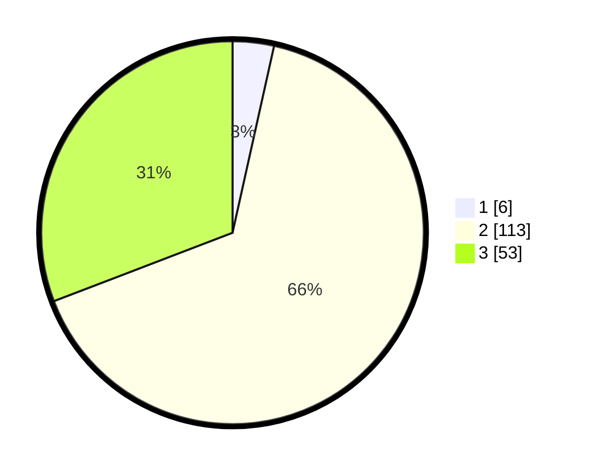

# Hasil

## Grafik

## Tabel

| No. | Nama Paslon    | Suara | Suara (raw) | Persentase |
|:--- |:-------------- | -----:| -----------:| ----------:|
| 1   | ANIES MUHAIMIN | 6     | [6][p-1]    | 3,49       |
| 2   | PRABOWO GIBRAN | 113   | [113][p-2]  | 65,70      |
| 3   | GANJAR MAHFUD  | 53    | [53][p-3]   | 30,81      |

[p-1]: https://github.com/gigit-pemilu/pemilu-2024-34-di-yogyakarta/blob/main/pilpres/hitung-suara/sub/34-di-yogyakarta/sub/03-gunungkidul/sub/10-ponjong/sub/2004-kenteng/sub/012-tps/sub/paslon-1.txt
[p-2]: https://github.com/gigit-pemilu/pemilu-2024-34-di-yogyakarta/blob/main/pilpres/hitung-suara/sub/34-di-yogyakarta/sub/03-gunungkidul/sub/10-ponjong/sub/2004-kenteng/sub/012-tps/sub/paslon-2.txt
[p-3]: https://github.com/gigit-pemilu/pemilu-2024-34-di-yogyakarta/blob/main/pilpres/hitung-suara/sub/34-di-yogyakarta/sub/03-gunungkidul/sub/10-ponjong/sub/2004-kenteng/sub/012-tps/sub/paslon-3.txt

## Foto C Plano

https://sirekap-obj-formc.kpu.go.id/83d1/pemilu/ppwp/34/03/10/20/04/3403102004012-20240215-012946--d6875c7f-cbfb-45f1-ab05-e58f24cdce60.jpg

https://sirekap-obj-formc.kpu.go.id/83d1/pemilu/ppwp/34/03/10/20/04/3403102004012-20240215-013118--7b31268f-a1d1-436d-9df4-3f1225cfe697.jpg

https://sirekap-obj-formc.kpu.go.id/83d1/pemilu/ppwp/34/03/10/20/04/3403102004012-20240215-013246--7245e21c-1465-4c7f-a94c-a900de160c90.jpg

## Metadata

| Key        | Value               |
| ---------- | ------------------- |
| Time Stamp | 2024-02-16 16:25:10 |

