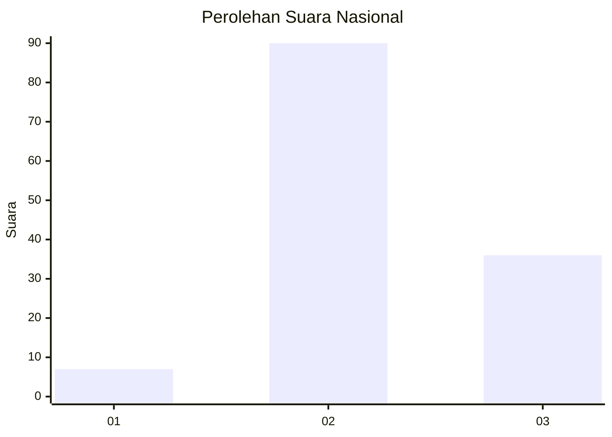
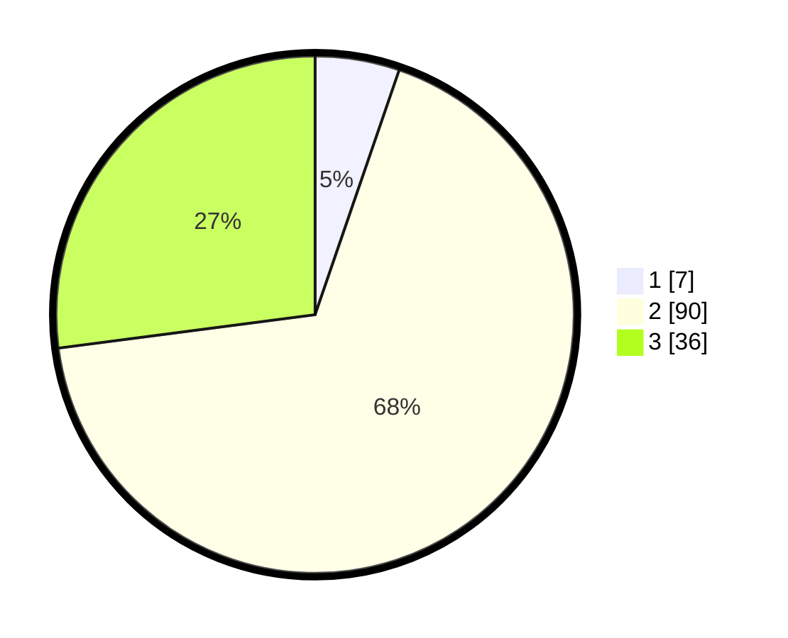

# Hasil

## Grafik

## Tabel

| No. | Nama Paslon    | Suara | Suara (raw) | Persentase |
|:--- |:-------------- | -----:| -----------:| ----------:|
| 1   | ANIES MUHAIMIN | 7     | [7][p-1]    | 5,26       |
| 2   | PRABOWO GIBRAN | 90    | [90][p-2]   | 67,67      |
| 3   | GANJAR MAHFUD  | 36    | [36][p-3]   | 27,07      |

[p-1]: https://github.com/gigit-pemilu/pemilu-2024/blob/main/pilpres/hitung-suara/sub/34-di-yogyakarta/sub/03-gunungkidul/sub/10-ponjong/sub/2005-sumbergiri/sub/002-tps/sub/paslon-1.txt
[p-2]: https://github.com/gigit-pemilu/pemilu-2024/blob/main/pilpres/hitung-suara/sub/34-di-yogyakarta/sub/03-gunungkidul/sub/10-ponjong/sub/2005-sumbergiri/sub/002-tps/sub/paslon-2.txt
[p-3]: https://github.com/gigit-pemilu/pemilu-2024/blob/main/pilpres/hitung-suara/sub/34-di-yogyakarta/sub/03-gunungkidul/sub/10-ponjong/sub/2005-sumbergiri/sub/002-tps/sub/paslon-3.txt

## Foto C Plano

https://sirekap-obj-formc.kpu.go.id/4bef/pemilu/ppwp/34/03/10/20/05/3403102005002-20240215-163027--a0e1662a-ae8e-497d-8a5e-6c0217b6b3d8.jpg

https://sirekap-obj-formc.kpu.go.id/4bef/pemilu/ppwp/34/03/10/20/05/3403102005002-20240214-141858--5c9bc94a-34e8-4ccf-9baa-b84342d72f83.jpg

https://sirekap-obj-formc.kpu.go.id/4bef/pemilu/ppwp/34/03/10/20/05/3403102005002-20240214-200803--45d82599-b25f-47f7-9d2b-fa3a02e81cfd.jpg

## Metadata

| Key        | Value               |
| ---------- | ------------------- |
| Time Stamp | 2024-02-15 17:00:25 |

