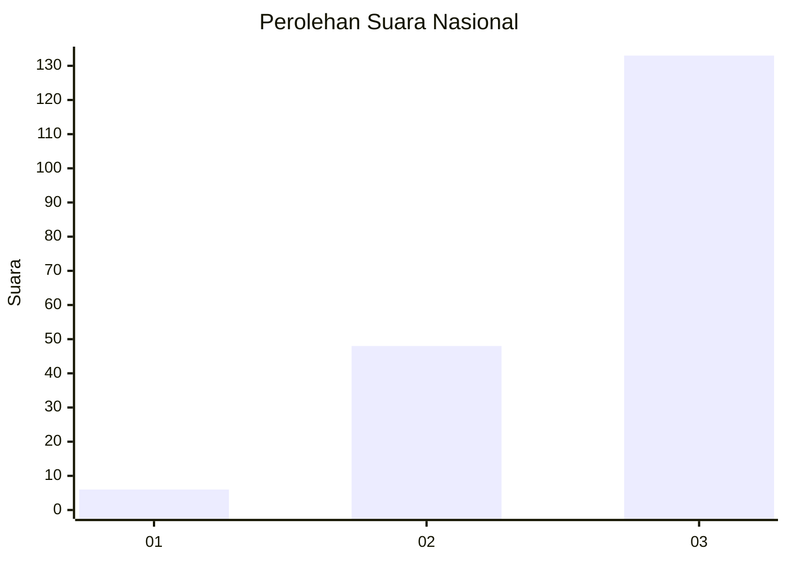
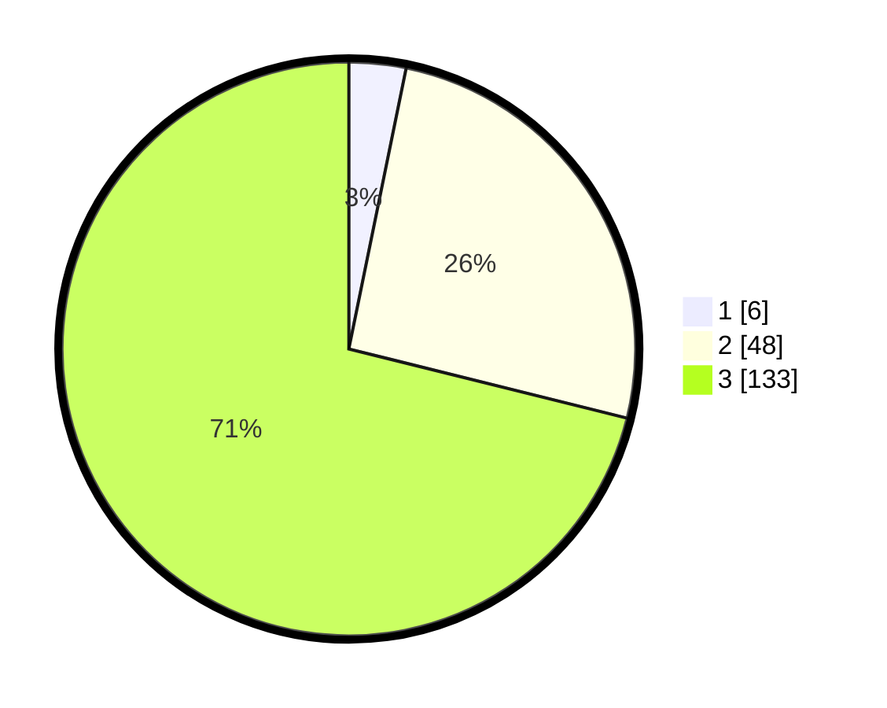

# Hasil

## Grafik

## Tabel

| No. | Nama Paslon    | Suara | Suara (raw) | Persentase |
|:--- |:-------------- | -----:| -----------:| ----------:|
| 1   | ANIES MUHAIMIN | 6     | [6][p-1]    | 3,21       |
| 2   | PRABOWO GIBRAN | 48    | [48][p-2]   | 25,67      |
| 3   | GANJAR MAHFUD  | 133   | [133][p-3]  | 71,12      |

[p-1]: https://github.com/gigit-pemilu/pemilu-2024/blob/main/pilpres/hitung-suara/sub/34-di-yogyakarta/sub/03-gunungkidul/sub/10-ponjong/sub/2005-sumbergiri/sub/003-tps/sub/paslon-1.txt
[p-2]: https://github.com/gigit-pemilu/pemilu-2024/blob/main/pilpres/hitung-suara/sub/34-di-yogyakarta/sub/03-gunungkidul/sub/10-ponjong/sub/2005-sumbergiri/sub/003-tps/sub/paslon-2.txt
[p-3]: https://github.com/gigit-pemilu/pemilu-2024/blob/main/pilpres/hitung-suara/sub/34-di-yogyakarta/sub/03-gunungkidul/sub/10-ponjong/sub/2005-sumbergiri/sub/003-tps/sub/paslon-3.txt

## Foto C Plano

https://sirekap-obj-formc.kpu.go.id/295a/pemilu/ppwp/34/03/10/20/05/3403102005003-20240214-193534--af335e71-4459-40ff-8f1f-80fa50a10c74.jpg

https://sirekap-obj-formc.kpu.go.id/295a/pemilu/ppwp/34/03/10/20/05/3403102005003-20240214-230050--9a909613-9ab7-4bd8-ae7c-d059cf701e7a.jpg

## Metadata

| Key        | Value               |
| ---------- | ------------------- |
| Time Stamp | 2024-02-20 21:00:00 |

