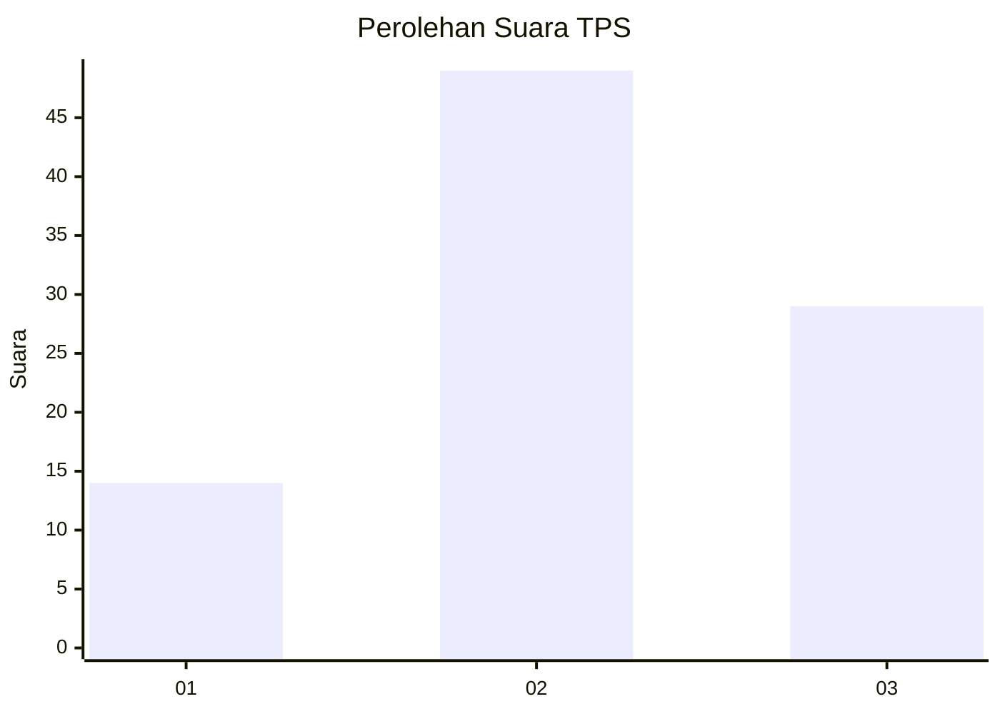
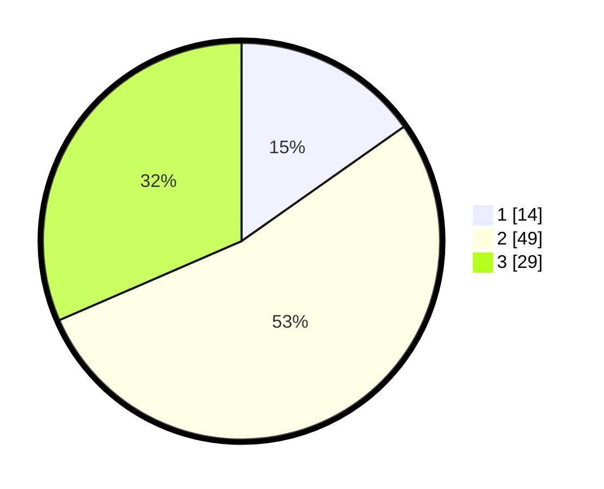

# Hasil

## Grafik

## Tabel

| No. | Nama Paslon    | Suara | Suara (raw) | Persentase |
|:--- |:-------------- | -----:| -----------:| ----------:|
| 1   | ANIES MUHAIMIN | 14    | [14][p-1]   | 15,22      |
| 2   | PRABOWO GIBRAN | 49    | [49][p-2]   | 53,26      |
| 3   | GANJAR MAHFUD  | 29    | [29][p-3]   | 31,52      |

[p-1]: https://github.com/gigit-pemilu/pemilu-2024-34-di-yogyakarta/blob/main/pilpres/hitung-suara/sub/34-di-yogyakarta/sub/03-gunungkidul/sub/10-ponjong/sub/2005-sumbergiri/sub/008-tps/sub/paslon-1.txt
[p-2]: https://github.com/gigit-pemilu/pemilu-2024-34-di-yogyakarta/blob/main/pilpres/hitung-suara/sub/34-di-yogyakarta/sub/03-gunungkidul/sub/10-ponjong/sub/2005-sumbergiri/sub/008-tps/sub/paslon-2.txt
[p-3]: https://github.com/gigit-pemilu/pemilu-2024-34-di-yogyakarta/blob/main/pilpres/hitung-suara/sub/34-di-yogyakarta/sub/03-gunungkidul/sub/10-ponjong/sub/2005-sumbergiri/sub/008-tps/sub/paslon-3.txt

## Foto C Plano

https://sirekap-obj-formc.kpu.go.id/e464/pemilu/ppwp/34/03/10/20/05/3403102005008-20240214-141131--e1ded14e-c005-426b-babe-5b5db4bb607c.jpg

https://sirekap-obj-formc.kpu.go.id/e464/pemilu/ppwp/34/03/10/20/05/3403102005008-20240214-160154--a43f2045-7492-4d6d-855f-1b609dc0a754.jpg

https://sirekap-obj-formc.kpu.go.id/e464/pemilu/ppwp/34/03/10/20/05/3403102005008-20240214-141139--bb5ff274-8354-4b35-bd0a-1150766007f2.jpg

## Metadata

| Key        | Value               |
| ---------- | ------------------- |
| Time Stamp | 2024-02-17 19:30:00 |

## DATA PEMILIH TETAP

Jumlah pemilih dalam DPT: **94**.
 * L: **39**.
 * P: **55**.

## DATA PENGGUNA HAK PILIH

Jumlah pengguna hak pilih dalam DPT: **93**.
 * L: **38**.
 * P: **55**.

Jumlah pengguna hak pilih dalam DPTb: **1**.
 * L: **1**.
 * P: **0**.

Jumlah pengguna hak pilih dalam DPK: **0**.
 * L: **0**.
 * P: **0**.

Jumlah pengguna hak pilih: **94**.
 * L: **39**.
 * P: **55**.

## JUMLAH SUARA SAH DAN TIDAK SAH

JUMLAH SELURUH SUARA SAH: **92**.

JUMLAH SUARA TIDAK SAH: **2**.

JUMLAH SELURUH SUARA SAH DAN SUARA TIDAK SAH: **94**.

