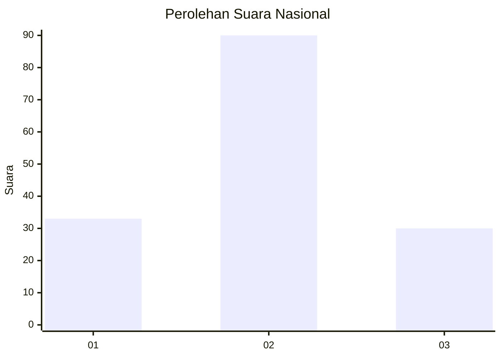
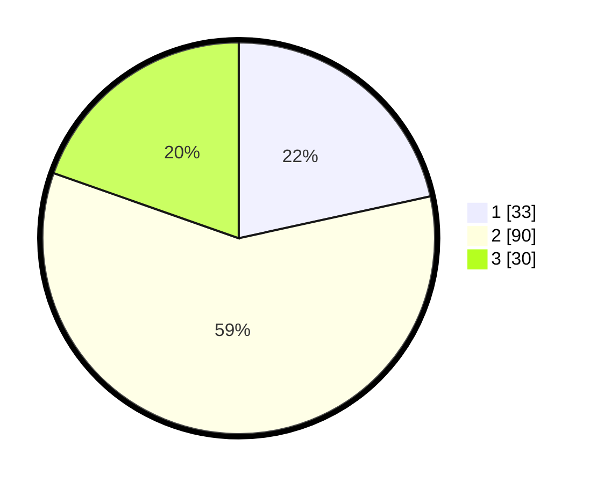

# Hasil

## Grafik

## Tabel

| No. | Nama Paslon    | Suara | Suara (raw) | Persentase |
|:--- |:-------------- | -----:| -----------:| ----------:|
| 1   | ANIES MUHAIMIN | 33    | [33][p-1]   | 21,57      |
| 2   | PRABOWO GIBRAN | 90    | [90][p-2]   | 58,82      |
| 3   | GANJAR MAHFUD  | 30    | [30][p-3]   | 19,61      |

[p-1]: https://github.com/gigit-pemilu/pemilu-2024/blob/main/pilpres/hitung-suara/sub/34-di-yogyakarta/sub/03-gunungkidul/sub/10-ponjong/sub/2005-sumbergiri/sub/011-tps/sub/paslon-1.txt
[p-2]: https://github.com/gigit-pemilu/pemilu-2024/blob/main/pilpres/hitung-suara/sub/34-di-yogyakarta/sub/03-gunungkidul/sub/10-ponjong/sub/2005-sumbergiri/sub/011-tps/sub/paslon-2.txt
[p-3]: https://github.com/gigit-pemilu/pemilu-2024/blob/main/pilpres/hitung-suara/sub/34-di-yogyakarta/sub/03-gunungkidul/sub/10-ponjong/sub/2005-sumbergiri/sub/011-tps/sub/paslon-3.txt

## Foto C Plano

https://sirekap-obj-formc.kpu.go.id/d8f5/pemilu/ppwp/34/03/10/20/05/3403102005011-20240214-214546--91253966-51ab-402f-a788-e088935afc65.jpg

https://sirekap-obj-formc.kpu.go.id/d8f5/pemilu/ppwp/34/03/10/20/05/3403102005011-20240214-214527--aa3a7ff4-e362-4612-aa0e-64da76a175d2.jpg

https://sirekap-obj-formc.kpu.go.id/d8f5/pemilu/ppwp/34/03/10/20/05/3403102005011-20240214-214331--2529c9c7-9917-4e3a-8199-9033e225325b.jpg

## Metadata

| Key        | Value               |
| ---------- | ------------------- |
| Time Stamp | 2024-02-19 06:16:00 |

