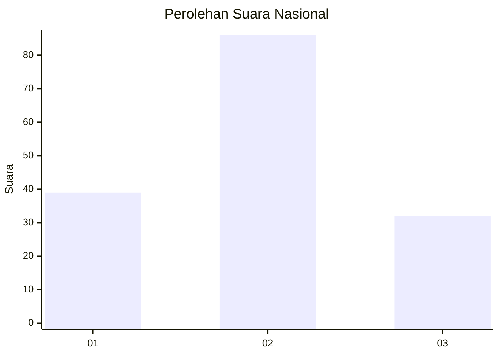
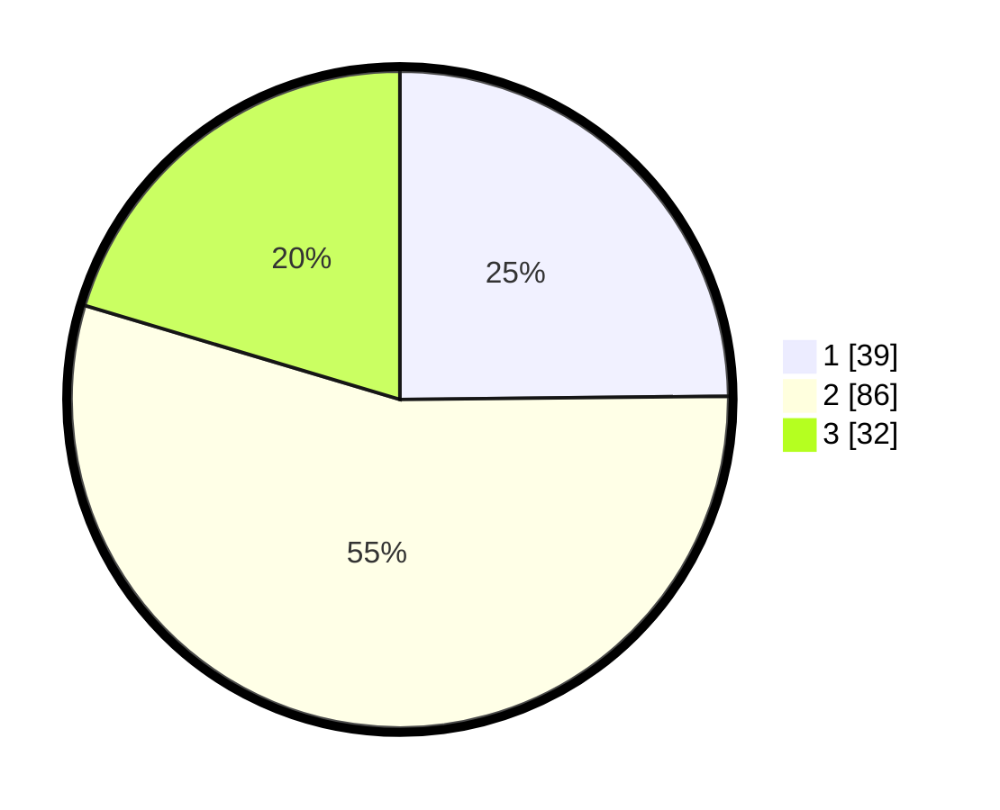

# Hasil

## Grafik

## Tabel

| No. | Nama Paslon    | Suara | Suara (raw) | Persentase |
|:--- |:-------------- | -----:| -----------:| ----------:|
| 1   | ANIES MUHAIMIN | 39    | [39][p-1]   | 24,84      |
| 2   | PRABOWO GIBRAN | 86    | [86][p-2]   | 54,78      |
| 3   | GANJAR MAHFUD  | 32    | [32][p-3]   | 20,38      |

[p-1]: https://github.com/gigit-pemilu/pemilu-2024/blob/main/pilpres/hitung-suara/sub/34-di-yogyakarta/sub/03-gunungkidul/sub/10-ponjong/sub/2005-sumbergiri/sub/013-tps/sub/paslon-1.txt
[p-2]: https://github.com/gigit-pemilu/pemilu-2024/blob/main/pilpres/hitung-suara/sub/34-di-yogyakarta/sub/03-gunungkidul/sub/10-ponjong/sub/2005-sumbergiri/sub/013-tps/sub/paslon-2.txt
[p-3]: https://github.com/gigit-pemilu/pemilu-2024/blob/main/pilpres/hitung-suara/sub/34-di-yogyakarta/sub/03-gunungkidul/sub/10-ponjong/sub/2005-sumbergiri/sub/013-tps/sub/paslon-3.txt

## Foto C Plano

https://sirekap-obj-formc.kpu.go.id/0e4b/pemilu/ppwp/34/03/10/20/05/3403102005013-20240216-212434--d406294e-ab1b-4794-9277-b42faf43b77d.jpg

https://sirekap-obj-formc.kpu.go.id/0e4b/pemilu/ppwp/34/03/10/20/05/3403102005013-20240216-212518--10648a54-3175-47a5-84e7-48aaabd6a34d.jpg

https://sirekap-obj-formc.kpu.go.id/0e4b/pemilu/ppwp/34/03/10/20/05/3403102005013-20240216-212639--89d63a24-8a93-44c0-b0b2-862041af2668.jpg

## Metadata

| Key        | Value               |
| ---------- | ------------------- |
| Time Stamp | 2024-02-19 06:16:00 |

