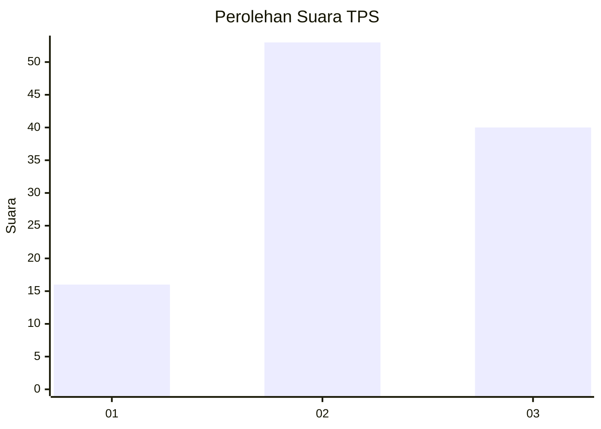
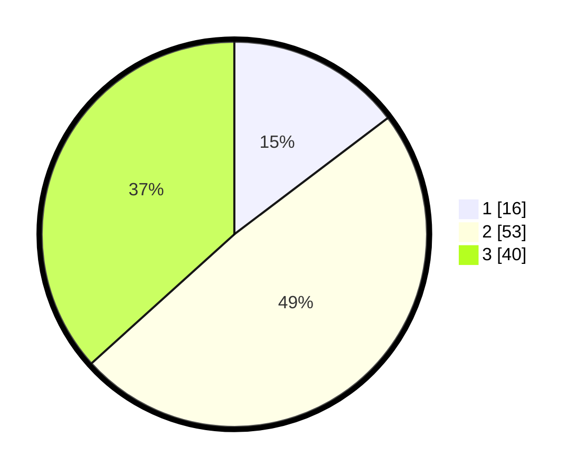

# Hasil

## Grafik

## Tabel

| No. | Nama Paslon    | Suara | Suara (raw) | Persentase |
|:--- |:-------------- | -----:| -----------:| ----------:|
| 1   | ANIES MUHAIMIN | 16    | [16][p-1]   | 14,68      |
| 2   | PRABOWO GIBRAN | 53    | [53][p-2]   | 48,62      |
| 3   | GANJAR MAHFUD  | 40    | [40][p-3]   | 36,70      |

[p-1]: https://github.com/gigit-pemilu/pemilu-2024-34-di-yogyakarta/blob/main/pilpres/hitung-suara/sub/34-di-yogyakarta/sub/03-gunungkidul/sub/10-ponjong/sub/2005-sumbergiri/sub/014-tps/sub/paslon-1.txt
[p-2]: https://github.com/gigit-pemilu/pemilu-2024-34-di-yogyakarta/blob/main/pilpres/hitung-suara/sub/34-di-yogyakarta/sub/03-gunungkidul/sub/10-ponjong/sub/2005-sumbergiri/sub/014-tps/sub/paslon-2.txt
[p-3]: https://github.com/gigit-pemilu/pemilu-2024-34-di-yogyakarta/blob/main/pilpres/hitung-suara/sub/34-di-yogyakarta/sub/03-gunungkidul/sub/10-ponjong/sub/2005-sumbergiri/sub/014-tps/sub/paslon-3.txt

## Foto C Plano

https://sirekap-obj-formc.kpu.go.id/ff5f/pemilu/ppwp/34/03/10/20/05/3403102005014-20240214-232150--8e22349a-fac6-4550-aea7-542e60d276e4.jpg

https://sirekap-obj-formc.kpu.go.id/ff5f/pemilu/ppwp/34/03/10/20/05/3403102005014-20240214-191416--dcdf04d4-a9ea-4297-917d-2e4de3af83fc.jpg

https://sirekap-obj-formc.kpu.go.id/ff5f/pemilu/ppwp/34/03/10/20/05/3403102005014-20240214-231847--a9d99179-e169-4a86-a2fa-14782e606074.jpg

## Metadata

| Key        | Value               |
| ---------- | ------------------- |
| Time Stamp | 2024-02-15 06:00:23 |

