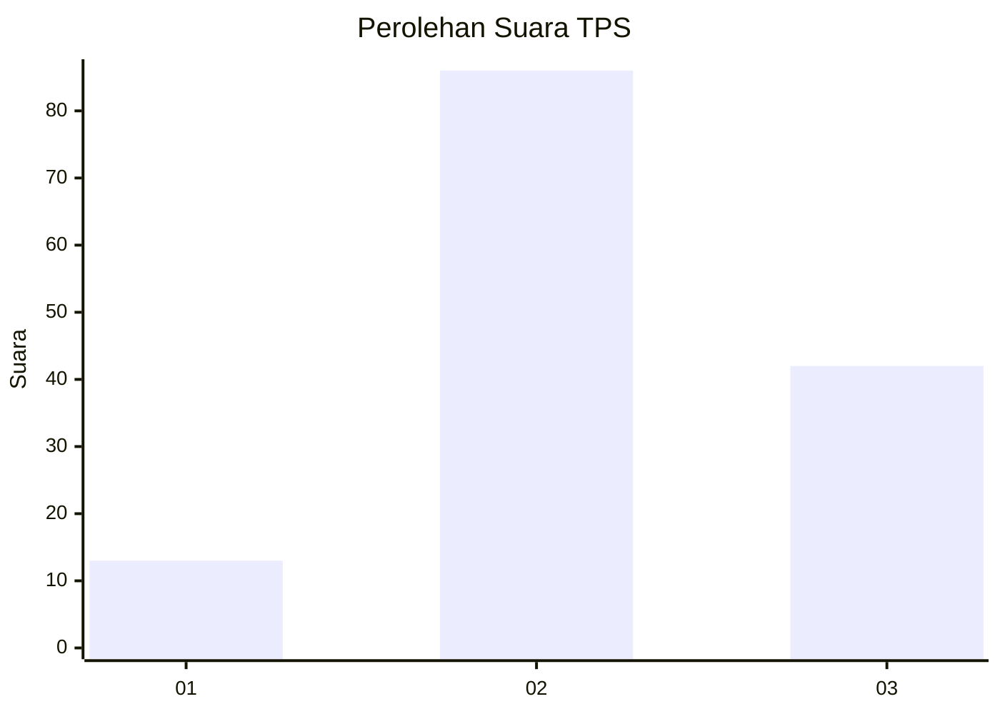
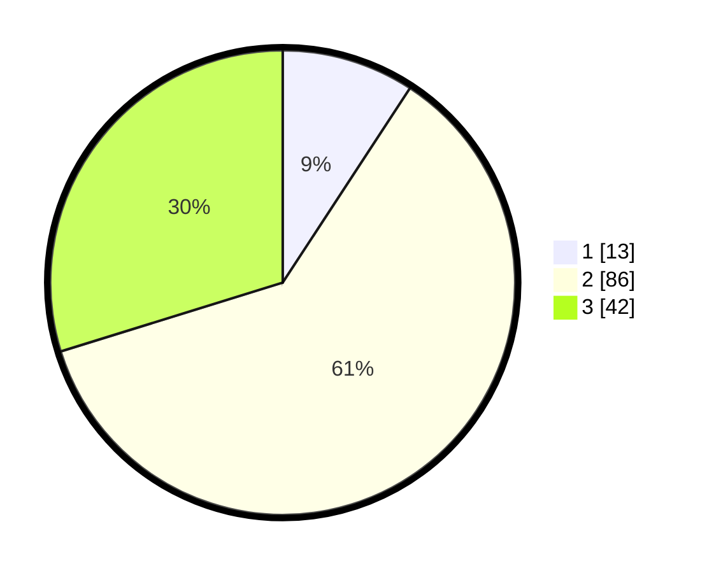

# Hasil

## Grafik

## Tabel

| No. | Nama Paslon    | Suara | Suara (raw) | Persentase |
|:--- |:-------------- | -----:| -----------:| ----------:|
| 1   | ANIES MUHAIMIN | 13    | [13][p-1]   | 9,22       |
| 2   | PRABOWO GIBRAN | 86    | [86][p-2]   | 60,99      |
| 3   | GANJAR MAHFUD  | 42    | [42][p-3]   | 29,79      |

[p-1]: https://github.com/gigit-pemilu/pemilu-2024-34-di-yogyakarta/blob/main/pilpres/hitung-suara/sub/34-di-yogyakarta/sub/03-gunungkidul/sub/10-ponjong/sub/2005-sumbergiri/sub/017-tps/sub/paslon-1.txt
[p-2]: https://github.com/gigit-pemilu/pemilu-2024-34-di-yogyakarta/blob/main/pilpres/hitung-suara/sub/34-di-yogyakarta/sub/03-gunungkidul/sub/10-ponjong/sub/2005-sumbergiri/sub/017-tps/sub/paslon-2.txt
[p-3]: https://github.com/gigit-pemilu/pemilu-2024-34-di-yogyakarta/blob/main/pilpres/hitung-suara/sub/34-di-yogyakarta/sub/03-gunungkidul/sub/10-ponjong/sub/2005-sumbergiri/sub/017-tps/sub/paslon-3.txt

## Foto C Plano

https://sirekap-obj-formc.kpu.go.id/f6a0/pemilu/ppwp/34/03/10/20/05/3403102005017-20240214-141511--c3a7c214-53d2-4c7c-8219-6b56a960c1b5.jpg

https://sirekap-obj-formc.kpu.go.id/f6a0/pemilu/ppwp/34/03/10/20/05/3403102005017-20240214-141033--04fcf799-49fc-4306-a867-f47cb9bf51b9.jpg

https://sirekap-obj-formc.kpu.go.id/f6a0/pemilu/ppwp/34/03/10/20/05/3403102005017-20240214-141156--48867407-4eb1-4248-b59d-eeb8cb8112fa.jpg

## Metadata

| Key        | Value               |
| ---------- | ------------------- |
| Time Stamp | 2024-02-17 19:30:00 |

