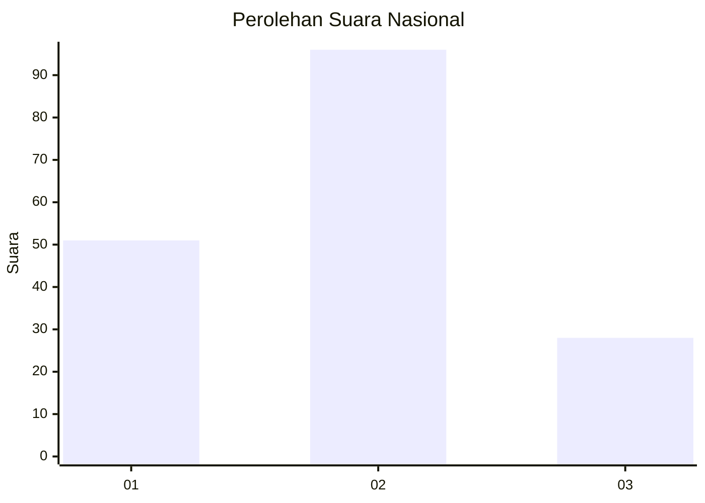
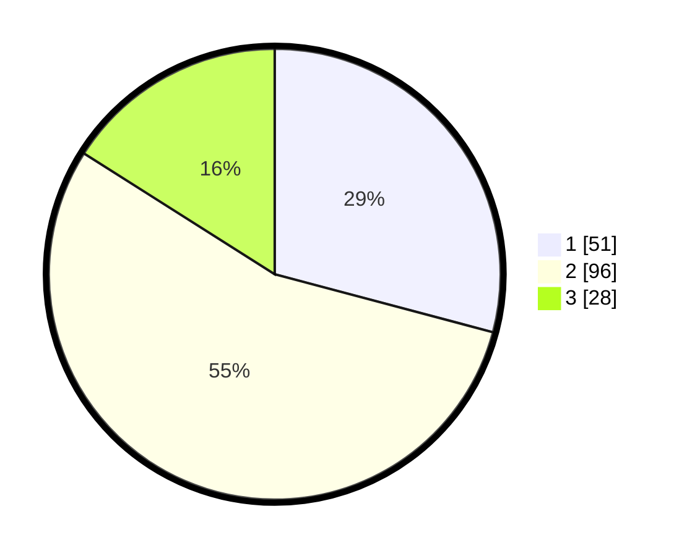

# Hasil

## Grafik

## Tabel

| No. | Nama Paslon    | Suara | Suara (raw) | Persentase |
|:--- |:-------------- | -----:| -----------:| ----------:|
| 1   | ANIES MUHAIMIN | 51    | [51][p-1]   | 29,14      |
| 2   | PRABOWO GIBRAN | 96    | [96][p-2]   | 54,86      |
| 3   | GANJAR MAHFUD  | 28    | [28][p-3]   | 16,00      |

[p-1]: https://github.com/gigit-pemilu/pemilu-2024/blob/main/pilpres/hitung-suara/sub/34-di-yogyakarta/sub/03-gunungkidul/sub/10-ponjong/sub/2005-sumbergiri/sub/019-tps/sub/paslon-1.txt
[p-2]: https://github.com/gigit-pemilu/pemilu-2024/blob/main/pilpres/hitung-suara/sub/34-di-yogyakarta/sub/03-gunungkidul/sub/10-ponjong/sub/2005-sumbergiri/sub/019-tps/sub/paslon-2.txt
[p-3]: https://github.com/gigit-pemilu/pemilu-2024/blob/main/pilpres/hitung-suara/sub/34-di-yogyakarta/sub/03-gunungkidul/sub/10-ponjong/sub/2005-sumbergiri/sub/019-tps/sub/paslon-3.txt

## Foto C Plano

https://sirekap-obj-formc.kpu.go.id/25f4/pemilu/ppwp/34/03/10/20/05/3403102005019-20240214-233021--4c1dfa23-5975-4cc8-8bec-96887e499e41.jpg

https://sirekap-obj-formc.kpu.go.id/25f4/pemilu/ppwp/34/03/10/20/05/3403102005019-20240214-160056--1cac7699-9b36-437b-85b4-bb2f447ecf04.jpg

https://sirekap-obj-formc.kpu.go.id/25f4/pemilu/ppwp/34/03/10/20/05/3403102005019-20240214-160128--8799b907-872c-41e4-bf6a-3735d680bbea.jpg

## Metadata

| Key        | Value               |
| ---------- | ------------------- |
| Time Stamp | 2024-02-15 19:30:26 |

