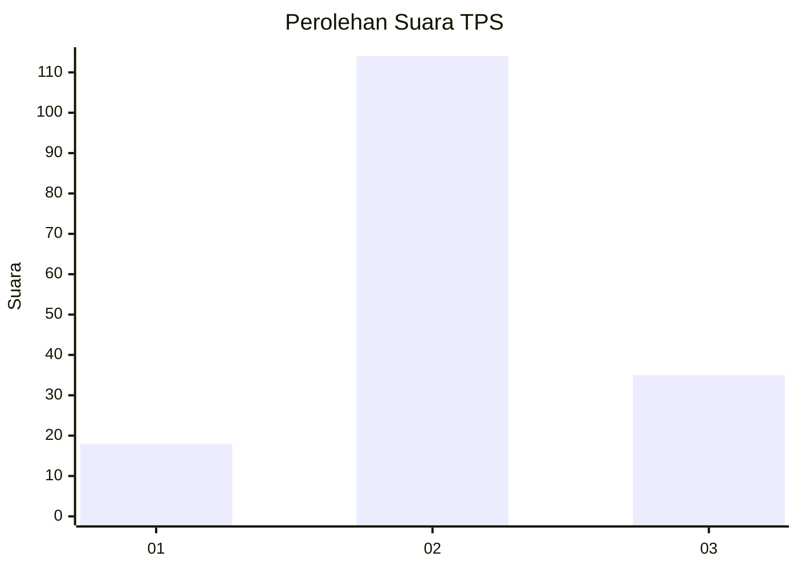
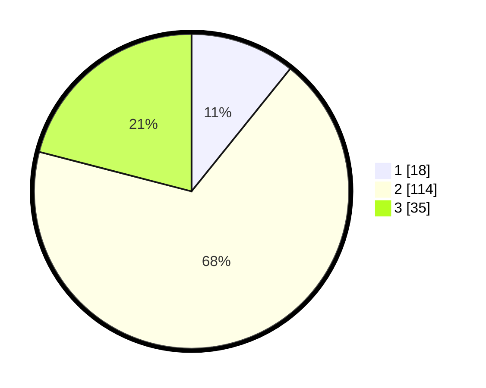

# Hasil

## Grafik

## Tabel

| No. | Nama Paslon    | Suara | Suara (raw) | Persentase |
|:--- |:-------------- | -----:| -----------:| ----------:|
| 1   | ANIES MUHAIMIN | 18    | [18][p-1]   | 10,78      |
| 2   | PRABOWO GIBRAN | 114   | [114][p-2]  | 68,26      |
| 3   | GANJAR MAHFUD  | 35    | [35][p-3]   | 20,96      |

[p-1]: https://github.com/gigit-pemilu/pemilu-2024-34-di-yogyakarta/blob/main/pilpres/hitung-suara/sub/34-di-yogyakarta/sub/03-gunungkidul/sub/10-ponjong/sub/2005-sumbergiri/sub/020-tps/sub/paslon-1.txt
[p-2]: https://github.com/gigit-pemilu/pemilu-2024-34-di-yogyakarta/blob/main/pilpres/hitung-suara/sub/34-di-yogyakarta/sub/03-gunungkidul/sub/10-ponjong/sub/2005-sumbergiri/sub/020-tps/sub/paslon-2.txt
[p-3]: https://github.com/gigit-pemilu/pemilu-2024-34-di-yogyakarta/blob/main/pilpres/hitung-suara/sub/34-di-yogyakarta/sub/03-gunungkidul/sub/10-ponjong/sub/2005-sumbergiri/sub/020-tps/sub/paslon-3.txt

## Foto C Plano

https://sirekap-obj-formc.kpu.go.id/fdde/pemilu/ppwp/34/03/10/20/05/3403102005020-20240215-000710--3250c088-a4fb-4299-8330-7fe88870cd8d.jpg

https://sirekap-obj-formc.kpu.go.id/fdde/pemilu/ppwp/34/03/10/20/05/3403102005020-20240215-000726--1db72757-0a6f-4678-ba56-8f10a87b0fe7.jpg

https://sirekap-obj-formc.kpu.go.id/fdde/pemilu/ppwp/34/03/10/20/05/3403102005020-20240215-000735--c408fab7-c5c3-49af-bd43-be7518ddc81d.jpg

## Metadata

| Key        | Value               |
| ---------- | ------------------- |
| Time Stamp | 2024-02-15 12:00:28 |

