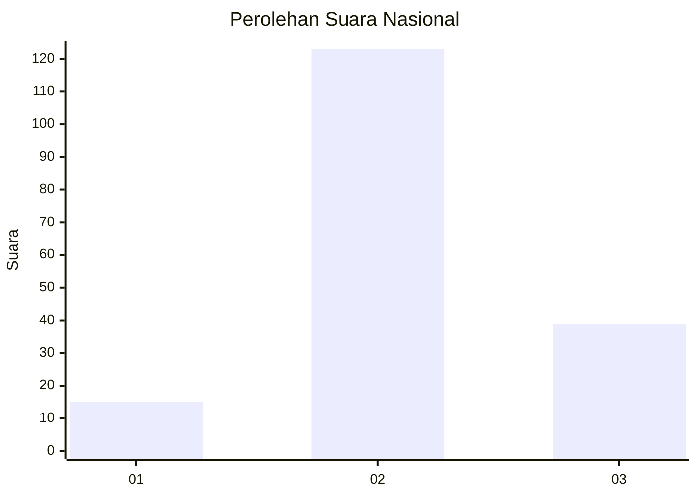
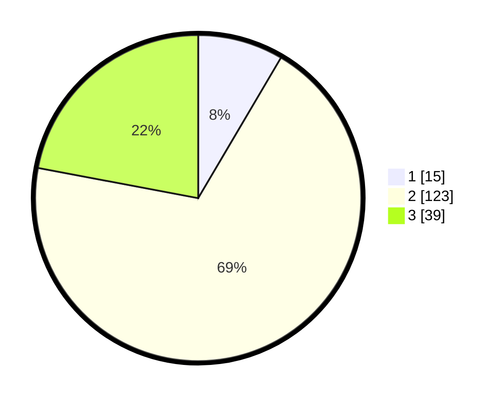

# Hasil

## Grafik

## Tabel

| No. | Nama Paslon    | Suara | Suara (raw) | Persentase |
|:--- |:-------------- | -----:| -----------:| ----------:|
| 1   | ANIES MUHAIMIN | 15    | [15][p-1]   | 8,47       |
| 2   | PRABOWO GIBRAN | 123   | [123][p-2]  | 69,49      |
| 3   | GANJAR MAHFUD  | 39    | [39][p-3]   | 22,03      |

[p-1]: https://github.com/gigit-pemilu/pemilu-2024/blob/main/pilpres/hitung-suara/sub/34-di-yogyakarta/sub/03-gunungkidul/sub/10-ponjong/sub/2006-genjahan/sub/023-tps/sub/paslon-1.txt
[p-2]: https://github.com/gigit-pemilu/pemilu-2024/blob/main/pilpres/hitung-suara/sub/34-di-yogyakarta/sub/03-gunungkidul/sub/10-ponjong/sub/2006-genjahan/sub/023-tps/sub/paslon-2.txt
[p-3]: https://github.com/gigit-pemilu/pemilu-2024/blob/main/pilpres/hitung-suara/sub/34-di-yogyakarta/sub/03-gunungkidul/sub/10-ponjong/sub/2006-genjahan/sub/023-tps/sub/paslon-3.txt

## Foto C Plano

https://sirekap-obj-formc.kpu.go.id/216a/pemilu/ppwp/34/03/10/20/06/3403102006023-20240214-141817--1d404346-07af-479f-8abd-5d3e3f155df8.jpg

https://sirekap-obj-formc.kpu.go.id/216a/pemilu/ppwp/34/03/10/20/06/3403102006023-20240214-141525--13d76c8a-61a0-43e4-ae32-e3d3768076c1.jpg

https://sirekap-obj-formc.kpu.go.id/216a/pemilu/ppwp/34/03/10/20/06/3403102006023-20240214-141619--e397b4f1-bfdf-42e8-b4be-49460b2b892d.jpg

## Metadata

| Key        | Value               |
| ---------- | ------------------- |
| Time Stamp | 2024-02-17 11:00:02 |

