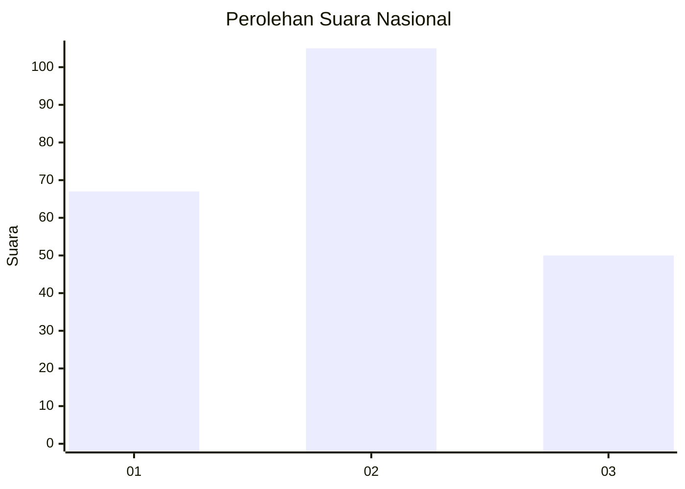
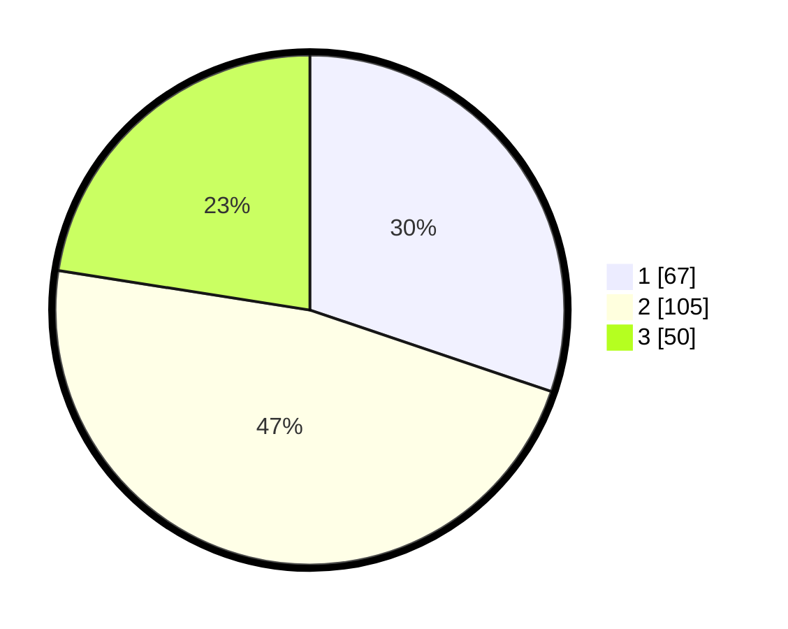

# Hasil

## Grafik

## Tabel

| No. | Nama Paslon    | Suara | Suara (raw) | Persentase |
|:--- |:-------------- | -----:| -----------:| ----------:|
| 1   | ANIES MUHAIMIN | 67    | [67][p-1]   | 30,18      |
| 2   | PRABOWO GIBRAN | 105   | [105][p-2]  | 47,30      |
| 3   | GANJAR MAHFUD  | 50    | [50][p-3]   | 22,52      |

[p-1]: https://github.com/gigit-pemilu/pemilu-2024/blob/main/pilpres/hitung-suara/sub/34-di-yogyakarta/sub/03-gunungkidul/sub/10-ponjong/sub/2007-ponjong/sub/002-tps/sub/paslon-1.txt
[p-2]: https://github.com/gigit-pemilu/pemilu-2024/blob/main/pilpres/hitung-suara/sub/34-di-yogyakarta/sub/03-gunungkidul/sub/10-ponjong/sub/2007-ponjong/sub/002-tps/sub/paslon-2.txt
[p-3]: https://github.com/gigit-pemilu/pemilu-2024/blob/main/pilpres/hitung-suara/sub/34-di-yogyakarta/sub/03-gunungkidul/sub/10-ponjong/sub/2007-ponjong/sub/002-tps/sub/paslon-3.txt

## Foto C Plano

https://sirekap-obj-formc.kpu.go.id/b79e/pemilu/ppwp/34/03/10/20/07/3403102007002-20240216-145054--d547e138-f153-4bf6-923c-320394bd2e58.jpg

https://sirekap-obj-formc.kpu.go.id/b79e/pemilu/ppwp/34/03/10/20/07/3403102007002-20240216-145055--a1486f74-8270-4ac3-8e09-54df968f86d0.jpg

https://sirekap-obj-formc.kpu.go.id/b79e/pemilu/ppwp/34/03/10/20/07/3403102007002-20240216-145055--10fd2612-414c-4a41-836f-13fc76384a34.jpg

## Metadata

| Key        | Value               |
| ---------- | ------------------- |
| Time Stamp | 2024-02-17 18:00:00 |

## DATA PEMILIH TETAP

Jumlah pemilih dalam DPT: **240**.
 * L: **114**.
 * P: **126**.

## DATA PENGGUNA HAK PILIH

Jumlah pengguna hak pilih dalam DPT: **209**.
 * L: **96**.
 * P: **113**.

Jumlah pengguna hak pilih dalam DPTb: **14**.
 * L: **0**.
 * P: **14**.

Jumlah pengguna hak pilih dalam DPK: **1**.
 * L: **1**.
 * P: **0**.

Jumlah pengguna hak pilih: **224**.
 * L: **97**.
 * P: **127**.

## JUMLAH SUARA SAH DAN TIDAK SAH

JUMLAH SELURUH SUARA SAH: **222**.

JUMLAH SUARA TIDAK SAH: **2**.

JUMLAH SELURUH SUARA SAH DAN SUARA TIDAK SAH: **224**.

