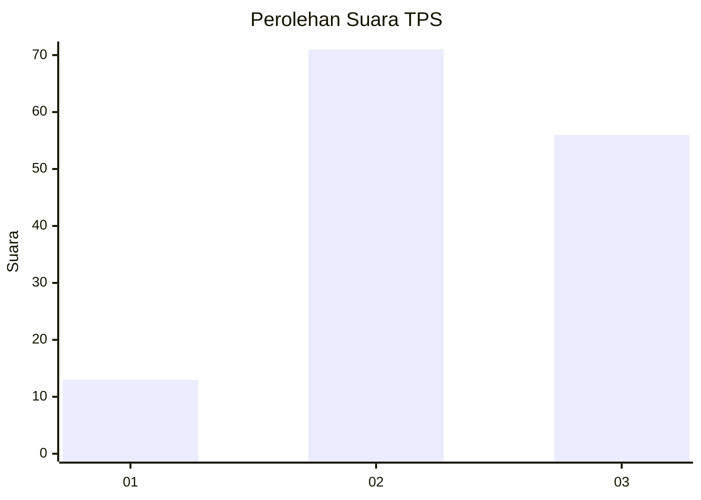
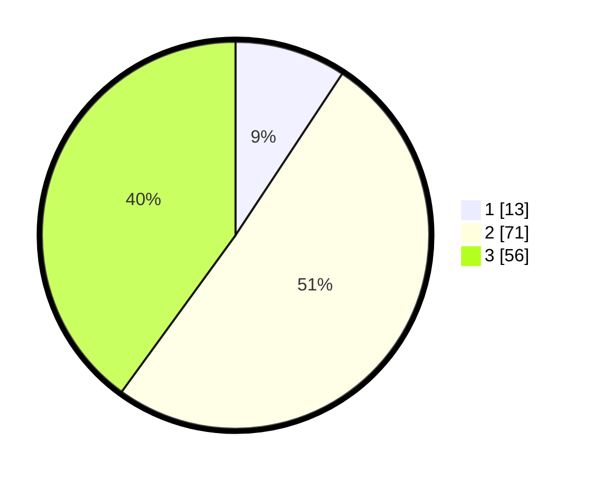

# Hasil

## Grafik

## Tabel

| No. | Nama Paslon    | Suara | Suara (raw) | Persentase |
|:--- |:-------------- | -----:| -----------:| ----------:|
| 1   | ANIES MUHAIMIN | 13    | [13][p-1]   | 9,29       |
| 2   | PRABOWO GIBRAN | 71    | [71][p-2]   | 50,71      |
| 3   | GANJAR MAHFUD  | 56    | [56][p-3]   | 40,00      |

[p-1]: https://github.com/gigit-pemilu/pemilu-2024-34-di-yogyakarta/blob/main/pilpres/hitung-suara/sub/34-di-yogyakarta/sub/03-gunungkidul/sub/10-ponjong/sub/2008-karangasem/sub/001-tps/sub/paslon-1.txt
[p-2]: https://github.com/gigit-pemilu/pemilu-2024-34-di-yogyakarta/blob/main/pilpres/hitung-suara/sub/34-di-yogyakarta/sub/03-gunungkidul/sub/10-ponjong/sub/2008-karangasem/sub/001-tps/sub/paslon-2.txt
[p-3]: https://github.com/gigit-pemilu/pemilu-2024-34-di-yogyakarta/blob/main/pilpres/hitung-suara/sub/34-di-yogyakarta/sub/03-gunungkidul/sub/10-ponjong/sub/2008-karangasem/sub/001-tps/sub/paslon-3.txt

## Foto C Plano

https://sirekap-obj-formc.kpu.go.id/4868/pemilu/ppwp/34/03/10/20/08/3403102008001-20240214-141510--0b3885e5-9007-4597-91b6-61500b561acf.jpg

https://sirekap-obj-formc.kpu.go.id/4868/pemilu/ppwp/34/03/10/20/08/3403102008001-20240214-141239--b4fe8328-db38-46c0-916a-cbfec8ed2189.jpg

https://sirekap-obj-formc.kpu.go.id/4868/pemilu/ppwp/34/03/10/20/08/3403102008001-20240214-141331--4ab988ff-bee6-445f-a6be-46632e554405.jpg

## Metadata

| Key        | Value               |
| ---------- | ------------------- |
| Time Stamp | 2024-02-14 21:46:01 |

