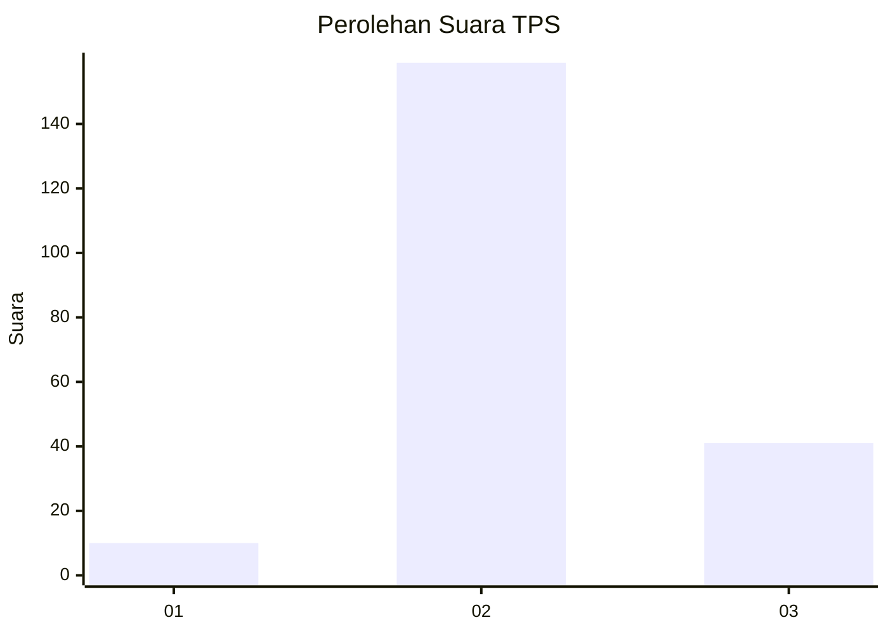
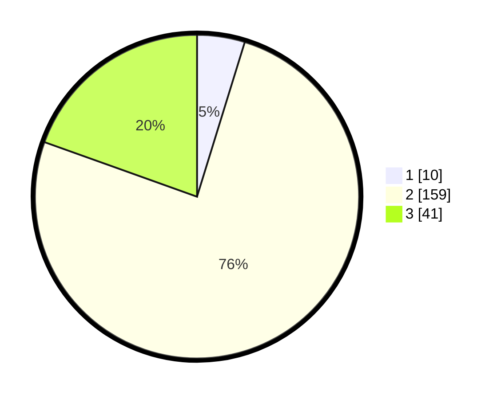

# Hasil

## Grafik

## Tabel

| No. | Nama Paslon    | Suara | Suara (raw) | Persentase |
|:--- |:-------------- | -----:| -----------:| ----------:|
| 1   | ANIES MUHAIMIN | 10    | [10][p-1]   | 4,76       |
| 2   | PRABOWO GIBRAN | 159   | [159][p-2]  | 75,71      |
| 3   | GANJAR MAHFUD  | 41    | [41][p-3]   | 19,52      |

[p-1]: https://github.com/gigit-pemilu/pemilu-2024-34-di-yogyakarta/blob/main/pilpres/hitung-suara/sub/34-di-yogyakarta/sub/03-gunungkidul/sub/10-ponjong/sub/2008-karangasem/sub/010-tps/sub/paslon-1.txt
[p-2]: https://github.com/gigit-pemilu/pemilu-2024-34-di-yogyakarta/blob/main/pilpres/hitung-suara/sub/34-di-yogyakarta/sub/03-gunungkidul/sub/10-ponjong/sub/2008-karangasem/sub/010-tps/sub/paslon-2.txt
[p-3]: https://github.com/gigit-pemilu/pemilu-2024-34-di-yogyakarta/blob/main/pilpres/hitung-suara/sub/34-di-yogyakarta/sub/03-gunungkidul/sub/10-ponjong/sub/2008-karangasem/sub/010-tps/sub/paslon-3.txt

## Foto C Plano

https://sirekap-obj-formc.kpu.go.id/17c6/pemilu/ppwp/34/03/10/20/08/3403102008010-20240214-191302--bdb8087c-bed5-4623-a1e4-41c9b06ceda4.jpg

https://sirekap-obj-formc.kpu.go.id/17c6/pemilu/ppwp/34/03/10/20/08/3403102008010-20240214-190324--d9ce5e9e-54e2-46e7-8cad-dc90322a0c61.jpg

https://sirekap-obj-formc.kpu.go.id/17c6/pemilu/ppwp/34/03/10/20/08/3403102008010-20240214-190356--7734410f-af77-4f2e-9006-256a7625af2a.jpg

## Metadata

| Key        | Value               |
| ---------- | ------------------- |
| Time Stamp | 2024-02-15 07:00:44 |

