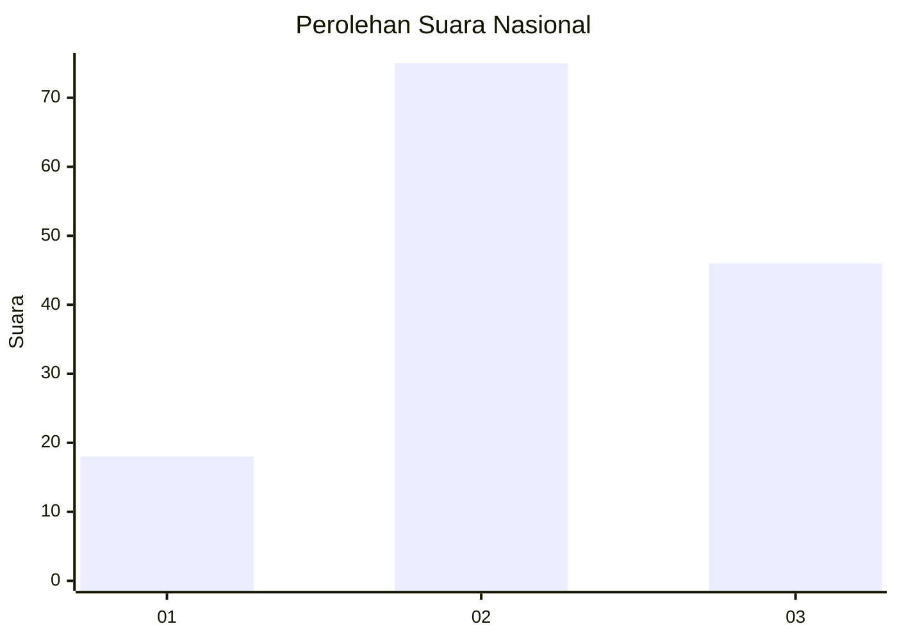
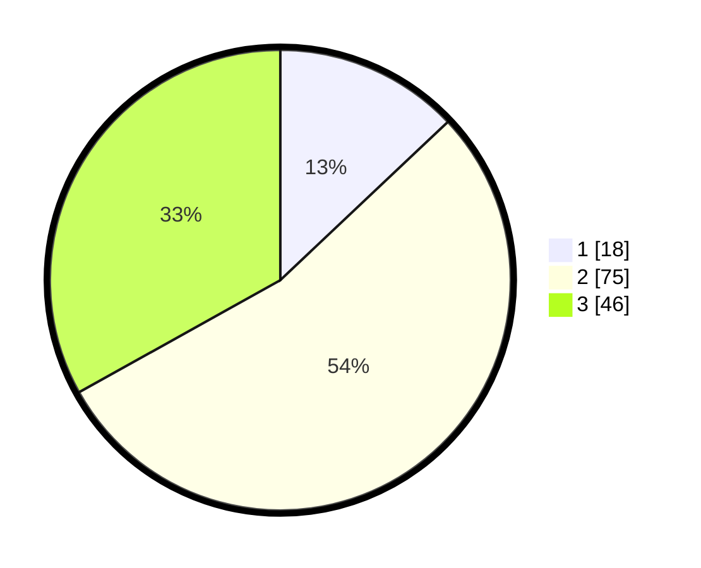

# Hasil

## Grafik

## Tabel

| No. | Nama Paslon    | Suara | Suara (raw) | Persentase |
|:--- |:-------------- | -----:| -----------:| ----------:|
| 1   | ANIES MUHAIMIN | 18    | [18][p-1]   | 12,95      |
| 2   | PRABOWO GIBRAN | 75    | [75][p-2]   | 53,96      |
| 3   | GANJAR MAHFUD  | 46    | [46][p-3]   | 33,09      |

[p-1]: https://github.com/gigit-pemilu/pemilu-2024/blob/main/pilpres/hitung-suara/sub/34-di-yogyakarta/sub/03-gunungkidul/sub/10-ponjong/sub/2009-bedoyo/sub/009-tps/sub/paslon-1.txt
[p-2]: https://github.com/gigit-pemilu/pemilu-2024/blob/main/pilpres/hitung-suara/sub/34-di-yogyakarta/sub/03-gunungkidul/sub/10-ponjong/sub/2009-bedoyo/sub/009-tps/sub/paslon-2.txt
[p-3]: https://github.com/gigit-pemilu/pemilu-2024/blob/main/pilpres/hitung-suara/sub/34-di-yogyakarta/sub/03-gunungkidul/sub/10-ponjong/sub/2009-bedoyo/sub/009-tps/sub/paslon-3.txt

## Foto C Plano

https://sirekap-obj-formc.kpu.go.id/6f97/pemilu/ppwp/34/03/10/20/09/3403102009009-20240215-203350--1cb62f97-564f-4402-a445-72604b29607b.jpg

https://sirekap-obj-formc.kpu.go.id/6f97/pemilu/ppwp/34/03/10/20/09/3403102009009-20240215-203424--909fa246-cb46-4ef1-a675-f8aae2f8f3ef.jpg

https://sirekap-obj-formc.kpu.go.id/6f97/pemilu/ppwp/34/03/10/20/09/3403102009009-20240215-203445--eb67a3a0-d9e2-4194-ac91-3fcad0b631a0.jpg

## Metadata

| Key        | Value               |
| ---------- | ------------------- |
| Time Stamp | 2024-02-17 19:30:00 |

