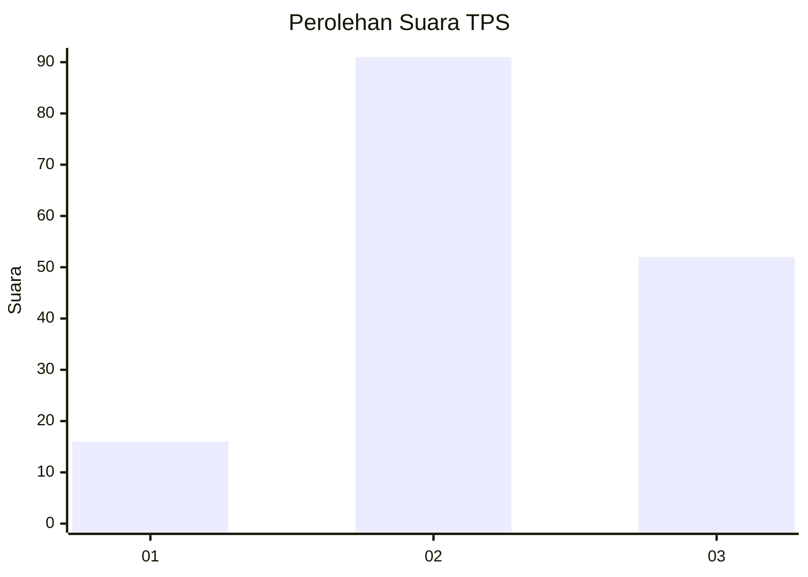
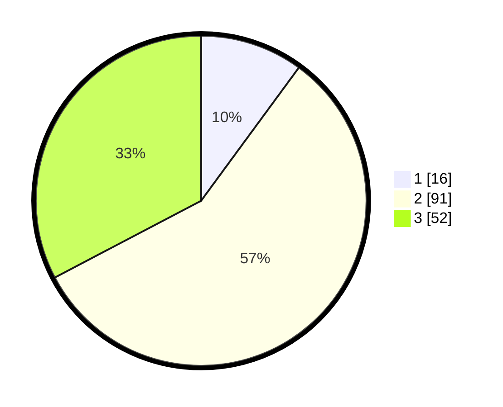

# Hasil

## Grafik

## Tabel

| No. | Nama Paslon    | Suara | Suara (raw) | Persentase |
|:--- |:-------------- | -----:| -----------:| ----------:|
| 1   | ANIES MUHAIMIN | 16    | [16][p-1]   | 10,06      |
| 2   | PRABOWO GIBRAN | 91    | [91][p-2]   | 57,23      |
| 3   | GANJAR MAHFUD  | 52    | [52][p-3]   | 32,70      |

[p-1]: https://github.com/gigit-pemilu/pemilu-2024-34-di-yogyakarta/blob/main/pilpres/hitung-suara/sub/34-di-yogyakarta/sub/03-gunungkidul/sub/10-ponjong/sub/2009-bedoyo/sub/010-tps/sub/paslon-1.txt
[p-2]: https://github.com/gigit-pemilu/pemilu-2024-34-di-yogyakarta/blob/main/pilpres/hitung-suara/sub/34-di-yogyakarta/sub/03-gunungkidul/sub/10-ponjong/sub/2009-bedoyo/sub/010-tps/sub/paslon-2.txt
[p-3]: https://github.com/gigit-pemilu/pemilu-2024-34-di-yogyakarta/blob/main/pilpres/hitung-suara/sub/34-di-yogyakarta/sub/03-gunungkidul/sub/10-ponjong/sub/2009-bedoyo/sub/010-tps/sub/paslon-3.txt

## Foto C Plano

https://sirekap-obj-formc.kpu.go.id/8c9e/pemilu/ppwp/34/03/10/20/09/3403102009010-20240215-015250--c4e1badd-6793-4dd4-901e-0f0d4d690c59.jpg

https://sirekap-obj-formc.kpu.go.id/8c9e/pemilu/ppwp/34/03/10/20/09/3403102009010-20240215-015354--801c7b36-a701-4776-a5f3-d4cd6c6a48ff.jpg

https://sirekap-obj-formc.kpu.go.id/8c9e/pemilu/ppwp/34/03/10/20/09/3403102009010-20240215-015531--2ef424a2-bf2c-492f-bc53-15ac305b1298.jpg

## Metadata

| Key        | Value               |
| ---------- | ------------------- |
| Time Stamp | 2024-02-19 06:16:00 |

