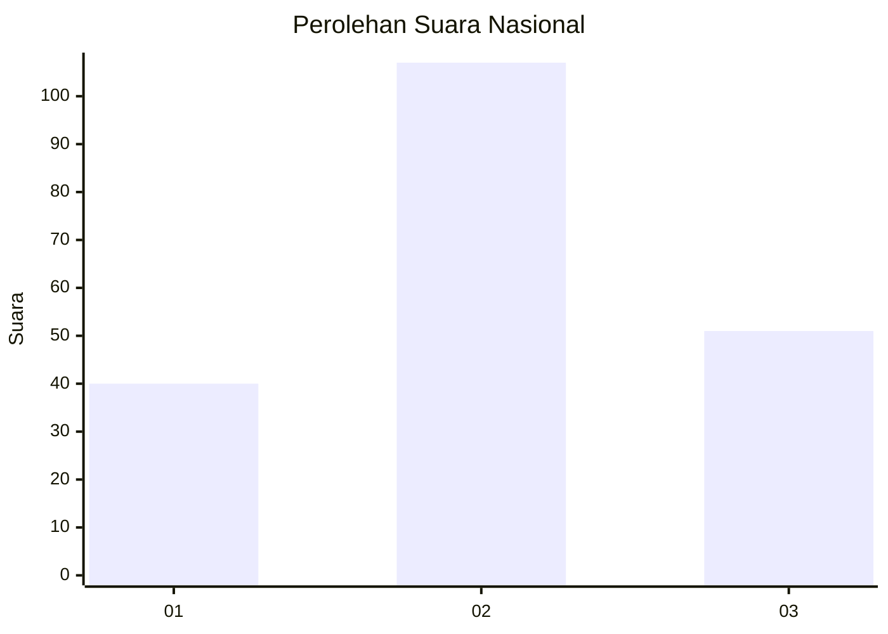
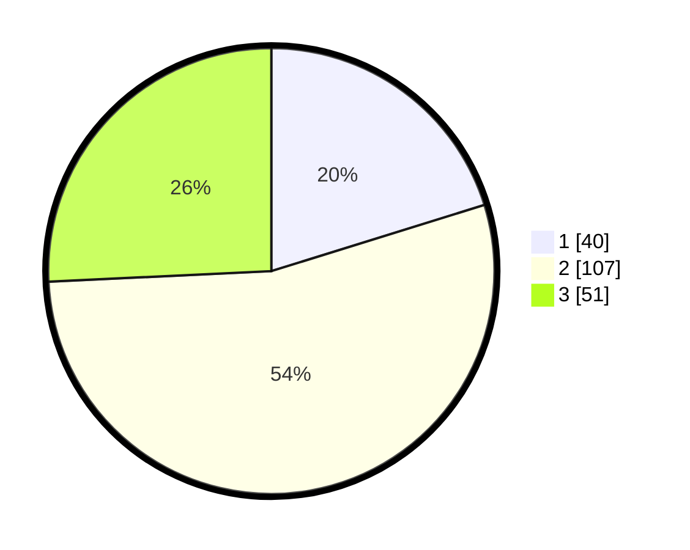

# Hasil

## Grafik

## Tabel

| No. | Nama Paslon    | Suara | Suara (raw) | Persentase |
|:--- |:-------------- | -----:| -----------:| ----------:|
| 1   | ANIES MUHAIMIN | 40    | [40][p-1]   | 20,20      |
| 2   | PRABOWO GIBRAN | 107   | [107][p-2]  | 54,04      |
| 3   | GANJAR MAHFUD  | 51    | [51][p-3]   | 25,76      |

[p-1]: https://github.com/gigit-pemilu/pemilu-2024/blob/main/pilpres/hitung-suara/sub/34-di-yogyakarta/sub/03-gunungkidul/sub/10-ponjong/sub/2010-sidorejo/sub/010-tps/sub/paslon-1.txt
[p-2]: https://github.com/gigit-pemilu/pemilu-2024/blob/main/pilpres/hitung-suara/sub/34-di-yogyakarta/sub/03-gunungkidul/sub/10-ponjong/sub/2010-sidorejo/sub/010-tps/sub/paslon-2.txt
[p-3]: https://github.com/gigit-pemilu/pemilu-2024/blob/main/pilpres/hitung-suara/sub/34-di-yogyakarta/sub/03-gunungkidul/sub/10-ponjong/sub/2010-sidorejo/sub/010-tps/sub/paslon-3.txt

## Foto C Plano

https://sirekap-obj-formc.kpu.go.id/ea0f/pemilu/ppwp/34/03/10/20/10/3403102010010-20240215-013001--b3fdc1e6-931d-4ae6-a5bc-9b37e443cb31.jpg

https://sirekap-obj-formc.kpu.go.id/ea0f/pemilu/ppwp/34/03/10/20/10/3403102010010-20240215-013010--9294c9b7-0ac8-4ac7-bad0-0a99dfbce620.jpg

https://sirekap-obj-formc.kpu.go.id/ea0f/pemilu/ppwp/34/03/10/20/10/3403102010010-20240215-013021--4435dd4f-e7d7-458f-b09b-7dc718599e85.jpg

## Metadata

| Key        | Value               |
| ---------- | ------------------- |
| Time Stamp | 2024-02-19 06:16:00 |

