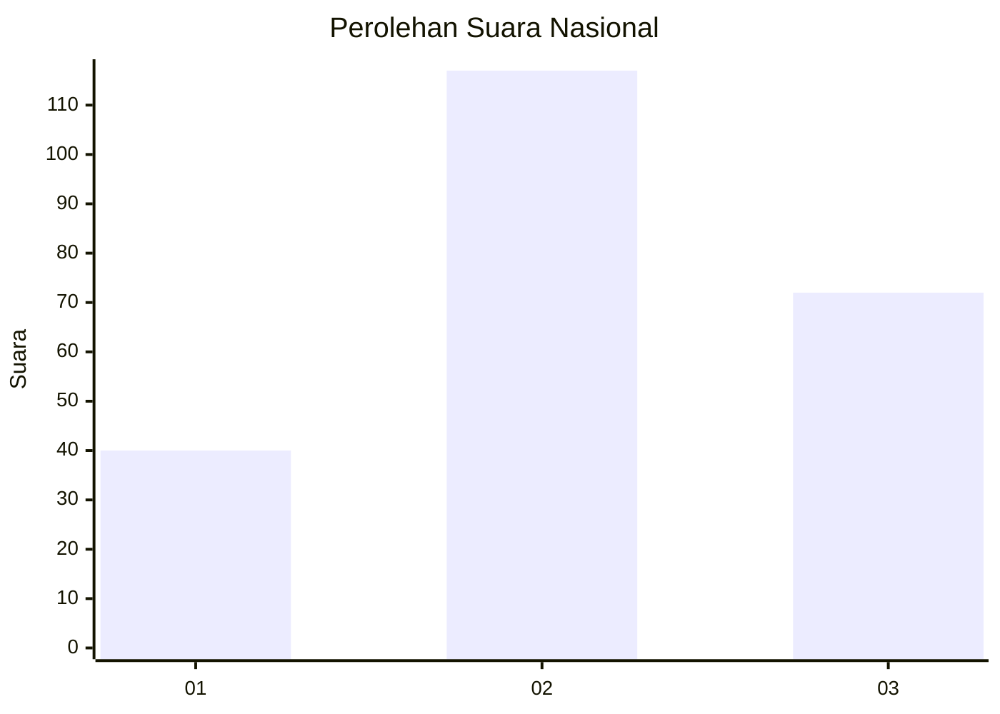
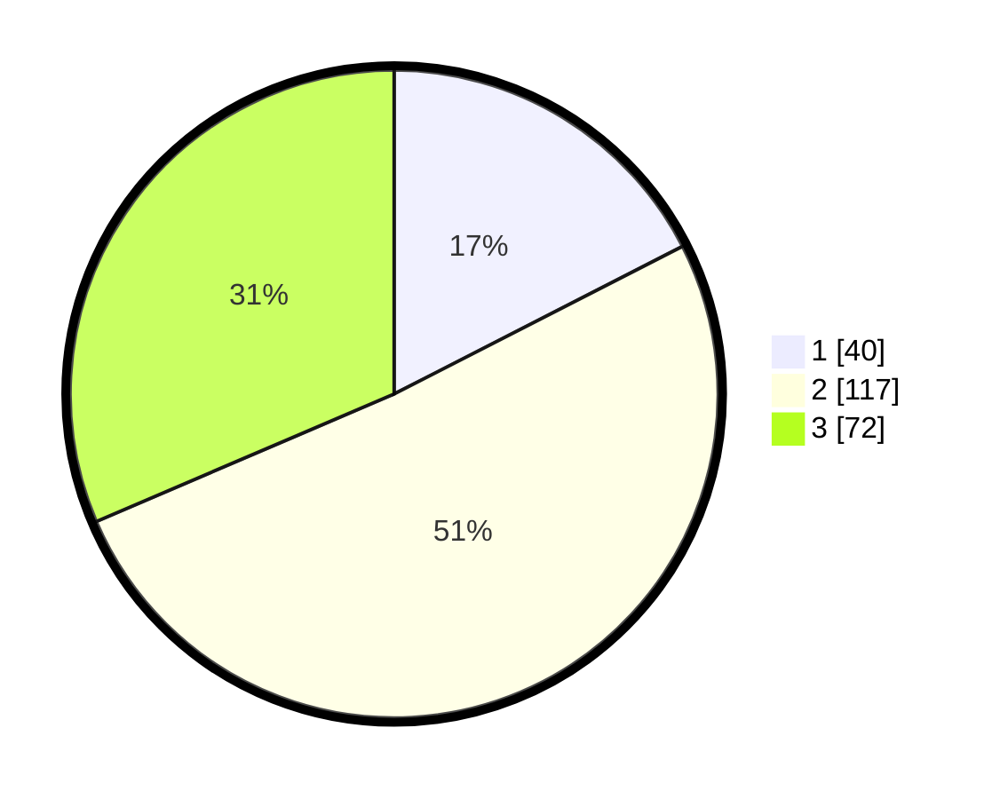

# Hasil

## Grafik

## Tabel

| No. | Nama Paslon    | Suara | Suara (raw) | Persentase |
|:--- |:-------------- | -----:| -----------:| ----------:|
| 1   | ANIES MUHAIMIN | 40    | [40][p-1]   | 17,47      |
| 2   | PRABOWO GIBRAN | 117   | [117][p-2]  | 51,09      |
| 3   | GANJAR MAHFUD  | 72    | [72][p-3]   | 31,44      |

[p-1]: https://github.com/gigit-pemilu/pemilu-2024/blob/main/pilpres/hitung-suara/sub/34-di-yogyakarta/sub/03-gunungkidul/sub/10-ponjong/sub/2010-sidorejo/sub/017-tps/sub/paslon-1.txt
[p-2]: https://github.com/gigit-pemilu/pemilu-2024/blob/main/pilpres/hitung-suara/sub/34-di-yogyakarta/sub/03-gunungkidul/sub/10-ponjong/sub/2010-sidorejo/sub/017-tps/sub/paslon-2.txt
[p-3]: https://github.com/gigit-pemilu/pemilu-2024/blob/main/pilpres/hitung-suara/sub/34-di-yogyakarta/sub/03-gunungkidul/sub/10-ponjong/sub/2010-sidorejo/sub/017-tps/sub/paslon-3.txt

## Foto C Plano

https://sirekap-obj-formc.kpu.go.id/deac/pemilu/ppwp/34/03/10/20/10/3403102010017-20240214-175314--7772b5dd-21cc-47b5-8c9c-4a2979747950.jpg

https://sirekap-obj-formc.kpu.go.id/deac/pemilu/ppwp/34/03/10/20/10/3403102010017-20240214-184520--ebf4d039-ffa2-4792-b7b4-1de73282421d.jpg

https://sirekap-obj-formc.kpu.go.id/deac/pemilu/ppwp/34/03/10/20/10/3403102010017-20240214-175444--548eef89-ec28-4820-9433-5f78583230e0.jpg

## Metadata

| Key        | Value               |
| ---------- | ------------------- |
| Time Stamp | 2024-02-19 06:16:00 |

