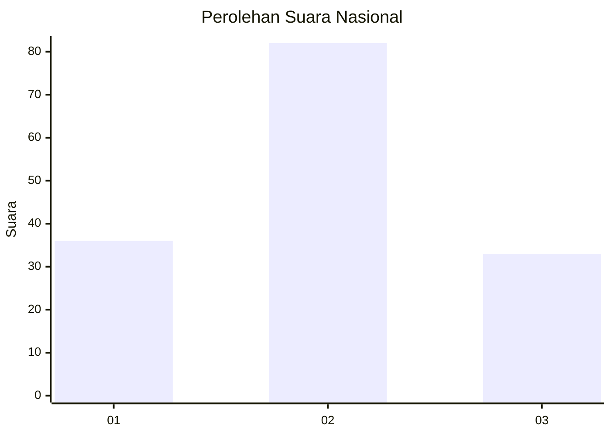
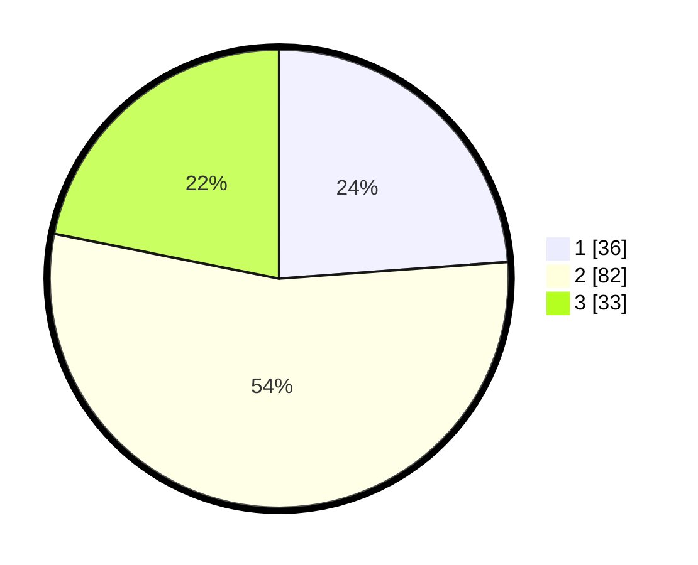

# Hasil

## Grafik

## Tabel

| No. | Nama Paslon    | Suara | Suara (raw) | Persentase |
|:--- |:-------------- | -----:| -----------:| ----------:|
| 1   | ANIES MUHAIMIN | 36    | [36][p-1]   | 23,84      |
| 2   | PRABOWO GIBRAN | 82    | [82][p-2]   | 54,30      |
| 3   | GANJAR MAHFUD  | 33    | [33][p-3]   | 21,85      |

[p-1]: https://github.com/gigit-pemilu/pemilu-2024/blob/main/pilpres/hitung-suara/sub/34-di-yogyakarta/sub/03-gunungkidul/sub/10-ponjong/sub/2011-gombang/sub/002-tps/sub/paslon-1.txt
[p-2]: https://github.com/gigit-pemilu/pemilu-2024/blob/main/pilpres/hitung-suara/sub/34-di-yogyakarta/sub/03-gunungkidul/sub/10-ponjong/sub/2011-gombang/sub/002-tps/sub/paslon-2.txt
[p-3]: https://github.com/gigit-pemilu/pemilu-2024/blob/main/pilpres/hitung-suara/sub/34-di-yogyakarta/sub/03-gunungkidul/sub/10-ponjong/sub/2011-gombang/sub/002-tps/sub/paslon-3.txt

## Foto C Plano

https://sirekap-obj-formc.kpu.go.id/56e0/pemilu/ppwp/34/03/10/20/11/3403102011002-20240215-135716--e13804ad-c3be-4108-a553-d0703b5ac073.jpg

https://sirekap-obj-formc.kpu.go.id/56e0/pemilu/ppwp/34/03/10/20/11/3403102011002-20240215-135827--160eeeee-3912-4002-b94c-f04a4a8b997d.jpg

https://sirekap-obj-formc.kpu.go.id/56e0/pemilu/ppwp/34/03/10/20/11/3403102011002-20240215-135833--7150d846-609f-4540-a05b-4ad1b52ed329.jpg

## Metadata

| Key        | Value               |
| ---------- | ------------------- |
| Time Stamp | 2024-02-17 19:30:00 |

