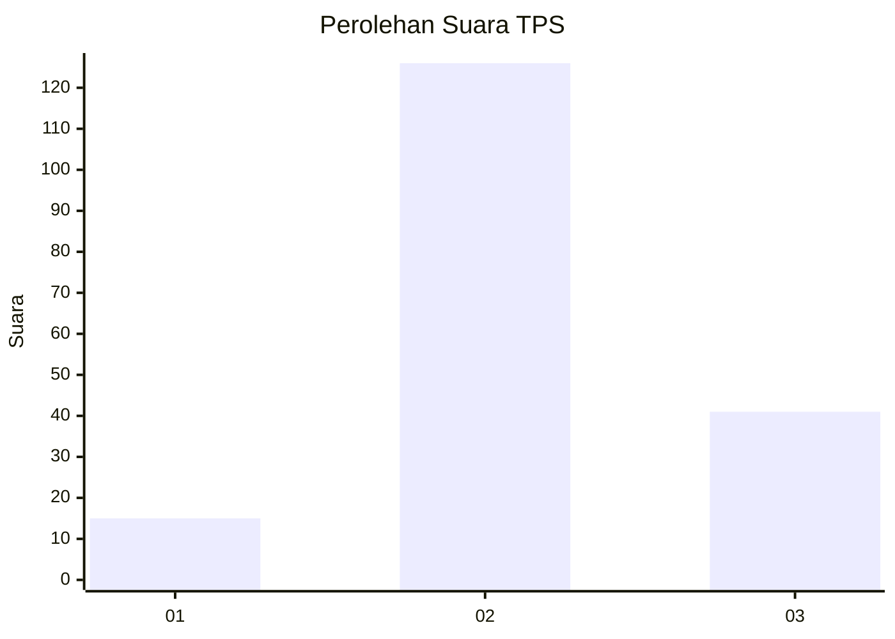
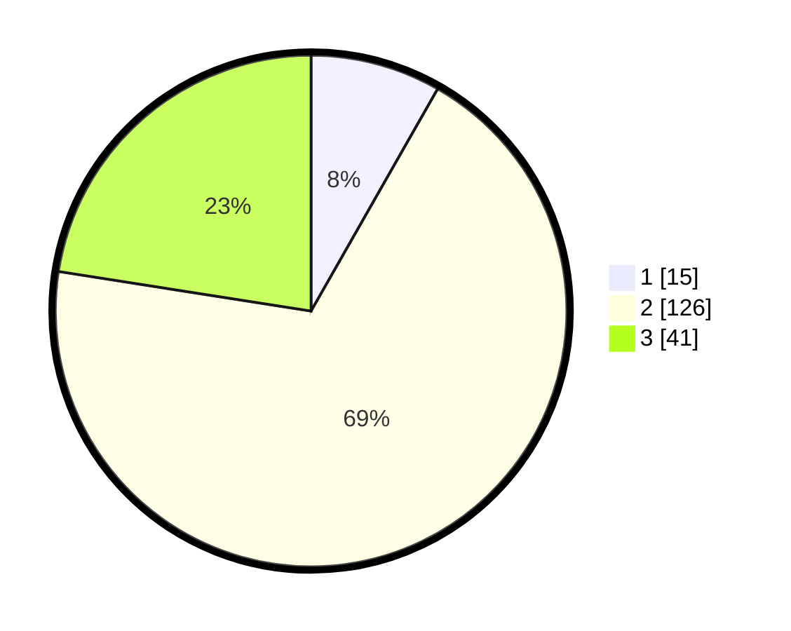

# Hasil

## Grafik

## Tabel

| No. | Nama Paslon    | Suara | Suara (raw) | Persentase |
|:--- |:-------------- | -----:| -----------:| ----------:|
| 1   | ANIES MUHAIMIN | 15    | [15][p-1]   | 8,24       |
| 2   | PRABOWO GIBRAN | 126   | [126][p-2]  | 69,23      |
| 3   | GANJAR MAHFUD  | 41    | [41][p-3]   | 22,53      |

[p-1]: https://github.com/gigit-pemilu/pemilu-2024-34-di-yogyakarta/blob/main/pilpres/hitung-suara/sub/34-di-yogyakarta/sub/03-gunungkidul/sub/10-ponjong/sub/2011-gombang/sub/008-tps/sub/paslon-1.txt
[p-2]: https://github.com/gigit-pemilu/pemilu-2024-34-di-yogyakarta/blob/main/pilpres/hitung-suara/sub/34-di-yogyakarta/sub/03-gunungkidul/sub/10-ponjong/sub/2011-gombang/sub/008-tps/sub/paslon-2.txt
[p-3]: https://github.com/gigit-pemilu/pemilu-2024-34-di-yogyakarta/blob/main/pilpres/hitung-suara/sub/34-di-yogyakarta/sub/03-gunungkidul/sub/10-ponjong/sub/2011-gombang/sub/008-tps/sub/paslon-3.txt

## Foto C Plano

https://sirekap-obj-formc.kpu.go.id/fc96/pemilu/ppwp/34/03/10/20/11/3403102011008-20240215-090921--6e51e962-008f-4676-8c5d-66f989d7ec28.jpg

https://sirekap-obj-formc.kpu.go.id/fc96/pemilu/ppwp/34/03/10/20/11/3403102011008-20240215-091107--09cb2003-71e0-455a-af17-097b9e941575.jpg

https://sirekap-obj-formc.kpu.go.id/fc96/pemilu/ppwp/34/03/10/20/11/3403102011008-20240215-091111--688ca430-f6b2-4aa6-96af-6a28117c2d01.jpg

## Metadata

| Key        | Value               |
| ---------- | ------------------- |
| Time Stamp | 2024-02-19 06:16:00 |

