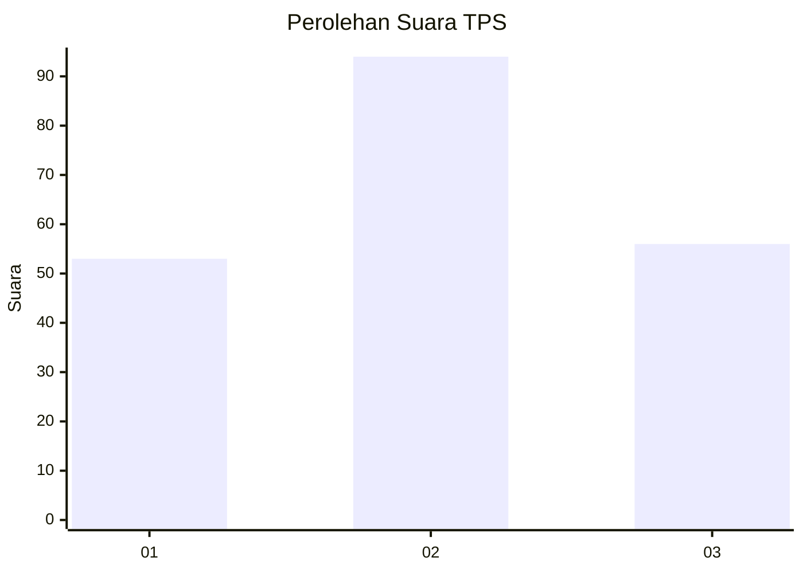
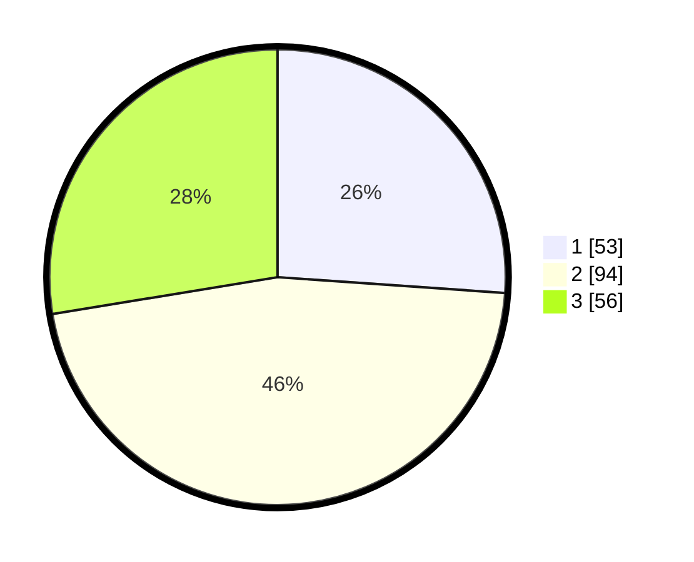

# Hasil

## Grafik

## Tabel

| No. | Nama Paslon    | Suara | Suara (raw) | Persentase |
|:--- |:-------------- | -----:| -----------:| ----------:|
| 1   | ANIES MUHAIMIN | 53    | [53][p-1]   | 26,11      |
| 2   | PRABOWO GIBRAN | 94    | [94][p-2]   | 46,31      |
| 3   | GANJAR MAHFUD  | 56    | [56][p-3]   | 27,59      |

[p-1]: https://github.com/gigit-pemilu/pemilu-2024-34-di-yogyakarta/blob/main/pilpres/hitung-suara/sub/34-di-yogyakarta/sub/03-gunungkidul/sub/10-ponjong/sub/2011-gombang/sub/010-tps/sub/paslon-1.txt
[p-2]: https://github.com/gigit-pemilu/pemilu-2024-34-di-yogyakarta/blob/main/pilpres/hitung-suara/sub/34-di-yogyakarta/sub/03-gunungkidul/sub/10-ponjong/sub/2011-gombang/sub/010-tps/sub/paslon-2.txt
[p-3]: https://github.com/gigit-pemilu/pemilu-2024-34-di-yogyakarta/blob/main/pilpres/hitung-suara/sub/34-di-yogyakarta/sub/03-gunungkidul/sub/10-ponjong/sub/2011-gombang/sub/010-tps/sub/paslon-3.txt

## Foto C Plano

https://sirekap-obj-formc.kpu.go.id/50f2/pemilu/ppwp/34/03/10/20/11/3403102011010-20240215-153724--812060f0-2f07-47d8-b947-eb0b31956107.jpg

https://sirekap-obj-formc.kpu.go.id/50f2/pemilu/ppwp/34/03/10/20/11/3403102011010-20240215-153756--f5aa046b-ad63-4ebd-a970-ebe907716c73.jpg

https://sirekap-obj-formc.kpu.go.id/50f2/pemilu/ppwp/34/03/10/20/11/3403102011010-20240215-153801--e105c45d-867f-45fd-bc8a-e0f28da32e93.jpg

## Metadata

| Key        | Value               |
| ---------- | ------------------- |
| Time Stamp | 2024-02-20 11:00:00 |

