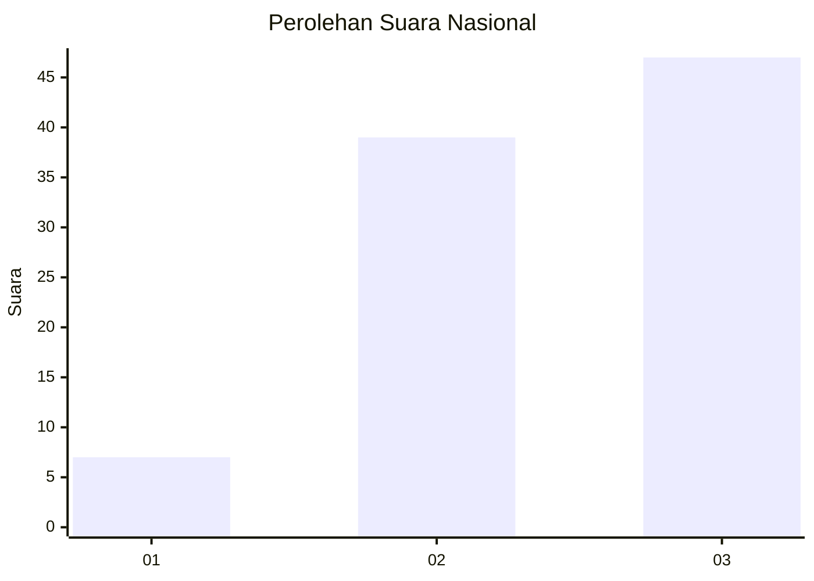
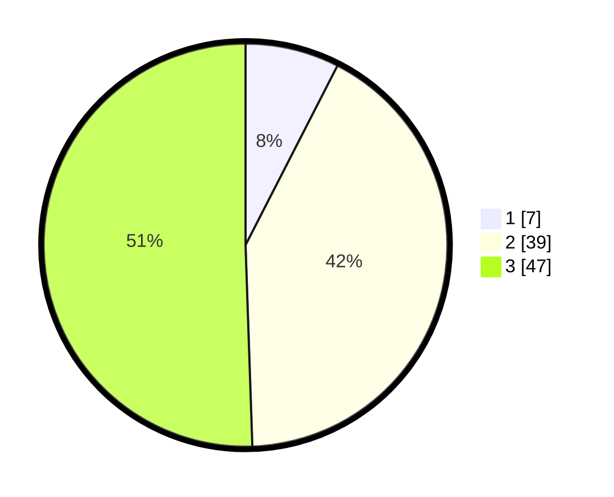

# Hasil

## Grafik

## Tabel

| No. | Nama Paslon    | Suara | Suara (raw) | Persentase |
|:--- |:-------------- | -----:| -----------:| ----------:|
| 1   | ANIES MUHAIMIN | 7     | [7][p-1]    | 7,53       |
| 2   | PRABOWO GIBRAN | 39    | [39][p-2]   | 41,94      |
| 3   | GANJAR MAHFUD  | 47    | [47][p-3]   | 50,54      |

[p-1]: https://github.com/gigit-pemilu/pemilu-2024/blob/main/pilpres/hitung-suara/sub/34-di-yogyakarta/sub/03-gunungkidul/sub/10-ponjong/sub/2011-gombang/sub/012-tps/sub/paslon-1.txt
[p-2]: https://github.com/gigit-pemilu/pemilu-2024/blob/main/pilpres/hitung-suara/sub/34-di-yogyakarta/sub/03-gunungkidul/sub/10-ponjong/sub/2011-gombang/sub/012-tps/sub/paslon-2.txt
[p-3]: https://github.com/gigit-pemilu/pemilu-2024/blob/main/pilpres/hitung-suara/sub/34-di-yogyakarta/sub/03-gunungkidul/sub/10-ponjong/sub/2011-gombang/sub/012-tps/sub/paslon-3.txt

## Foto C Plano

https://sirekap-obj-formc.kpu.go.id/30c7/pemilu/ppwp/34/03/10/20/11/3403102011012-20240216-100015--c268d5f2-799c-4fbc-ba15-967591b101e1.jpg

https://sirekap-obj-formc.kpu.go.id/30c7/pemilu/ppwp/34/03/10/20/11/3403102011012-20240215-022807--d684bb0c-8592-4085-a42e-254cd7c74b14.jpg

https://sirekap-obj-formc.kpu.go.id/30c7/pemilu/ppwp/34/03/10/20/11/3403102011012-20240215-022857--12b499ab-b5a2-44bb-885c-7e033a4dc86e.jpg

## Metadata

| Key        | Value               |
| ---------- | ------------------- |
| Time Stamp | 2024-02-16 10:30:29 |

## DATA PEMILIH TETAP

Jumlah pemilih dalam DPT: **110**.
 * L: **52**.
 * P: **58**.

## DATA PENGGUNA HAK PILIH

Jumlah pengguna hak pilih dalam DPT: **96**.
 * L: **45**.
 * P: **51**.

Jumlah pengguna hak pilih dalam DPTb: **0**.
 * L: **0**.
 * P: **0**.

Jumlah pengguna hak pilih dalam DPK: **0**.
 * L: **0**.
 * P: **0**.

Jumlah pengguna hak pilih: **96**.
 * L: **45**.
 * P: **51**.

## JUMLAH SUARA SAH DAN TIDAK SAH

JUMLAH SELURUH SUARA SAH: **93**.

JUMLAH SUARA TIDAK SAH: **3**.

JUMLAH SELURUH SUARA SAH DAN SUARA TIDAK SAH: **96**.

