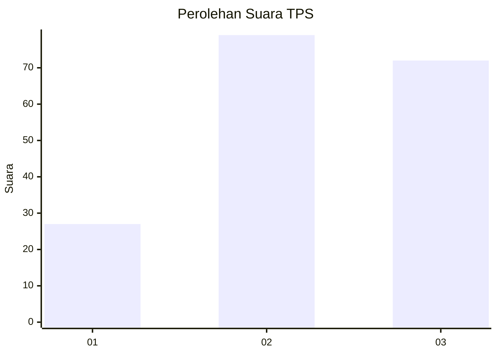
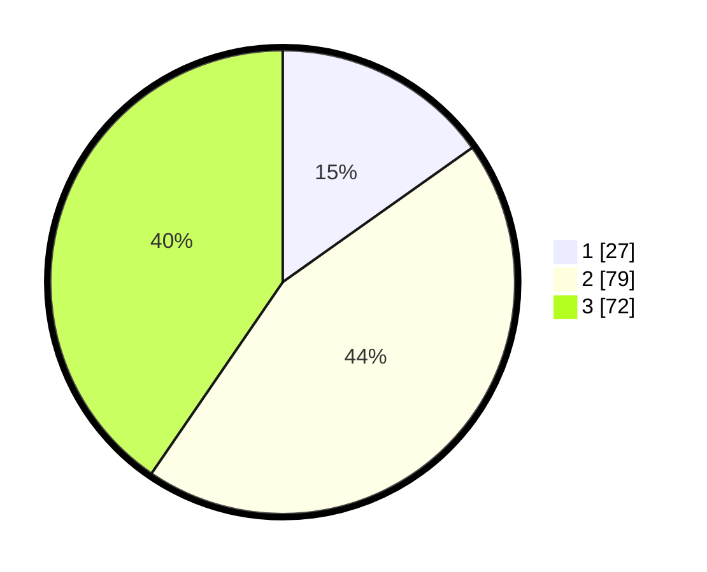

# Hasil

## Grafik

## Tabel

| No. | Nama Paslon    | Suara | Suara (raw) | Persentase |
|:--- |:-------------- | -----:| -----------:| ----------:|
| 1   | ANIES MUHAIMIN | 27    | [27][p-1]   | 15,17      |
| 2   | PRABOWO GIBRAN | 79    | [79][p-2]   | 44,38      |
| 3   | GANJAR MAHFUD  | 72    | [72][p-3]   | 40,45      |

[p-1]: https://github.com/gigit-pemilu/pemilu-2024-34-di-yogyakarta/blob/main/pilpres/hitung-suara/sub/34-di-yogyakarta/sub/03-gunungkidul/sub/10-ponjong/sub/2011-gombang/sub/013-tps/sub/paslon-1.txt
[p-2]: https://github.com/gigit-pemilu/pemilu-2024-34-di-yogyakarta/blob/main/pilpres/hitung-suara/sub/34-di-yogyakarta/sub/03-gunungkidul/sub/10-ponjong/sub/2011-gombang/sub/013-tps/sub/paslon-2.txt
[p-3]: https://github.com/gigit-pemilu/pemilu-2024-34-di-yogyakarta/blob/main/pilpres/hitung-suara/sub/34-di-yogyakarta/sub/03-gunungkidul/sub/10-ponjong/sub/2011-gombang/sub/013-tps/sub/paslon-3.txt

## Foto C Plano

https://sirekap-obj-formc.kpu.go.id/7f37/pemilu/ppwp/34/03/10/20/11/3403102011013-20240216-194133--0aaca924-4b32-4769-85e3-40bdb9bbccfb.jpg

https://sirekap-obj-formc.kpu.go.id/7f37/pemilu/ppwp/34/03/10/20/11/3403102011013-20240215-080842--e0d30c7a-365d-4788-b018-8f5fbb4f99db.jpg

https://sirekap-obj-formc.kpu.go.id/7f37/pemilu/ppwp/34/03/10/20/11/3403102011013-20240215-080858--fa00a8af-09e3-42d6-babc-fcf945d46ef0.jpg

## Metadata

| Key        | Value               |
| ---------- | ------------------- |
| Time Stamp | 2024-02-20 11:00:00 |

