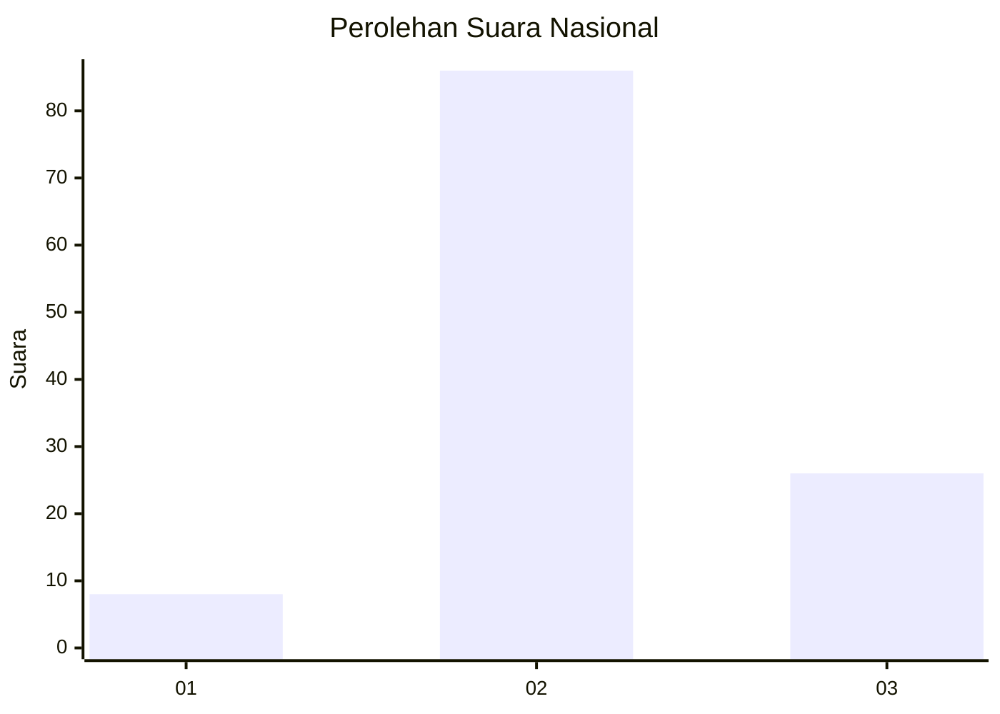

# Hasil

## Grafik

## Tabel

| No. | Nama Paslon    | Suara | Suara (raw) | Persentase |
|:--- |:-------------- | -----:| -----------:| ----------:|
| 1   | ANIES MUHAIMIN | 8     | [8][p-1]    | 6,67       |
| 2   | PRABOWO GIBRAN | 86    | [86][p-2]   | 71,67      |
| 3   | GANJAR MAHFUD  | 26    | [26][p-3]   | 21,67      |

[p-1]: https://github.com/gigit-pemilu/pemilu-2024/blob/main/pilpres/hitung-suara/sub/34-di-yogyakarta/sub/03-gunungkidul/sub/11-rongkop/sub/2001-bohol/sub/001-tps/sub/paslon-1.txt
[p-2]: https://github.com/gigit-pemilu/pemilu-2024/blob/main/pilpres/hitung-suara/sub/34-di-yogyakarta/sub/03-gunungkidul/sub/11-rongkop/sub/2001-bohol/sub/001-tps/sub/paslon-2.txt
[p-3]: https://github.com/gigit-pemilu/pemilu-2024/blob/main/pilpres/hitung-suara/sub/34-di-yogyakarta/sub/03-gunungkidul/sub/11-rongkop/sub/2001-bohol/sub/001-tps/sub/paslon-3.txt

## Foto C Plano

https://sirekap-obj-formc.kpu.go.id/e9c6/pemilu/ppwp/34/03/11/20/01/3403112001001-20240216-122619--4679e062-8ed7-42fb-8e5b-787962d994a3.jpg

https://sirekap-obj-formc.kpu.go.id/e9c6/pemilu/ppwp/34/03/11/20/01/3403112001001-20240216-122621--6c1da2f4-60e1-4240-b8f6-960b2ba63e95.jpg

https://sirekap-obj-formc.kpu.go.id/e9c6/pemilu/ppwp/34/03/11/20/01/3403112001001-20240216-122620--cdee08e3-4428-4581-ac02-e33175313f61.jpg

## Metadata

| Key        | Value               |
| ---------- | ------------------- |
| Time Stamp | 2024-02-17 09:30:03 |

## DATA PEMILIH TETAP

Jumlah pemilih dalam DPT: **152**.
 * L: **68**.
 * P: **84**.

## DATA PENGGUNA HAK PILIH

Jumlah pengguna hak pilih dalam DPT: **120**.
 * L: **55**.
 * P: **65**.

Jumlah pengguna hak pilih dalam DPTb: **1**.
 * L: **1**.
 * P: **0**.

Jumlah pengguna hak pilih dalam DPK: **0**.
 * L: **0**.
 * P: **0**.

Jumlah pengguna hak pilih: **121**.
 * L: **56**.
 * P: **65**.

## JUMLAH SUARA SAH DAN TIDAK SAH

JUMLAH SELURUH SUARA SAH: **120**.

JUMLAH SUARA TIDAK SAH: **1**.

JUMLAH SELURUH SUARA SAH DAN SUARA TIDAK SAH: **121**.

