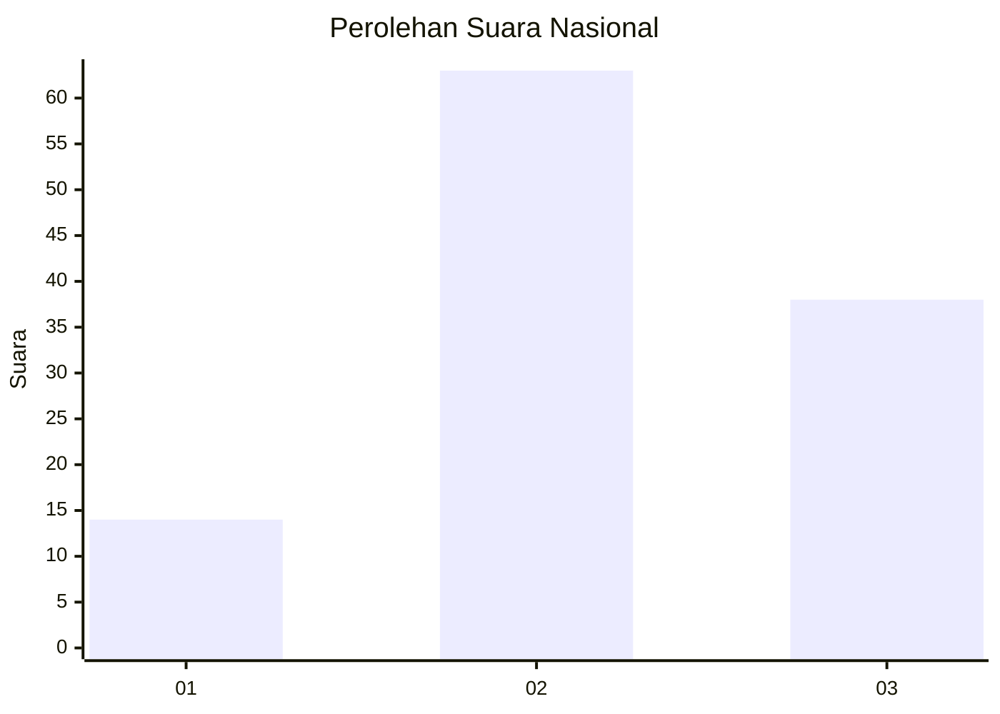
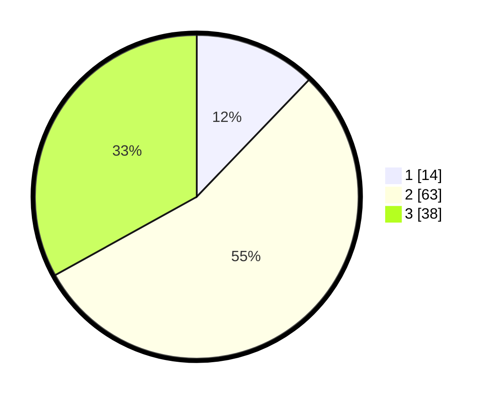

# Hasil

## Grafik

## Tabel

| No. | Nama Paslon    | Suara | Suara (raw) | Persentase |
|:--- |:-------------- | -----:| -----------:| ----------:|
| 1   | ANIES MUHAIMIN | 14    | [14][p-1]   | 12,17      |
| 2   | PRABOWO GIBRAN | 63    | [63][p-2]   | 54,78      |
| 3   | GANJAR MAHFUD  | 38    | [38][p-3]   | 33,04      |

[p-1]: https://github.com/gigit-pemilu/pemilu-2024/blob/main/pilpres/hitung-suara/sub/34-di-yogyakarta/sub/03-gunungkidul/sub/11-rongkop/sub/2001-bohol/sub/002-tps/sub/paslon-1.txt
[p-2]: https://github.com/gigit-pemilu/pemilu-2024/blob/main/pilpres/hitung-suara/sub/34-di-yogyakarta/sub/03-gunungkidul/sub/11-rongkop/sub/2001-bohol/sub/002-tps/sub/paslon-2.txt
[p-3]: https://github.com/gigit-pemilu/pemilu-2024/blob/main/pilpres/hitung-suara/sub/34-di-yogyakarta/sub/03-gunungkidul/sub/11-rongkop/sub/2001-bohol/sub/002-tps/sub/paslon-3.txt

## Foto C Plano

https://sirekap-obj-formc.kpu.go.id/8858/pemilu/ppwp/34/03/11/20/01/3403112001002-20240216-123121--837436a7-f152-4b51-b87c-dee8af94fa50.jpg

https://sirekap-obj-formc.kpu.go.id/8858/pemilu/ppwp/34/03/11/20/01/3403112001002-20240216-123122--f4016184-fd0b-4eaa-98c3-e2b25a82b21c.jpg

https://sirekap-obj-formc.kpu.go.id/8858/pemilu/ppwp/34/03/11/20/01/3403112001002-20240216-123121--fed6c1a2-495e-4480-9038-817616f88b20.jpg

## Metadata

| Key        | Value               |
| ---------- | ------------------- |
| Time Stamp | 2024-02-17 09:30:03 |

## DATA PEMILIH TETAP

Jumlah pemilih dalam DPT: **139**.
 * L: **68**.
 * P: **71**.

## DATA PENGGUNA HAK PILIH

Jumlah pengguna hak pilih dalam DPT: **115**.
 * L: **58**.
 * P: **57**.

Jumlah pengguna hak pilih dalam DPTb: **0**.
 * L: **0**.
 * P: **0**.

Jumlah pengguna hak pilih dalam DPK: **0**.
 * L: **0**.
 * P: **0**.

Jumlah pengguna hak pilih: **115**.
 * L: **58**.
 * P: **57**.

## JUMLAH SUARA SAH DAN TIDAK SAH

JUMLAH SELURUH SUARA SAH: **115**.

JUMLAH SUARA TIDAK SAH: **0**.

JUMLAH SELURUH SUARA SAH DAN SUARA TIDAK SAH: **115**.

