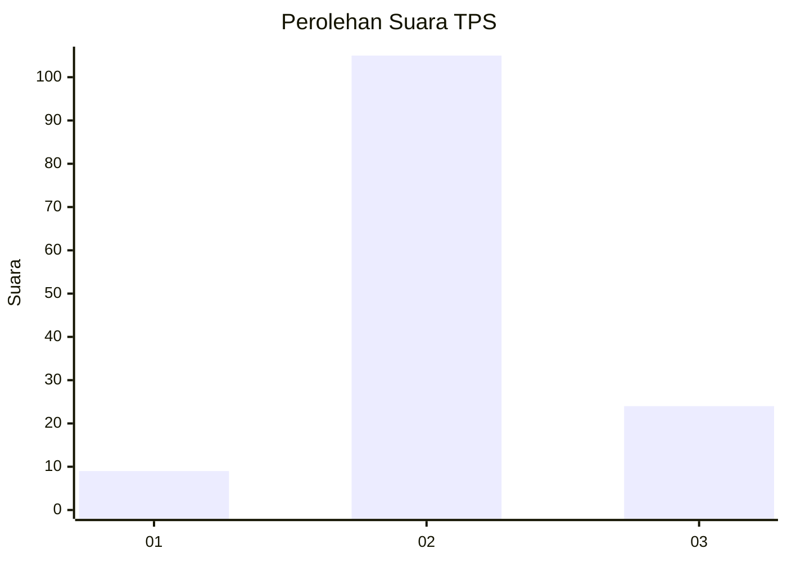

# Hasil

## Grafik

## Tabel

| No. | Nama Paslon    | Suara | Suara (raw) | Persentase |
|:--- |:-------------- | -----:| -----------:| ----------:|
| 1   | ANIES MUHAIMIN | 9     | [9][p-1]    | 6,52       |
| 2   | PRABOWO GIBRAN | 105   | [105][p-2]  | 76,09      |
| 3   | GANJAR MAHFUD  | 24    | [24][p-3]   | 17,39      |

[p-1]: https://github.com/gigit-pemilu/pemilu-2024-34-di-yogyakarta/blob/main/pilpres/hitung-suara/sub/34-di-yogyakarta/sub/03-gunungkidul/sub/11-rongkop/sub/2001-bohol/sub/005-tps/sub/paslon-1.txt
[p-2]: https://github.com/gigit-pemilu/pemilu-2024-34-di-yogyakarta/blob/main/pilpres/hitung-suara/sub/34-di-yogyakarta/sub/03-gunungkidul/sub/11-rongkop/sub/2001-bohol/sub/005-tps/sub/paslon-2.txt
[p-3]: https://github.com/gigit-pemilu/pemilu-2024-34-di-yogyakarta/blob/main/pilpres/hitung-suara/sub/34-di-yogyakarta/sub/03-gunungkidul/sub/11-rongkop/sub/2001-bohol/sub/005-tps/sub/paslon-3.txt

## Foto C Plano

https://sirekap-obj-formc.kpu.go.id/2d52/pemilu/ppwp/34/03/11/20/01/3403112001005-20240216-081443--c7af9667-03ff-48f3-a72e-887c497c21ab.jpg

https://sirekap-obj-formc.kpu.go.id/2d52/pemilu/ppwp/34/03/11/20/01/3403112001005-20240216-081444--b79e1c22-ff47-4b5b-af05-b8454c0df977.jpg

https://sirekap-obj-formc.kpu.go.id/2d52/pemilu/ppwp/34/03/11/20/01/3403112001005-20240216-081443--8613b944-4da9-4b5d-bc6e-0d76002797aa.jpg

## Metadata

| Key        | Value               |
| ---------- | ------------------- |
| Time Stamp | 2024-02-17 09:30:03 |

## DATA PEMILIH TETAP

Jumlah pemilih dalam DPT: **159**.
 * L: **77**.
 * P: **82**.

## DATA PENGGUNA HAK PILIH

Jumlah pengguna hak pilih dalam DPT: **141**.
 * L: **69**.
 * P: **72**.

Jumlah pengguna hak pilih dalam DPTb: **1**.
 * L: **0**.
 * P: **1**.

Jumlah pengguna hak pilih dalam DPK: **0**.
 * L: **0**.
 * P: **0**.

Jumlah pengguna hak pilih: **142**.
 * L: **69**.
 * P: **73**.

## JUMLAH SUARA SAH DAN TIDAK SAH

JUMLAH SELURUH SUARA SAH: **138**.

JUMLAH SUARA TIDAK SAH: **4**.

JUMLAH SELURUH SUARA SAH DAN SUARA TIDAK SAH: **142**.

