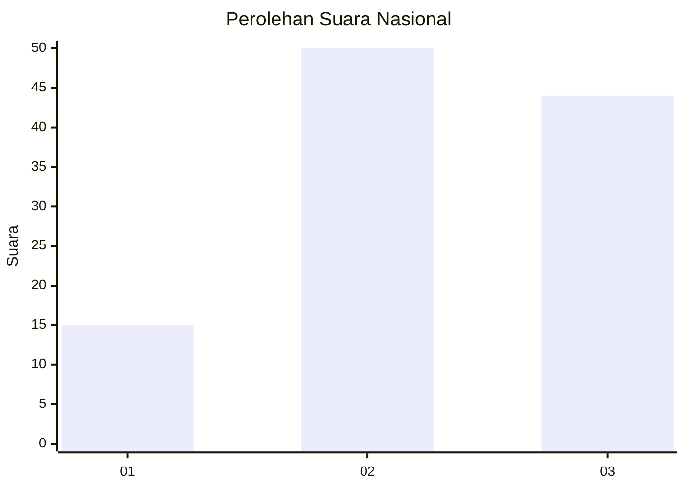
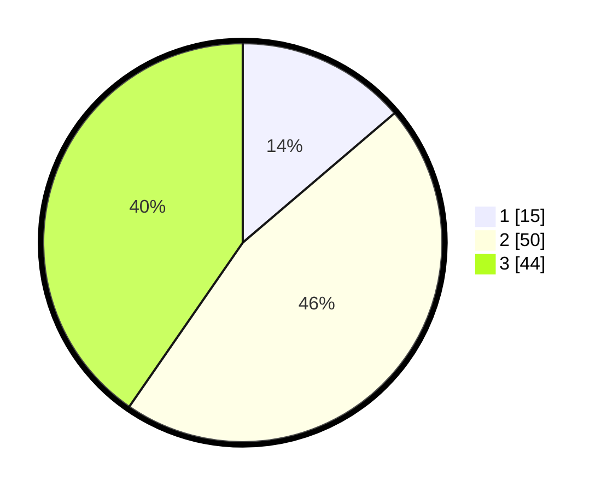

# Hasil

## Grafik

## Tabel

| No. | Nama Paslon    | Suara | Suara (raw) | Persentase |
|:--- |:-------------- | -----:| -----------:| ----------:|
| 1   | ANIES MUHAIMIN | 15    | [15][p-1]   | 13,76      |
| 2   | PRABOWO GIBRAN | 50    | [50][p-2]   | 45,87      |
| 3   | GANJAR MAHFUD  | 44    | [44][p-3]   | 40,37      |

[p-1]: https://github.com/gigit-pemilu/pemilu-2024/blob/main/pilpres/hitung-suara/sub/34-di-yogyakarta/sub/03-gunungkidul/sub/11-rongkop/sub/2002-pringombo/sub/014-tps/sub/paslon-1.txt
[p-2]: https://github.com/gigit-pemilu/pemilu-2024/blob/main/pilpres/hitung-suara/sub/34-di-yogyakarta/sub/03-gunungkidul/sub/11-rongkop/sub/2002-pringombo/sub/014-tps/sub/paslon-2.txt
[p-3]: https://github.com/gigit-pemilu/pemilu-2024/blob/main/pilpres/hitung-suara/sub/34-di-yogyakarta/sub/03-gunungkidul/sub/11-rongkop/sub/2002-pringombo/sub/014-tps/sub/paslon-3.txt

## Foto C Plano

https://sirekap-obj-formc.kpu.go.id/c8f6/pemilu/ppwp/34/03/11/20/02/3403112002014-20240216-051010--bcd1e63b-bed4-427d-8dee-eb7a6bafa3e4.jpg

https://sirekap-obj-formc.kpu.go.id/c8f6/pemilu/ppwp/34/03/11/20/02/3403112002014-20240216-051025--c20ec50d-7fd0-4c4e-9b16-bce242bd29c2.jpg

https://sirekap-obj-formc.kpu.go.id/c8f6/pemilu/ppwp/34/03/11/20/02/3403112002014-20240216-051656--1ec59a6b-3f30-4990-bcf9-a4c5c18daba9.jpg

## Metadata

| Key        | Value               |
| ---------- | ------------------- |
| Time Stamp | 2024-02-16 17:00:00 |

## DATA PEMILIH TETAP

Jumlah pemilih dalam DPT: **154**.
 * L: **80**.
 * P: **74**.

## DATA PENGGUNA HAK PILIH

Jumlah pengguna hak pilih dalam DPT: **112**.
 * L: **58**.
 * P: **54**.

Jumlah pengguna hak pilih dalam DPTb: **0**.
 * L: **0**.
 * P: **0**.

Jumlah pengguna hak pilih dalam DPK: **0**.
 * L: **0**.
 * P: **0**.

Jumlah pengguna hak pilih: **112**.
 * L: **58**.
 * P: **54**.

## JUMLAH SUARA SAH DAN TIDAK SAH

JUMLAH SELURUH SUARA SAH: **109**.

JUMLAH SUARA TIDAK SAH: **3**.

JUMLAH SELURUH SUARA SAH DAN SUARA TIDAK SAH: **112**.

