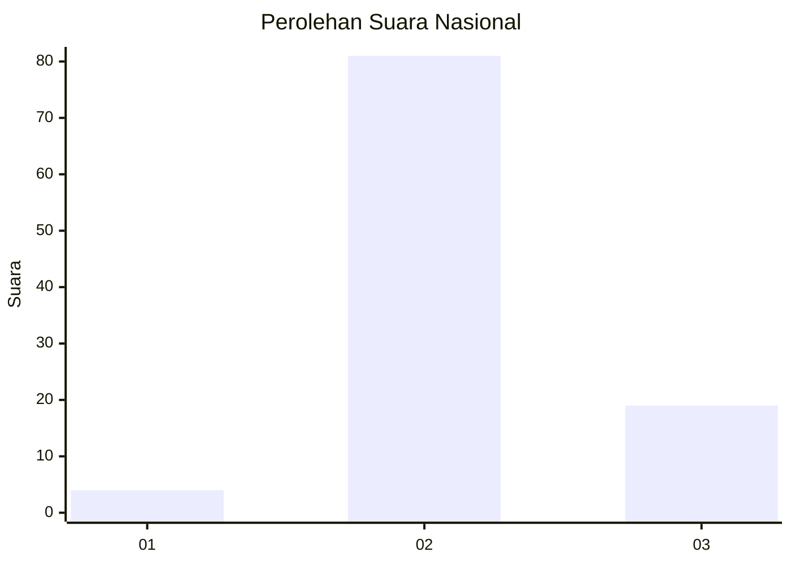
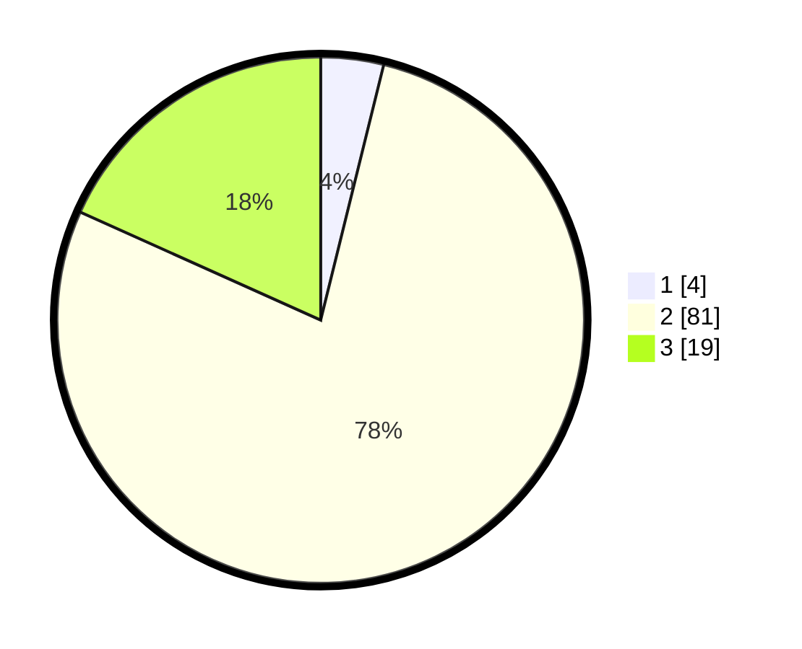

# Hasil

## Grafik

## Tabel

| No. | Nama Paslon    | Suara | Suara (raw) | Persentase |
|:--- |:-------------- | -----:| -----------:| ----------:|
| 1   | ANIES MUHAIMIN | 4     | [4][p-1]    | 3,85       |
| 2   | PRABOWO GIBRAN | 81    | [81][p-2]   | 77,88      |
| 3   | GANJAR MAHFUD  | 19    | [19][p-3]   | 18,27      |

[p-1]: https://github.com/gigit-pemilu/pemilu-2024/blob/main/pilpres/hitung-suara/sub/34-di-yogyakarta/sub/03-gunungkidul/sub/11-rongkop/sub/2003-botodayaan/sub/012-tps/sub/paslon-1.txt
[p-2]: https://github.com/gigit-pemilu/pemilu-2024/blob/main/pilpres/hitung-suara/sub/34-di-yogyakarta/sub/03-gunungkidul/sub/11-rongkop/sub/2003-botodayaan/sub/012-tps/sub/paslon-2.txt
[p-3]: https://github.com/gigit-pemilu/pemilu-2024/blob/main/pilpres/hitung-suara/sub/34-di-yogyakarta/sub/03-gunungkidul/sub/11-rongkop/sub/2003-botodayaan/sub/012-tps/sub/paslon-3.txt

## Foto C Plano

https://sirekap-obj-formc.kpu.go.id/dc4a/pemilu/ppwp/34/03/11/20/03/3403112003012-20240216-022806--5401cd66-95d8-4a7c-82b9-8048155d14d4.jpg

https://sirekap-obj-formc.kpu.go.id/dc4a/pemilu/ppwp/34/03/11/20/03/3403112003012-20240216-022807--2c9d6f6e-e200-4c6e-8627-7dc30ea3a244.jpg

https://sirekap-obj-formc.kpu.go.id/dc4a/pemilu/ppwp/34/03/11/20/03/3403112003012-20240216-022807--ef045468-f81e-42c5-9431-16c74b783ec9.jpg

## Metadata

| Key        | Value               |
| ---------- | ------------------- |
| Time Stamp | 2024-02-17 10:00:02 |

## DATA PEMILIH TETAP

Jumlah pemilih dalam DPT: **107**.
 * L: **50**.
 * P: **57**.

## DATA PENGGUNA HAK PILIH

Jumlah pengguna hak pilih dalam DPT: **102**.
 * L: **49**.
 * P: **53**.

Jumlah pengguna hak pilih dalam DPTb: **1**.
 * L: **1**.
 * P: **0**.

Jumlah pengguna hak pilih dalam DPK: **1**.
 * L: **0**.
 * P: **1**.

Jumlah pengguna hak pilih: **104**.
 * L: **50**.
 * P: **54**.

## JUMLAH SUARA SAH DAN TIDAK SAH

JUMLAH SELURUH SUARA SAH: **104**.

JUMLAH SUARA TIDAK SAH: **0**.

JUMLAH SELURUH SUARA SAH DAN SUARA TIDAK SAH: **104**.

