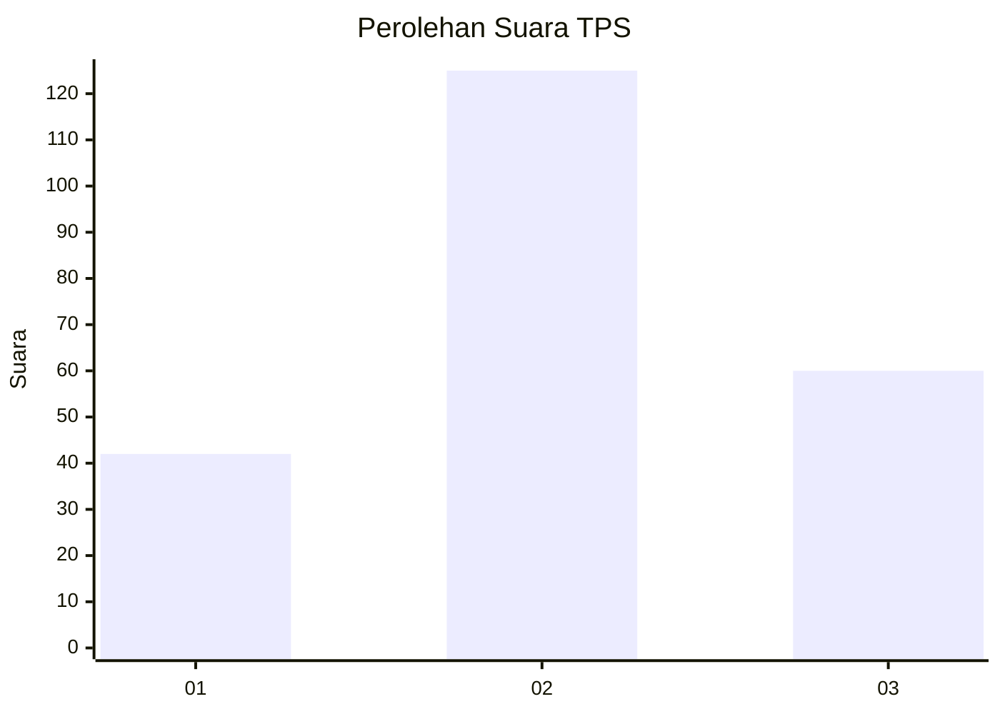
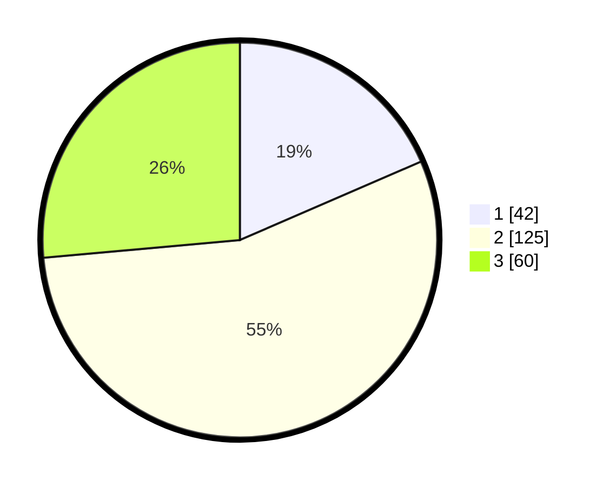

# Hasil

## Grafik

## Tabel

| No. | Nama Paslon    | Suara | Suara (raw) | Persentase |
|:--- |:-------------- | -----:| -----------:| ----------:|
| 1   | ANIES MUHAIMIN | 42    | [42][p-1]   | 18,50      |
| 2   | PRABOWO GIBRAN | 125   | [125][p-2]  | 55,07      |
| 3   | GANJAR MAHFUD  | 60    | [60][p-3]   | 26,43      |

[p-1]: https://github.com/gigit-pemilu/pemilu-2024-34-di-yogyakarta/blob/main/pilpres/hitung-suara/sub/34-di-yogyakarta/sub/03-gunungkidul/sub/11-rongkop/sub/2006-semugih/sub/005-tps/sub/paslon-1.txt
[p-2]: https://github.com/gigit-pemilu/pemilu-2024-34-di-yogyakarta/blob/main/pilpres/hitung-suara/sub/34-di-yogyakarta/sub/03-gunungkidul/sub/11-rongkop/sub/2006-semugih/sub/005-tps/sub/paslon-2.txt
[p-3]: https://github.com/gigit-pemilu/pemilu-2024-34-di-yogyakarta/blob/main/pilpres/hitung-suara/sub/34-di-yogyakarta/sub/03-gunungkidul/sub/11-rongkop/sub/2006-semugih/sub/005-tps/sub/paslon-3.txt

## Foto C Plano

https://sirekap-obj-formc.kpu.go.id/78e6/pemilu/ppwp/34/03/11/20/06/3403112006005-20240216-093545--861e3180-4a2b-40a7-b7be-2cd58bbea395.jpg

https://sirekap-obj-formc.kpu.go.id/78e6/pemilu/ppwp/34/03/11/20/06/3403112006005-20240216-093555--2fa3adcb-145e-4466-836e-b75335cd8c56.jpg

https://sirekap-obj-formc.kpu.go.id/78e6/pemilu/ppwp/34/03/11/20/06/3403112006005-20240216-093553--8d3d18f8-dd64-413c-a3e8-b1824ea1b8ad.jpg

## Metadata

| Key        | Value               |
| ---------- | ------------------- |
| Time Stamp | 2024-02-17 10:30:03 |

## DATA PEMILIH TETAP

Jumlah pemilih dalam DPT: **247**.
 * L: **112**.
 * P: **135**.

## DATA PENGGUNA HAK PILIH

Jumlah pengguna hak pilih dalam DPT: **219**.
 * L: **98**.
 * P: **121**.

Jumlah pengguna hak pilih dalam DPTb: **11**.
 * L: **6**.
 * P: **5**.

Jumlah pengguna hak pilih dalam DPK: **2**.
 * L: **1**.
 * P: **1**.

Jumlah pengguna hak pilih: **232**.
 * L: **105**.
 * P: **127**.

## JUMLAH SUARA SAH DAN TIDAK SAH

JUMLAH SELURUH SUARA SAH: **227**.

JUMLAH SUARA TIDAK SAH: **5**.

JUMLAH SELURUH SUARA SAH DAN SUARA TIDAK SAH: **232**.

