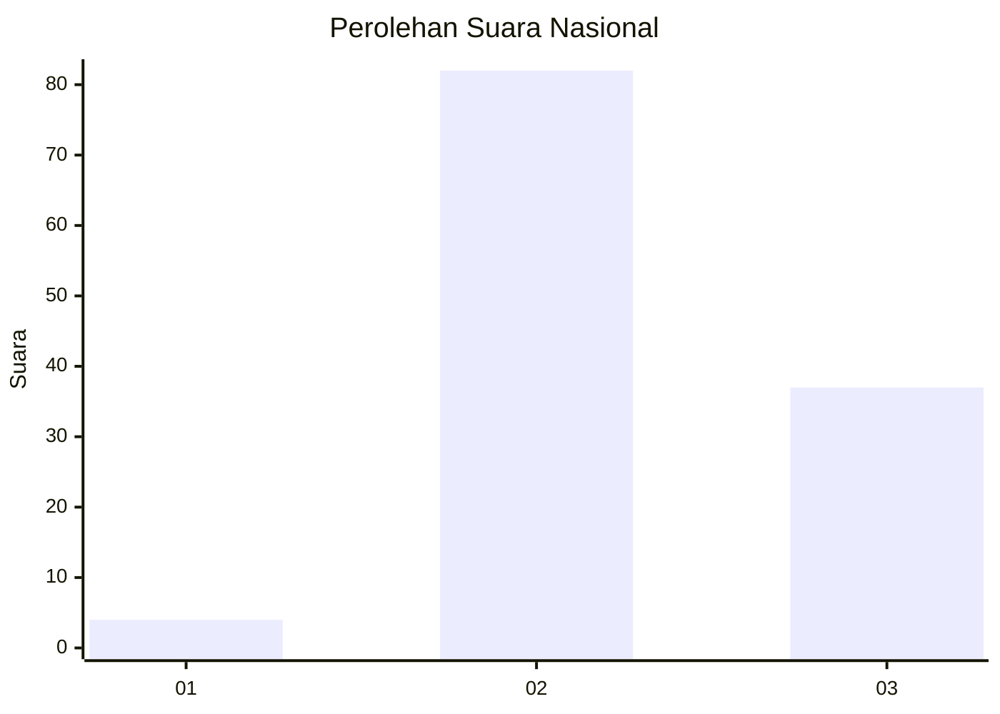
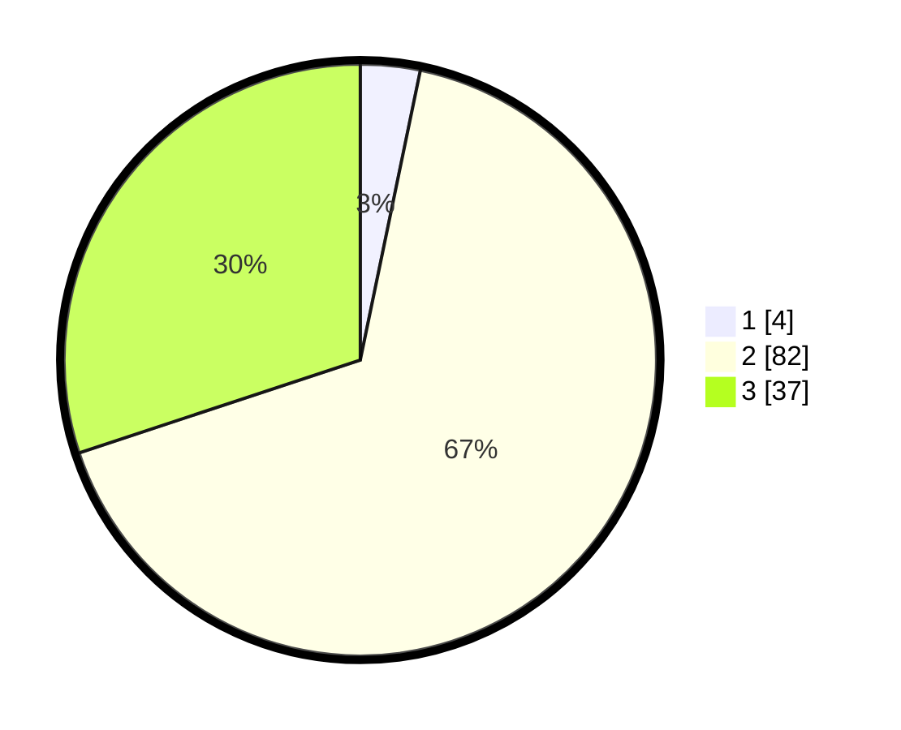

# Hasil

## Grafik

## Tabel

| No. | Nama Paslon    | Suara | Suara (raw) | Persentase |
|:--- |:-------------- | -----:| -----------:| ----------:|
| 1   | ANIES MUHAIMIN | 4     | [4][p-1]    | 3,25       |
| 2   | PRABOWO GIBRAN | 82    | [82][p-2]   | 66,67      |
| 3   | GANJAR MAHFUD  | 37    | [37][p-3]   | 30,08      |

[p-1]: https://github.com/gigit-pemilu/pemilu-2024/blob/main/pilpres/hitung-suara/sub/34-di-yogyakarta/sub/03-gunungkidul/sub/12-semin/sub/2001-kalitekuk/sub/001-tps/sub/paslon-1.txt
[p-2]: https://github.com/gigit-pemilu/pemilu-2024/blob/main/pilpres/hitung-suara/sub/34-di-yogyakarta/sub/03-gunungkidul/sub/12-semin/sub/2001-kalitekuk/sub/001-tps/sub/paslon-2.txt
[p-3]: https://github.com/gigit-pemilu/pemilu-2024/blob/main/pilpres/hitung-suara/sub/34-di-yogyakarta/sub/03-gunungkidul/sub/12-semin/sub/2001-kalitekuk/sub/001-tps/sub/paslon-3.txt

## Foto C Plano

https://sirekap-obj-formc.kpu.go.id/9cf7/pemilu/ppwp/34/03/12/20/01/3403122001001-20240215-215859--dbd8ff9e-346a-48f7-bc22-362b13282c72.jpg

https://sirekap-obj-formc.kpu.go.id/9cf7/pemilu/ppwp/34/03/12/20/01/3403122001001-20240215-215902--801c4b58-621b-44c1-9b9f-e8815870ed1d.jpg

https://sirekap-obj-formc.kpu.go.id/9cf7/pemilu/ppwp/34/03/12/20/01/3403122001001-20240215-215900--64759f61-c895-4b56-8c78-03e9e66da28e.jpg

## Metadata

| Key        | Value               |
| ---------- | ------------------- |
| Time Stamp | 2024-02-21 12:00:00 |

## DATA PEMILIH TETAP

Jumlah pemilih dalam DPT: **147**.
 * L: **74**.
 * P: **73**.

## DATA PENGGUNA HAK PILIH

Jumlah pengguna hak pilih dalam DPT: **123**.
 * L: **60**.
 * P: **63**.

Jumlah pengguna hak pilih dalam DPTb: **1**.
 * L: **1**.
 * P: **0**.

Jumlah pengguna hak pilih dalam DPK: **0**.
 * L: **0**.
 * P: **0**.

Jumlah pengguna hak pilih: **124**.
 * L: **61**.
 * P: **63**.

## JUMLAH SUARA SAH DAN TIDAK SAH

JUMLAH SELURUH SUARA SAH: **123**.

JUMLAH SUARA TIDAK SAH: **1**.

JUMLAH SELURUH SUARA SAH DAN SUARA TIDAK SAH: **124**.

