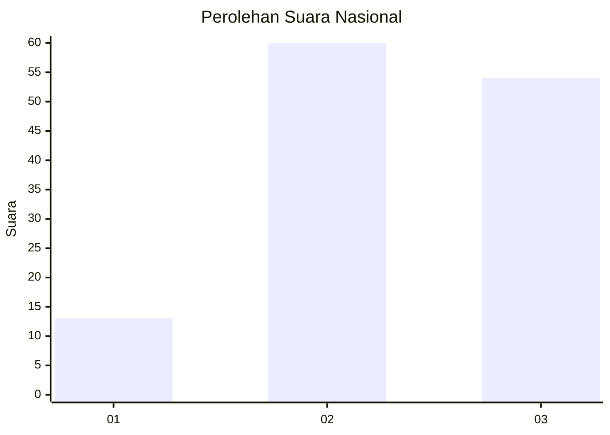
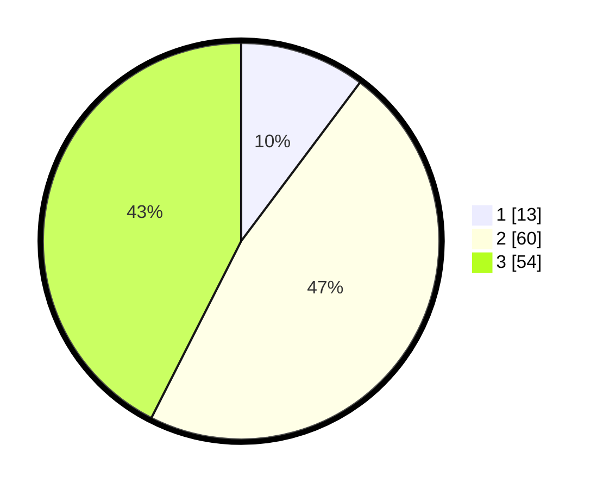

# Hasil

## Grafik

## Tabel

| No. | Nama Paslon    | Suara | Suara (raw) | Persentase |
|:--- |:-------------- | -----:| -----------:| ----------:|
| 1   | ANIES MUHAIMIN | 13    | [13][p-1]   | 10,24      |
| 2   | PRABOWO GIBRAN | 60    | [60][p-2]   | 47,24      |
| 3   | GANJAR MAHFUD  | 54    | [54][p-3]   | 42,52      |

[p-1]: https://github.com/gigit-pemilu/pemilu-2024/blob/main/pilpres/hitung-suara/sub/34-di-yogyakarta/sub/03-gunungkidul/sub/12-semin/sub/2001-kalitekuk/sub/005-tps/sub/paslon-1.txt
[p-2]: https://github.com/gigit-pemilu/pemilu-2024/blob/main/pilpres/hitung-suara/sub/34-di-yogyakarta/sub/03-gunungkidul/sub/12-semin/sub/2001-kalitekuk/sub/005-tps/sub/paslon-2.txt
[p-3]: https://github.com/gigit-pemilu/pemilu-2024/blob/main/pilpres/hitung-suara/sub/34-di-yogyakarta/sub/03-gunungkidul/sub/12-semin/sub/2001-kalitekuk/sub/005-tps/sub/paslon-3.txt

## Foto C Plano

https://sirekap-obj-formc.kpu.go.id/480b/pemilu/ppwp/34/03/12/20/01/3403122001005-20240216-114900--270fb87b-37db-4e99-987f-e747c96543f1.jpg

https://sirekap-obj-formc.kpu.go.id/480b/pemilu/ppwp/34/03/12/20/01/3403122001005-20240216-114903--456dd895-0caa-4fa3-ad96-1ebc4ee8723b.jpg

https://sirekap-obj-formc.kpu.go.id/480b/pemilu/ppwp/34/03/12/20/01/3403122001005-20240216-114902--ea43b459-735e-4f19-a163-83f0bf8e2473.jpg

## Metadata

| Key        | Value               |
| ---------- | ------------------- |
| Time Stamp | 2024-02-17 11:30:03 |

## DATA PEMILIH TETAP

Jumlah pemilih dalam DPT: **157**.
 * L: **79**.
 * P: **78**.

## DATA PENGGUNA HAK PILIH

Jumlah pengguna hak pilih dalam DPT: **129**.
 * L: **65**.
 * P: **64**.

Jumlah pengguna hak pilih dalam DPTb: **0**.
 * L: **0**.
 * P: **0**.

Jumlah pengguna hak pilih dalam DPK: **0**.
 * L: **0**.
 * P: **0**.

Jumlah pengguna hak pilih: **129**.
 * L: **65**.
 * P: **64**.

## JUMLAH SUARA SAH DAN TIDAK SAH

JUMLAH SELURUH SUARA SAH: **127**.

JUMLAH SUARA TIDAK SAH: **2**.

JUMLAH SELURUH SUARA SAH DAN SUARA TIDAK SAH: **129**.

