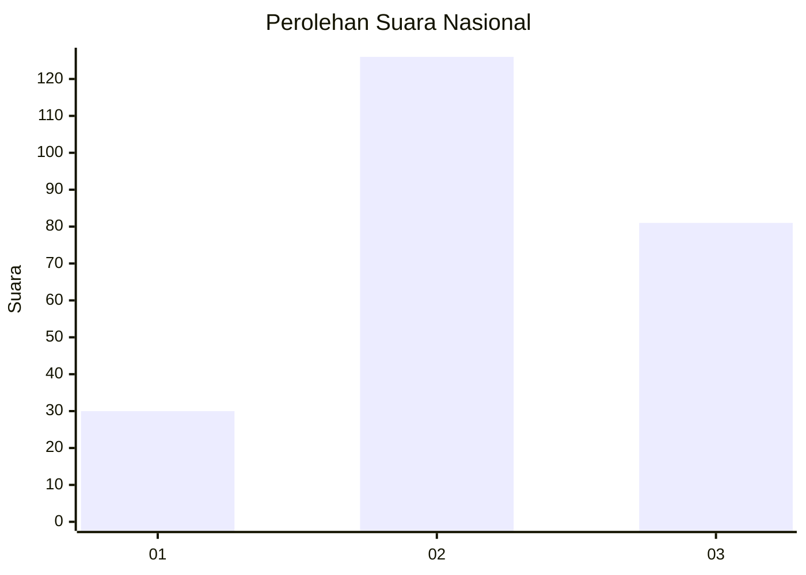
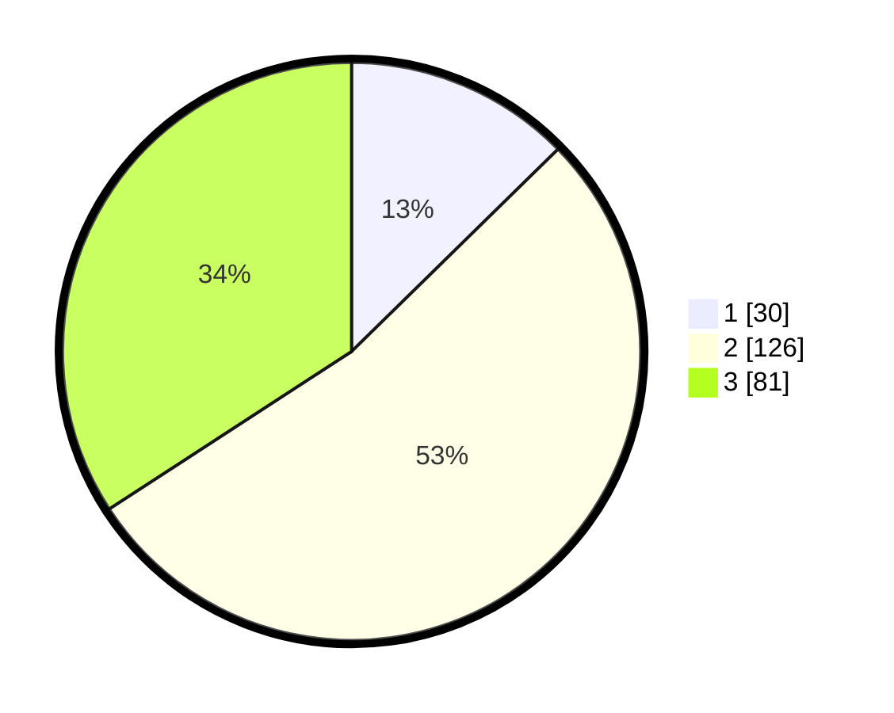

# Hasil

## Grafik

## Tabel

| No. | Nama Paslon    | Suara | Suara (raw) | Persentase |
|:--- |:-------------- | -----:| -----------:| ----------:|
| 1   | ANIES MUHAIMIN | 30    | [30][p-1]   | 12,66      |
| 2   | PRABOWO GIBRAN | 126   | [126][p-2]  | 53,16      |
| 3   | GANJAR MAHFUD  | 81    | [81][p-3]   | 34,18      |

[p-1]: https://github.com/gigit-pemilu/pemilu-2024/blob/main/pilpres/hitung-suara/sub/34-di-yogyakarta/sub/03-gunungkidul/sub/12-semin/sub/2001-kalitekuk/sub/009-tps/sub/paslon-1.txt
[p-2]: https://github.com/gigit-pemilu/pemilu-2024/blob/main/pilpres/hitung-suara/sub/34-di-yogyakarta/sub/03-gunungkidul/sub/12-semin/sub/2001-kalitekuk/sub/009-tps/sub/paslon-2.txt
[p-3]: https://github.com/gigit-pemilu/pemilu-2024/blob/main/pilpres/hitung-suara/sub/34-di-yogyakarta/sub/03-gunungkidul/sub/12-semin/sub/2001-kalitekuk/sub/009-tps/sub/paslon-3.txt

## Foto C Plano

https://sirekap-obj-formc.kpu.go.id/9e6c/pemilu/ppwp/34/03/12/20/01/3403122001009-20240217-183010--abccafee-bccb-41d4-9f38-a954b0583ab8.jpg

https://sirekap-obj-formc.kpu.go.id/9e6c/pemilu/ppwp/34/03/12/20/01/3403122001009-20240217-183011--166a698f-e49b-4584-9c08-ec7e9dfb3f49.jpg

https://sirekap-obj-formc.kpu.go.id/9e6c/pemilu/ppwp/34/03/12/20/01/3403122001009-20240217-183010--2457b9d0-6042-400d-9b51-70a3ffd29523.jpg

## Metadata

| Key        | Value               |
| ---------- | ------------------- |
| Time Stamp | 2024-02-21 13:00:00 |

## DATA PEMILIH TETAP

Jumlah pemilih dalam DPT: **277**.
 * L: **139**.
 * P: **138**.

## DATA PENGGUNA HAK PILIH

Jumlah pengguna hak pilih dalam DPT: **238**.
 * L: **114**.
 * P: **124**.

Jumlah pengguna hak pilih dalam DPTb: **1**.
 * L: **0**.
 * P: **1**.

Jumlah pengguna hak pilih dalam DPK: **3**.
 * L: **1**.
 * P: **2**.

Jumlah pengguna hak pilih: **242**.
 * L: **115**.
 * P: **127**.

## JUMLAH SUARA SAH DAN TIDAK SAH

JUMLAH SELURUH SUARA SAH: **237**.

JUMLAH SUARA TIDAK SAH: **5**.

JUMLAH SELURUH SUARA SAH DAN SUARA TIDAK SAH: **242**.

