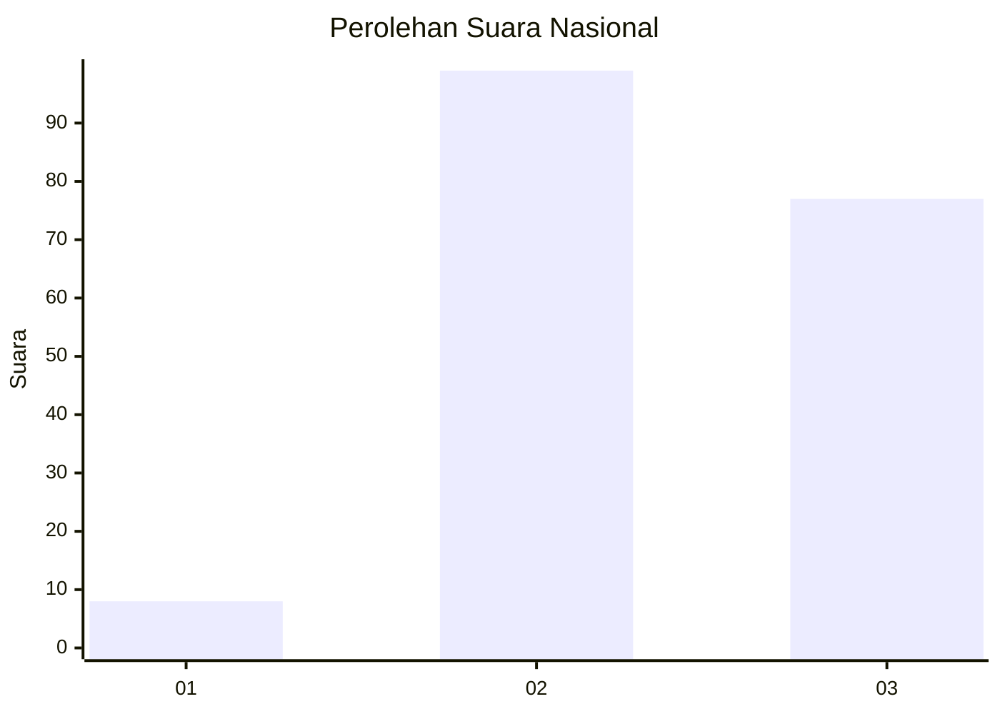
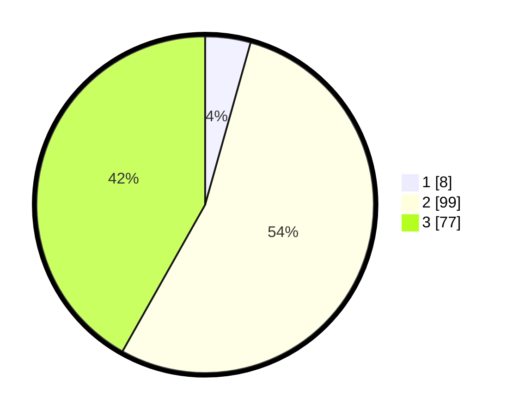

# Hasil

## Grafik

## Tabel

| No. | Nama Paslon    | Suara | Suara (raw) | Persentase |
|:--- |:-------------- | -----:| -----------:| ----------:|
| 1   | ANIES MUHAIMIN | 8     | [8][p-1]    | 4,35       |
| 2   | PRABOWO GIBRAN | 99    | [99][p-2]   | 53,80      |
| 3   | GANJAR MAHFUD  | 77    | [77][p-3]   | 41,85      |

[p-1]: https://github.com/gigit-pemilu/pemilu-2024/blob/main/pilpres/hitung-suara/sub/34-di-yogyakarta/sub/03-gunungkidul/sub/12-semin/sub/2002-kemejing/sub/005-tps/sub/paslon-1.txt
[p-2]: https://github.com/gigit-pemilu/pemilu-2024/blob/main/pilpres/hitung-suara/sub/34-di-yogyakarta/sub/03-gunungkidul/sub/12-semin/sub/2002-kemejing/sub/005-tps/sub/paslon-2.txt
[p-3]: https://github.com/gigit-pemilu/pemilu-2024/blob/main/pilpres/hitung-suara/sub/34-di-yogyakarta/sub/03-gunungkidul/sub/12-semin/sub/2002-kemejing/sub/005-tps/sub/paslon-3.txt

## Foto C Plano

https://sirekap-obj-formc.kpu.go.id/fed6/pemilu/ppwp/34/03/12/20/02/3403122002005-20240217-201030--f8a8575c-3a2e-446d-a975-221204c4fa4e.jpg

https://sirekap-obj-formc.kpu.go.id/fed6/pemilu/ppwp/34/03/12/20/02/3403122002005-20240217-200913--981794ff-e7ce-4655-b04e-af2b390767a7.jpg

## Metadata

| Key        | Value               |
| ---------- | ------------------- |
| Time Stamp | 2024-02-19 06:16:00 |

