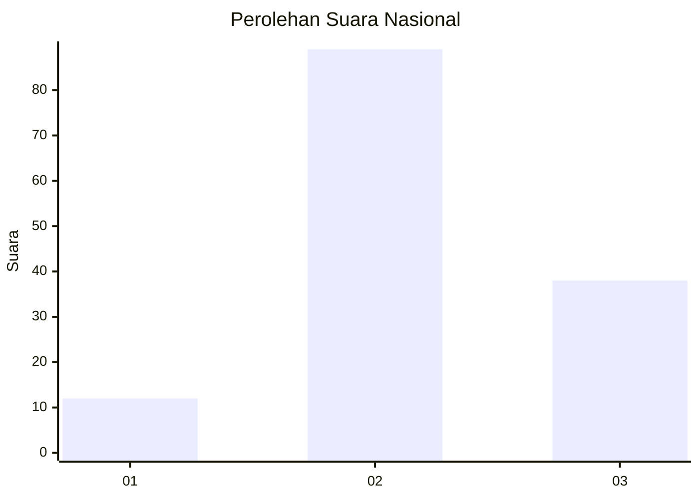
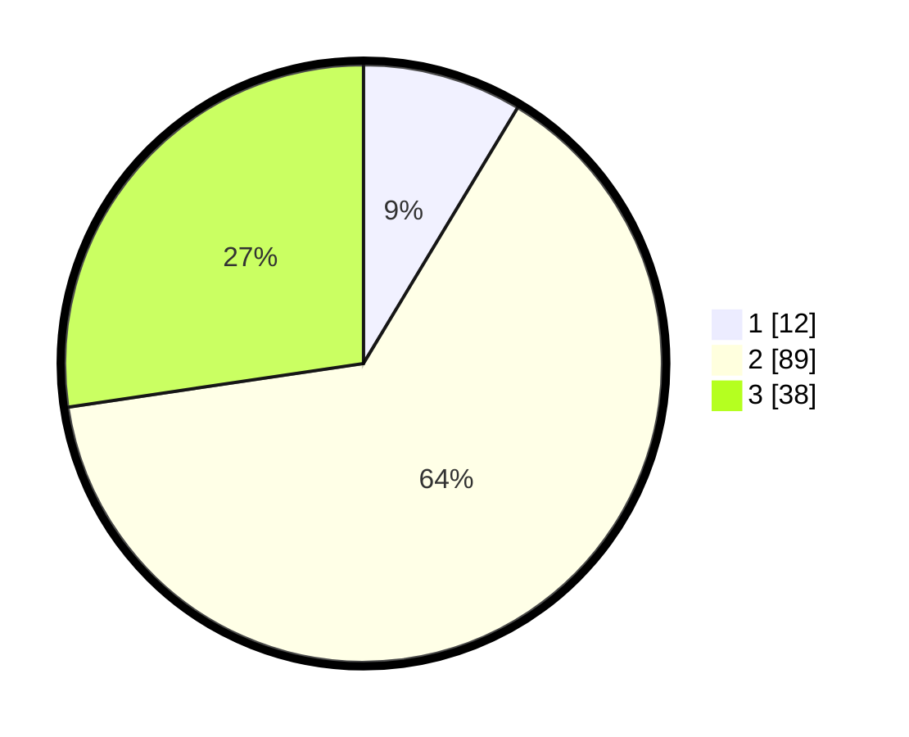

# Hasil

## Grafik

## Tabel

| No. | Nama Paslon    | Suara | Suara (raw) | Persentase |
|:--- |:-------------- | -----:| -----------:| ----------:|
| 1   | ANIES MUHAIMIN | 12    | [12][p-1]   | 8,63       |
| 2   | PRABOWO GIBRAN | 89    | [89][p-2]   | 64,03      |
| 3   | GANJAR MAHFUD  | 38    | [38][p-3]   | 27,34      |

[p-1]: https://github.com/gigit-pemilu/pemilu-2024/blob/main/pilpres/hitung-suara/sub/34-di-yogyakarta/sub/03-gunungkidul/sub/12-semin/sub/2003-bulurejo/sub/006-tps/sub/paslon-1.txt
[p-2]: https://github.com/gigit-pemilu/pemilu-2024/blob/main/pilpres/hitung-suara/sub/34-di-yogyakarta/sub/03-gunungkidul/sub/12-semin/sub/2003-bulurejo/sub/006-tps/sub/paslon-2.txt
[p-3]: https://github.com/gigit-pemilu/pemilu-2024/blob/main/pilpres/hitung-suara/sub/34-di-yogyakarta/sub/03-gunungkidul/sub/12-semin/sub/2003-bulurejo/sub/006-tps/sub/paslon-3.txt

## Foto C Plano

https://sirekap-obj-formc.kpu.go.id/0c22/pemilu/ppwp/34/03/12/20/03/3403122003006-20240216-011759--f09c0d65-bfd9-4004-ba66-fc38248cd097.jpg

https://sirekap-obj-formc.kpu.go.id/0c22/pemilu/ppwp/34/03/12/20/03/3403122003006-20240216-011817--b5a34a40-9215-4e49-a4b3-f94dfd39e979.jpg

https://sirekap-obj-formc.kpu.go.id/0c22/pemilu/ppwp/34/03/12/20/03/3403122003006-20240216-011807--61e9a3ee-8ffa-480e-88bc-4b8ea86b7041.jpg

## Metadata

| Key        | Value               |
| ---------- | ------------------- |
| Time Stamp | 2024-02-26 16:00:00 |

## DATA PEMILIH TETAP

Jumlah pemilih dalam DPT: **164**.
 * L: **77**.
 * P: **87**.

## DATA PENGGUNA HAK PILIH

Jumlah pengguna hak pilih dalam DPT: **137**.
 * L: **63**.
 * P: **74**.

Jumlah pengguna hak pilih dalam DPTb: **2**.
 * L: **1**.
 * P: **1**.

Jumlah pengguna hak pilih dalam DPK: **0**.
 * L: **0**.
 * P: **0**.

Jumlah pengguna hak pilih: **139**.
 * L: **64**.
 * P: **75**.

## JUMLAH SUARA SAH DAN TIDAK SAH

JUMLAH SELURUH SUARA SAH: **139**.

JUMLAH SUARA TIDAK SAH: **0**.

JUMLAH SELURUH SUARA SAH DAN SUARA TIDAK SAH: **139**.

